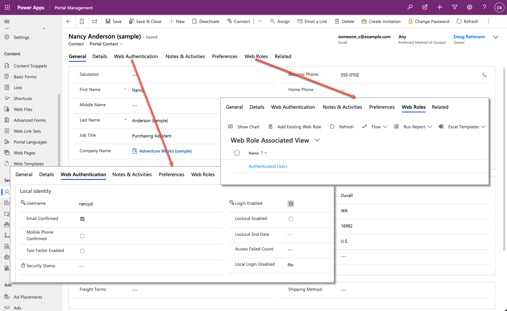
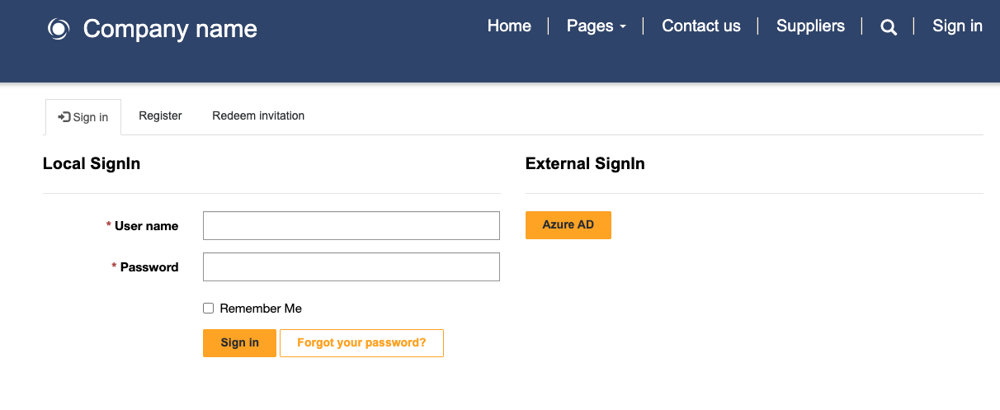
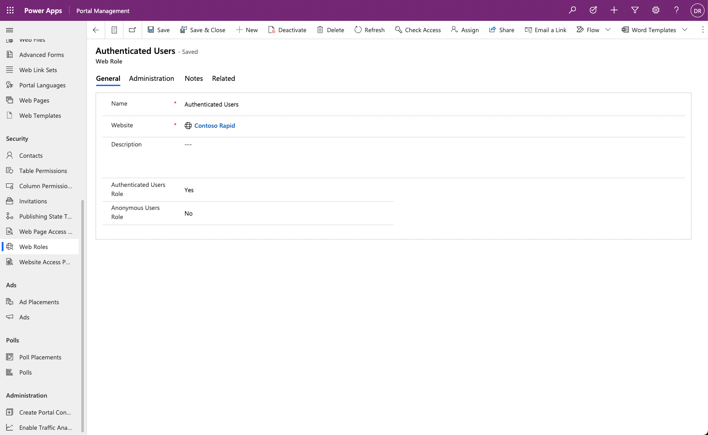

## Microsoft Dataverse customer tables

Microsoft Power Pages security is set up primarily around the Microsoft Dataverse (or Microsoft Dynamics 365) **contact**. The contact represents a person with which an organization has a relationship. In the Dynamics 365 apps, a contact row can represent a stakeholder, such as a customer, partner, supplier, supporter, or an employee of organizational stakeholders (typically, you'd represent organizations by using the **Account** table). For more information, see the [Customer tables](/power-apps/developer/data-platform/customer-entities-account-contact?azure-portal=true) documentation.

> [!NOTE]
> For Power Pages websites that are set up for internal staff access (such as the Employee portal), Dataverse system users will also need corresponding contact rows to access the website.

## Contact

A website might show public information and content that's viewed by anonymous users who don't need to authenticate. An example would be an online newsletter or an event schedule that shows details from a Dataverse table.

However, you need to ensure that certain private or protected information is only accessible to specified, authenticated users of the website. An example of this information would be members-only protected content or private information such as invoices.

Power Pages adds columns, forms, and views that contain information that's specific to Power Pages to the Contact table.

> [!div class="mx-imgBorder"]
> 

A website user needs to sign in by using an authentication process in which the website application recognizes the visitor as a specific Dataverse contact. Then, Power Pages can show the protected and private static and dynamic content to that user.

For more information, see [Configure Power Pages site authentication](/power-pages/security/authentication/configure-site?azure-portal=true).

To be recognized as a website user, the contact needs to accept an invitation from the website that's associated with an existing contact, or they can register as a new contact.

Make sure that you consider strategies for adding contacts to a Power Pages website. If starting a new initiative where you're building a new audience, you would allow new website users to register and create new contact rows.

> [!div class="mx-imgBorder"]
> 

If you have an existing customer base with thousands of contacts that already exist in your app, you should invite these existing contacts to the website to avoid creating duplicate contact rows.

You can set up the ability to allow or not allow website visitors to register as a new contact by ensuring that the **Authentication/Registration/Enabled** website setting is set to **true** or **false**.

## Accounts

A common relationship in Dataverse is where the contact is a child table of an account row that represents an employee-employer relationship. This relationship might have an impact on how you set up table permissions because the contact might be provided access to content based on the permissions that are granted to the parent account row.

## Web role

When a website user has an associated contact, you'll still need to assign web roles that are linked to webpage access control rules and table and column permissions that determine the information that the website user can access.

You can only create a **Web Role** row in the Portal Management app. The following table describes the properties in the **Web Role** row.

| Property | Details |
| --- | --- |
| Name | The name of the web role. This name should be descriptive of the purpose or audience that's assigned the web role. |
| Website | The website that this web role belongs to. |
| Description | A description of the purpose of the web role and other descriptive information. |
| Authenticated Users Role | A Boolean column indicating that the linked table permissions or webpage access control rules are automatically applied to all authenticated website users. |
| Anonymous Users Role |  A Boolean column indicating that the linked table permissions or webpage access control rules are automatically applied to all anonymous website users. |

You can assign web roles by using the Portal Management app and relating an existing contact to a web role. Additionally, you can specify web roles on a website invitation row and have them automatically assigned when a contact accepts the invitation.

You can set up web roles to automatically provide access to all authenticated users or all anonymous users.

> [!div class="mx-imgBorder"]
> 
