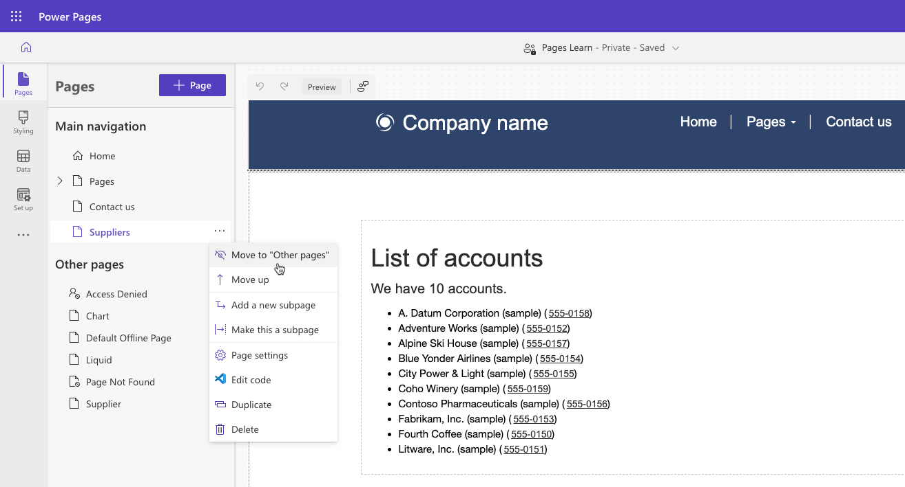
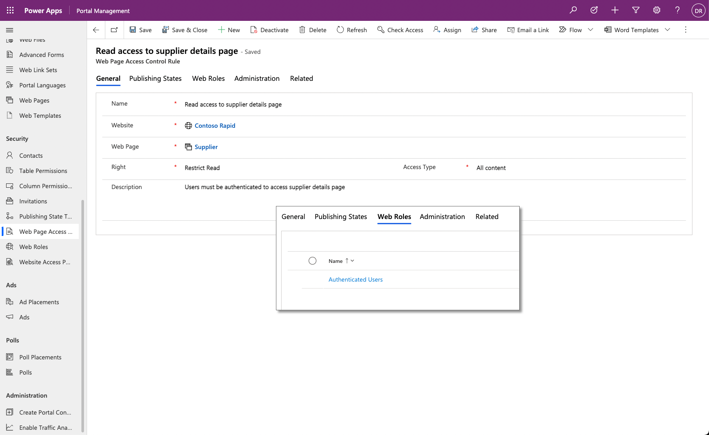
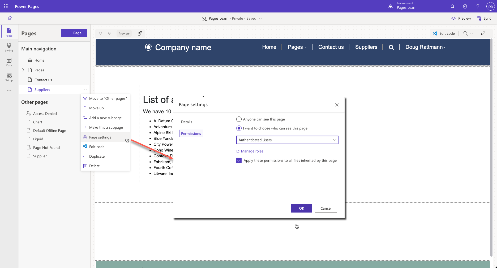
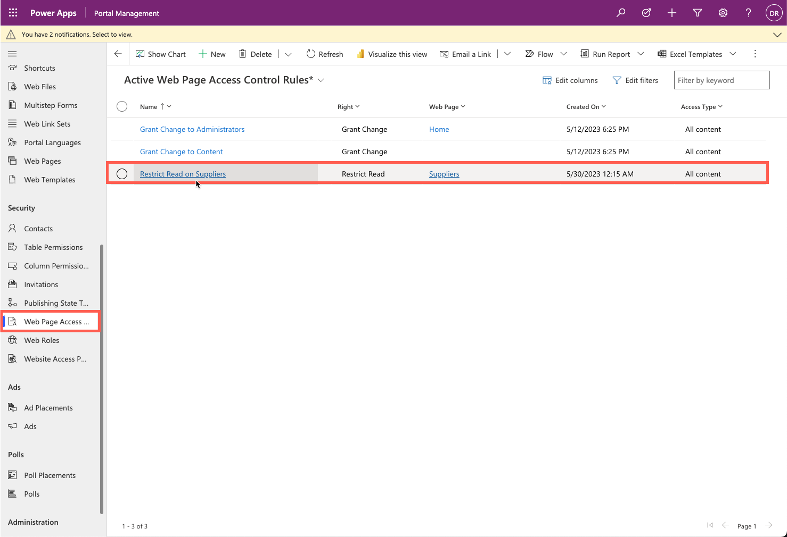

## Webpage content

A website is a common way for an organization to provide content to a public-facing audience. You can create webpages to display overall organization information, offerings of products and services, or educational content.

Occasionally, certain situations occur when companies should make content available only to specific authenticated website users, such as when a company webpage is providing members-only content or specific instructions or offers.

By default, when a maker creates a new webpage by using Power Pages design studio or the Portal Management app, the page is publicly available and added to the default menu. The maker can remove the page from the menu; however, it's still accessible by using the direct URL.

> [!div class="mx-imgBorder"]
> 

## Webpage access control rule

The **Web Page Access Control Rule** table is a website metadata table that you can link to a specific webpage and determine the visibility of that page.

> [!div class="mx-imgBorder"]
> 

The following table describes the **Web Page Access Control Rule** row properties.

| Property | Details |
| --- | --- |
| Name | This property can be any name to describe the rule. Ideally, it should note the webpage that's being referenced. |
| Website | This property references the website in which the rule resides. |
| Web Page | This lookup references the webpage to which you should apply the rule. |
| Right | This property determines the level of access rights that a website user has to the specific webpage. The **Restrict Read** right means that a website visitor is allowed to view the page but can't directly edit the page. The **Grant Change** right means that the user can view the page, and if they have access to the content editing tools, they're able to change the content. |
| Description | This column allows a maker to add a description of the purpose and scope of the rule. |

After you've defined an access control for a webpage, the page won't be accessible on the website, and by default, won't appear on any menu navigation.

> [!NOTE]
> You can make the menu link (**WebLink**) to a restricted page visible to all website visitors by selecting the **Disable Page Validation** option on the **WebLink** row in the Portal Management app. That way, anonymous visitors can view links to protected pages and be redirected automatically to a sign-in page when they try to access them.

You can link the **Web Page Access Control Rule** row to one or more web roles. A user who's assigned any of these web roles will be able to access the particular webpage.

## Access management in Power Pages design studio

Power Pages design studio simplifies the configuration of webpage access permissions compared to using the Portal Management app, and it's the recommended method. You can use Power Pages design studio to manage **Restrict Read** rights only. To restrict page access to a specific user role in design studio, follow these steps:

1. Select a page in the **Pages** workspace.

1. Select the ellipsis (**...**) menu and then select **Page settings**.

1. Select the **Permissions** tab.

1. Select the **I want to choose who can see this page** option.

1. Use the dropdown menu to select one or more roles that are allowed to access the page.

1. Select **OK**.

When a rule is added in design studio, the corresponding **Web Page Access Control Rule** row is created automatically.

For more information, see [Page permissions in Power Pages](/power-pages/security/page-security?azure-portal=true).
