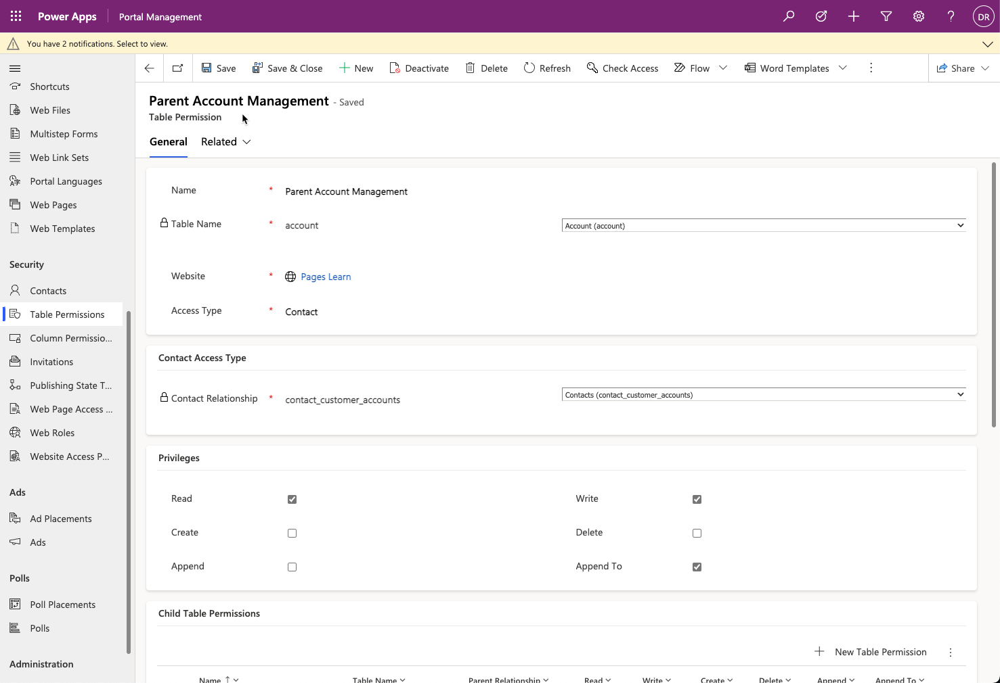
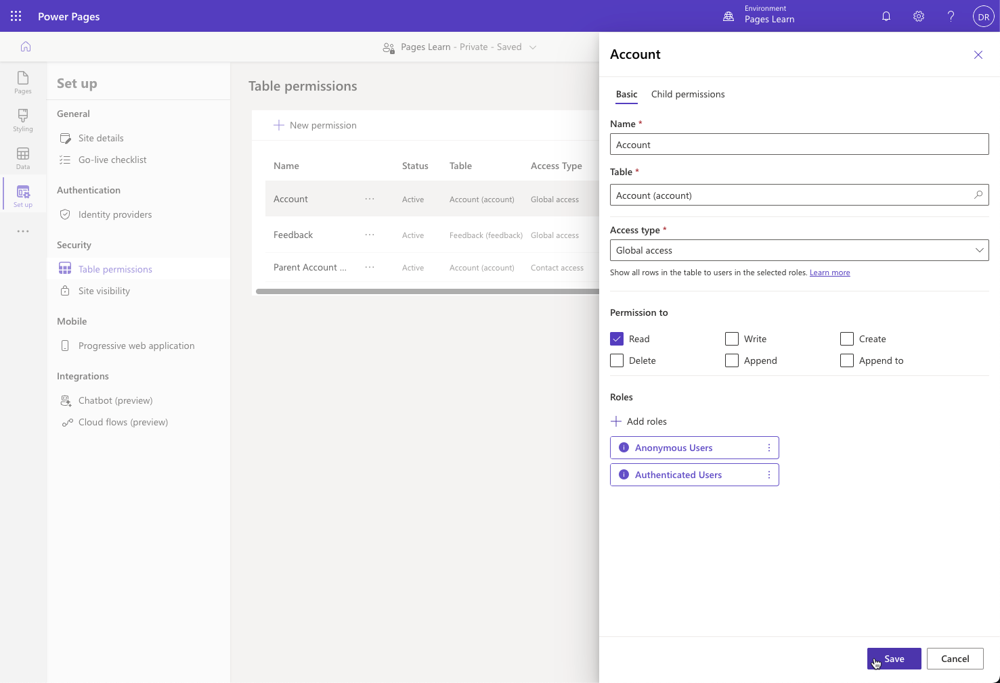

Table permissions define the access and scope that a website user has to a particular Microsoft Dataverse table on the website. You can access Dataverse rows on a Power Pages website by using a list, form, or multi-step form, or you can display them by using Liquid tags in webpage content or web templates.

> [!div class="mx-imgBorder"]
> 

You can create a table permission in the Portal Management app or in Power Pages design studio and associate it with one or more web roles to allow a website user access to the specific table rows.

> [!IMPORTANT]
> Table permissions are automatically enforced for all forms and lists and applied to data that's retrieved by using Liquid tags.

## Create a table permission

Follow these steps to create a new **Table Permission** row:

1. Identify the table that's secured.

1. Define scope.

1. For any scope other than **Global**, select the relationships that define that scope.

1. Determine the privileges that you're granting to the role through this permission.

> [!IMPORTANT]
> Rights are cumulative. If a user is in one role that grants **Read** rights and another role that grants **Read** and **Write** rights, the user will have **Read** and **Write** rights for any rows that overlap between the two roles. No mechanism exists to reduce the permission scope or remove a privilege by assigning another role.

## Use Power Pages design studio

In Power Pages design studio, follow these steps to provide a user experience for creating and editing table permissions:

1. Select the **Set up** workspace and then select **Table permissions**.
   
1. Select the ellipsis (**...**) menu and then select **Edit** for an existing table permission row or use the **New permission** command to access the permission settings panel.

   

For more information about managing table permissions in Power Pages design studio and for step-by-step instructions, see [Configure table permissions in Power Pages](/power-pages/security/table-permissions?azure-portal=true).

## Column permissions

You can use table permissions to apply security to individual Dataverse table rows. Now, you can add column permissions to help secure individual table columns.

> [!NOTE]
> Currently, column permissions are only applicable for [Power Pages portals Web API](/power-pages/configure/web-api-overview?azure-portal=true), and you'd use them to perform operations across all Microsoft Dataverse tables from your website pages.

Web roles can have any number of table permissions and column permissions. If a web role has multiple column permissions, all column permissions are applied to the selected web role.

When permissions are evaluated, table permissions are evaluated first. If a user has access to a table, the table's column permissions are applied. If the user doesn't have access to the table, any configured column permissions are ignored.

When no column permissions are defined, the corresponding table permissions apply to all columns.

For more information about managing column permissions, see [Configure column permissions for Power Pages](/power-pages/security/column-permissions?azure-portal=true).
