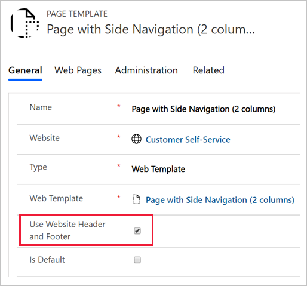

The **Page Template** table has a setting that specifies whether the page should use the common website header and footer templates when the web template is used. 

> [!div class="mx-imgBorder"]
> [](../media/page-template.png#lightbox)

When the website header and footer aren't used, the template assumes responsibility for generating the entire page output. If you're rendering HTML, this output includes the doctype, the root `<html>` element, and everything in between. This approach could be useful in different scenarios, such as when:

- Special purpose pages need to appear different from the rest of the portal, such as marketing campaign landing pages.

- The web template generates non-HTML content, returning data in XML, JSON, or other formats.

For example, you can create a web template that returns a list of accounts, or any other data that the current user has access to, in `JSON` format. 

```twig

[

    {
        "name": "{{ acc.name }}",
        "phone": "{{ acc.telephone1 }}"
    },

]

```

> [!NOTE]
> In this example, instead of the `entityview` tag,  you can use a FetchXML query inside the `fetchxml` tag. Using inline FetchXML adds some flexibility to the query. You can build the query dynamically by using template parameters or even a `request` object that contains query string parameters of a current HTTP page request.

You would use this template without a header and footer, with the MIME type set to `application/json`. The output would be similar to the following example:

```json
[
  {
      "name": "A Datum Corporation",
      "phone": "425-555-0182"
  },
  {
      "name": "A Datum Fabrication",
      "phone": "303-555-0134"
  },
  {
      "name": "A Datum Integration",
      "phone": "512-555-0163"
  },
  {
      "name": "A. Datum",
      "phone": "+86-23-4444-0100"
  },
  {
      "name": "Adventure Works",
      "phone": "+27-264-1234567"
  }
]
```

> [!TIP]
> Consider using Portals Web API for the data retrieval where applicable. Portal Web API is fast and avoids server-side template processing altogether. However, if data transformation is required, you'll need to complete it by using JavaScript on the client side. Conversely, Liquid templates can transform and use the data entirely on the server side. For more information, see [Portals read operations using the Web API](/power-pages/configure/read-operations?azure-portal=true).

The page that uses this web template wouldn't be seen by people who are using a browser; instead, it's called from JavaScript code, effectively defining an API endpoint for your solution. JavaScript on another page would be able to load and render this data as required.

Authorization is in place, and accessing Microsoft Dataverse data by using this "headless" template is no different than if the output was rendered as HTML. The calling page would typically require user authentication prior to calling the endpoint.
