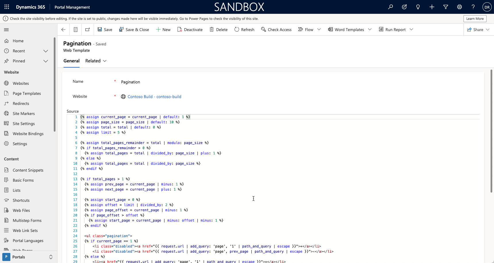

To create custom page templates, you can use the **Web Template** row, which is basically a layout template. For example, if a web template includes static HTML, this HTML is rendered as it is in the page output that uses that template. The real power of web templates comes from the ability to contain Liquid code, which adds processing capabilities to the static content, including access to Dataverse data.

> [!div class="mx-imgBorder"]
> [](../media/web-templates.png#lightbox)

**Web Template** is a simple table that contains the following columns:

- **Name** - When a template is included in other content, or extended by other templates, it's referred to by this name.

- **Website** - Website row where the template is used.  

- **Source** - The source content of the template. It can be static text, an HTML fragment, or most often, a layout by using Liquid.

- **MIME type** - Defines what Multipurpose Internet Mail Extensions (MIME) type that the server sends to the client when the template is rendered. If a value isn't provided, the value is assumed to be `text/html`, which is a standard type for HTML pages. You can create a web template that will render specialized content. For example, you can create a web template that returns some Microsoft Dataverse data in `json` format. In this case, the MIME type would be set to `application/json`. 

## Web template management

Liquid implementations within Power Pages websites contain many [Template tags](/power-pages/configure/liquid/template-tags?azure-portal=true) that help manage templates and promote reusability.

### FetchXML tag

The `fetchxml` tag allows users to query data from Dataverse and renders the results in a page.

```html

<!— Fetchxml query -->
<fetch>
  <entity name="account">
    <attribute name="name" />
  </entity>
</fetch>

```

The `varResults` variable contains the results of the query.

```twig
 
  <p>{{ account.name }}</p>

```

> [!IMPORTANT]
> Table permissions are always applied to the data that's retrieved by using Liquid, including the `fetchxml` tag.

### Comment tag

With the `comment` tag, any content within the block won't be rendered and Liquid code within won't be run. This tag is useful for including extended comments in complex templates and to temporarily comment out blocks of code when you're troubleshooting.

```twig
This is a very useful comment.
```

The preceding logic generates the following result: 

> This is a comment.

### Raw tag

The `raw` tag allows the output of Liquid code on a page without having it parsed and implemented. This tag is useful for generating content that uses conflicting client-side syntax, such as handlebars. It's also useful when the page content needs to include fragments of Liquid code, such as a knowledge base article that discusses the use of Liquid language and includes samples.

```twig
Hello, {{ user.fullname }}. Nice to meet you.
```

The preceding logic generates the following result: 

> Hello, {{ user.fullname }}. Nice to meet you.

Notice how `user.fullname` is rendered explicitly instead of being processed as a Liquid instruction and converted into the actual name of the user.

### Include tag

The `include` tag includes the contents of one template in another, by name. This tag allows for the reuse of common template fragments in multiple places, such as the rendering of social links. The included template has access to variables that are defined in the parent template, and it's possible to pass parameters.

```xml

```

This logic includes the output that's generated by the **Breadcrumbs** template that will have a `separator` variable set to the right angle bracket (`>`) symbol.

### Block tag

By using the `block` tag, you can define a block within a template, which defines a region that can be optionally overwritten by the templates that extend the current template.

### Extend tag

When used with the `block` tag, the `extend` tag provides template inheritance. This tag allows multiple templates to use a shared layout while overriding specific areas of the parent layout. When `extend` is used, it must be the first content in the template and can only be followed by one or more block tags.

#### Base template

The base template logic is as follows:

```twig
<div>
Hello
default content
</div>
```

#### Child template

The child template logic is as follows:

```twig

Power Pages websites
```

The child template generates the following output:

```html
<div>
  Hello
  Power Pages websites
</div>
```

The typical use of the `extend` and `block` tags is to separate layout and content templates. Parent or base templates usually define broad page layout, such as if it's a single column or a two-column page. Child templates that extend the base can only define the content of the blocks as specified by the parent.

For a comprehensive Liquid code sample that demonstrates template inheritance with `block/extend` and `include` tags, see [Custom page layouts in Power Pages](/power-pages/configure/custom-page-layouts?azure-portal=true).

## Web templates best practices

To improve template structure and make the web templates more manageable, make sure that you follow these guidelines: 

- Choose descriptive names for your templates because they'll be referenced or included as part of other templates.

- Break down the page layout and separate layout from content. These layouts are candidates for extendable templates.

- Look out for repeatable and reusable fragments; they can be defined as sub templates and will use the `include` tag.

- Use the `include` tag to help reuse layout and commonly used JavaScript fragments. Make your JavaScript templates "smart" by using parameters that are available in the `include` tag. These fragments are inserted inline.

- Move larger, reusable blocks of JavaScript to separate files and insert them as a reference instead. The client's browser loads them separately and they can be cached. Additionally, you can minify externally loaded scripts, which will result in better performance. 

- Find parts of the page that need to be translated for multilingual implementation. Define these pages as page content or content snippets.

- Identify editable fragments. Determine which parts of the webpage where you want users to be responsible for content management and maintenance.

- Be generous with the layout when creating a template, but avoid excessive blank lines by using hyphens in your tags, for example: 

  ```xml
  
    Hello, {{ user.firstname}}
  
  ```

- Use the `comments` tag to describe complex parts of the template.

- Study templates that are already deployed with the starter portal, and look for Liquid techniques in [Custom page layouts in Power Pages](/power-pages/configure/custom-page-layouts?azure-portal=true).

Numerous ready-to-use Liquid templates are installed when you provision a starter portal: [Built-in web templates](/power-pages/configure/web-templates?azure-portal=true#built-in-web-templates). Their names are fixed, and some of these templates might not be available for editing.

For more information, see [Liquid overview](/power-pages/configure/liquid/liquid-overview?azure-portal=true).
