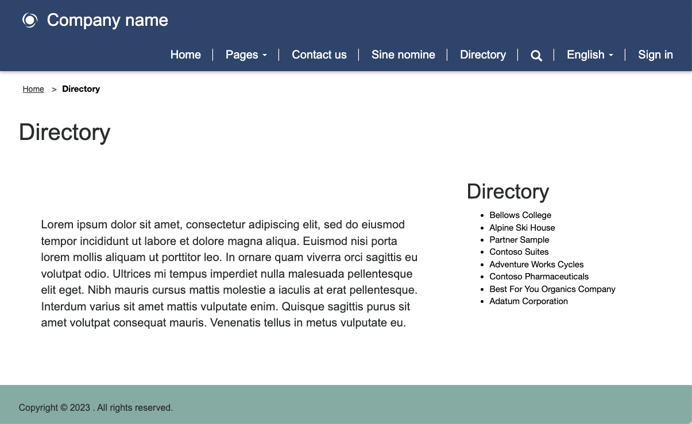

The purpose of this hands-on lab is to introduce the concept of building and extending Liquid templates.

The exercises work best when you have sample data to work with. Depending on the environment that you're working with, you might want to install some sample data to assist with the exercises. Microsoft Dataverse provides you with the ability to add sample data as needed. If the environment that you're working in doesn't have sample data installed, follow the steps in the [Add or remove sample data](/power-platform/admin/add-remove-sample-data/?azure-portal=true) documentation to install the sample data into your environment.

## Learning objectives

The objective of these exercises is to help you learn how to:

- Extend Liquid templates by using `extend` and `block` tags.
- Reuse Liquid templates by using the `include` tag.
- Apply table permissions to the results of the new template.

### Prerequisites

For this exercise, you'll need to have the following parameters set up in your environment:

- A provisioned Power Pages website. If you don't have a Power Pages website available, follow the [Create a site with Power Pages](/power-pages/getting-started/create-manage/?azure-portal=true) instructions to create one.
- Access to the Portal Management app.

## High-level steps

To finish the exercise, you'll need to complete the following high-level tasks:

- Create a partial template by accessing Dataverse data to use as a layout block.

- Create a new template that extends a two-column layout web template.

- Overwrite the side panel to include the partial template.

- Change the template of an existing webpage.

- Set up table permissions to display data to anonymous users.

## Detailed steps

To complete the exercise, you build a new page template that includes a side panel that lists all accounts in Dataverse.  

### Create a partial template

Your first task is to create a partial template that won't be used to render a page but will instead be inserted into another template.

1. Sign in to [Power Pages Home](https://make.powerpages.microsoft.com/?azure-portal=true).

1. Select the target environment in the upper-right corner.

1. Locate your website, expand the extension menu (ellipsis), and then select **Portal management** to open the Portal Management app.

1. Select **Web Templates**.

1. Select **New**.

1. Enter the following values:

   - **Name** - Directory 

   - **Website** - Select your current website

   - **Source** - Enter the following content:

    ```twig
    
    <fetch>
      <entity name="account">
        <attribute name="name" />
      </entity>
    </fetch>
    
    
    
      <ul>
         
        <li>{{ account.name }}</li>
        
      </ul>
    
      <div class="alert alert-warning">You do not have permissions to access the directory.</div>
    
    ```

1. Select **Save & Close**.

### Extend an existing template

Next, you'll create a new template that extends an existing Liquid template and then insert the template that you previously created.

1. Select **Web Templates**.

1. Select **New**.

1. Enter the following values:

   - **Name** - Directory Template

   - **Website** - Select your current website

   - **Source** - Enter the following content:

    ```twig
    
    
    
      <h2>Directory</h2>
      
    
    ```

1. Select **Save & Close**.

### Create a page template and associate with that page

In this task, you'll create a page template that uses your new web template and will include the Directory output.

1. Select **Page Templates**.

1. Select **New**.

1. Enter the following values:

   - **Name** - Directory Page Template

   - **Website** - Select the current website

   - **Type** - Select **Web Template**

   - **Web Template** - Select **Directory Template**

   - **Table Name** - Select **Web Page**

1. **Optional:** Add a text element to the page content and then enter text of your choice.

1. Select **Save & Close**.

### Test

Your next step is to test that your new template works:

1. Return to the [Power Pages Home](https://make.powerpages.microsoft.com/?azure-portal=true) tab or open a new one.

1. Locate the website then select **Edit** to open Power Pages design studio.

1. Select **Sync** to synchronize the changes.

1. Select the **Pages** workspace.

1. Select **+ Page**. In the **Add a page** dialog, complete the following steps:

   1. Enter **Directory** as the page name.

   1. Select **Custom layouts** and then select **Directory Page Template**.

   1. Select **Add**.  

The empty page will display with the message "You don't have permissions to access the directory" in the right panel.

### Add table permissions

> [!WARNING]
> Granting global read permission to anonymous users is for illustrative purposes only. Exercise caution to avoid unintentionally exposing sensitive information by granting excessive permissions and not including appropriate filters in your views or FetchXML expressions.

Follow these steps to add table permissions.

1. Select **Set up workspace** and then select **Table Permissions**.

1. Select **+ New**.

1. Enter the following values:

   - **Name** - Account Directory

   - **Table** - Select the **Account (account)** table

   - **Access type** - Select **Global access**

   - **Permission to** - Select **Read**

1. Select **Add roles**.

1. Select **Anonymous users** and **Authenticated users**.

1. Select **Save**.

### Test

Your final task is to test your new template:

1. Select the **Pages** workspace and then select the **Directory** page.

1. Select **Preview > Desktop**.

   > [!NOTE]
   > A simple browser page refresh won't be sufficient to update the data. Using this command instead rebuilds the site cache. 
   
The page should now be displayed and include the list of accounts in the right panel.

 > [!div class="mx-imgBorder"]
 > [](../media/build-template.png#lightbox)
