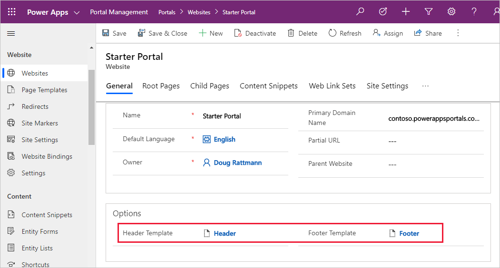

Liquid is an [open-source template language](http://liquidmarkup.org/?azure-portal=true) that you can use to add dynamic content to webpages. You can use Liquid code anywhere in Microsoft Power Pages where you can enter HTML or text content, including content in webpages, content snippets, and web templates. 

Liquid offers various language constructs that help build content, apply transformations, and control the implementation flow. The ability to access Microsoft Dataverse data by using FetchXML query language or directly retrieving table rows by identifiers makes Liquid the primary choice for building data-driven webpages. It also includes many special tags (or processing instructions) that specifically target the creation of reusable web templates. The following sections explain how you can use templates in Microsoft Power Pages websites.

## Templates

In Power Pages, a webpage row doesn't define how the rendered page looks on the website. Instead, it's linked to a **Page Template** row that defines the layout and behavior. 

The two types of templates that you can use in Power Pages websites are:

- **Rewrite** - These templates use server-side processing to implement specialized behavior that's required by some components and special pages, such as an error page, a sign-in page, and others. 

- **Web Template** - The linked layout template defines how the content of the page is rendered for output. 

**Rewrite** templates offer limited customizations. You can use Liquid template language as part of the content or inside content snippets, but the page layout and behavior are predefined.

Contrarily, the **Web Template** option is entirely template-based and uses Liquid to define how the content is rendered. Templates are flexible. A template can include other templates for parts of the content. A template can also be based on another template, extending the base functionality. The real power of web templates comes from the ability to contain Liquid code that adds processing capabilities to the static content, including access to Dataverse data.

> [!TIP]
> Web templates can also contain HTML, Cascading Style Sheets (CSS), and JavaScript.

You can use web templates to define an entire webpage, part of a page, or common elements such as the site header and footer. This approach creates a consistent appearance and behavior throughout the website and helps make it easier for you to modify the appearance and data that's rendered. The following example shows what a typical, simple template might look like:

```twig
<div class="container">
  <div class="page-heading">
    
    
  </div>
  <div class="row">
    <div class="col-md-12">
    
      

      
        
      
    
      
        
      

		
    </div>
  </div>
</div>
```

This simple template includes other templates to render common bits and pieces. It defines a content block that can be rendered differently by a derived template, and it renders Dataverse data by using related **List** and **Form** rows.

## Web templates as website headers and footers

You can use web templates to override the global header and footer that a Power Pages website uses. To accomplish this task, set the **Header Template** or **Footer Template** column of your website to the web template of your choice. 

> [!div class="mx-imgBorder"]
> [](../media/website-header-footer.png#lightbox)

If you override the **Header Template** column, your selected template assumes responsibility for rendering the primary navigation, sign-in/sign-out links, search interface, and so on, for your site interface elements that are normally handled by the default header template.

> [!TIP]
> If you don't specify a header or a footer template in the **Website** row, the default content is rendered. To remove a header or footer entirely, specify a blank template.
