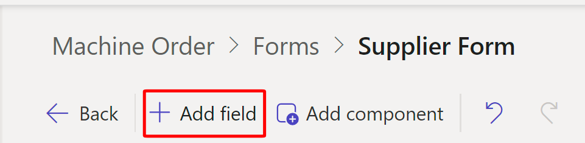

Power Pages uses Dataverse components. In this task, you'll modify a Dataverse form that you can use to create a form component on a webpage for the Machine Orders table so that suppliers who visit your website can view machine order details. 

1.  In the **Data** workspace, use the **Search** box to find and select the **Machine Order** table (it's in the **Other tables** area at first).
     
	> [!div class="mx-imgBorder"]
	> 

1.  Select the **Forms** tab and then select **Supplier Form** in the **Forms available for this table** section.     

	> [!div class="mx-imgBorder"]
	> 

1.  When the form has loaded, select **Add field**.

	> [!div class="mx-imgBorder"]
	> 

1.  From the **Table columns** pane, drag and drop or select the following table columns to add them to the form: **Comments**, **Supplier Order ID**, and **Estimated Ship Date**. Once done, your form has the same fields as the image below. 

	> [!div class="mx-imgBorder"]
	>  

1.  Select the **Machine Name** field and then select the **Read-only** checkbox in the **Properties** pane to the right.

	> [!div class="mx-imgBorder"]
	>  

1.  Repeat the previous step for the following fields: **Price**, **Comments**, and **Approver**. Feel free to rearrange the fields and hide the owner field if desired. 

	> [!div class="mx-imgBorder"]
	> 

1.  In the upper-right corner of the studio, select **Save > Publish form**.

	> [!div class="mx-imgBorder"]
	>  