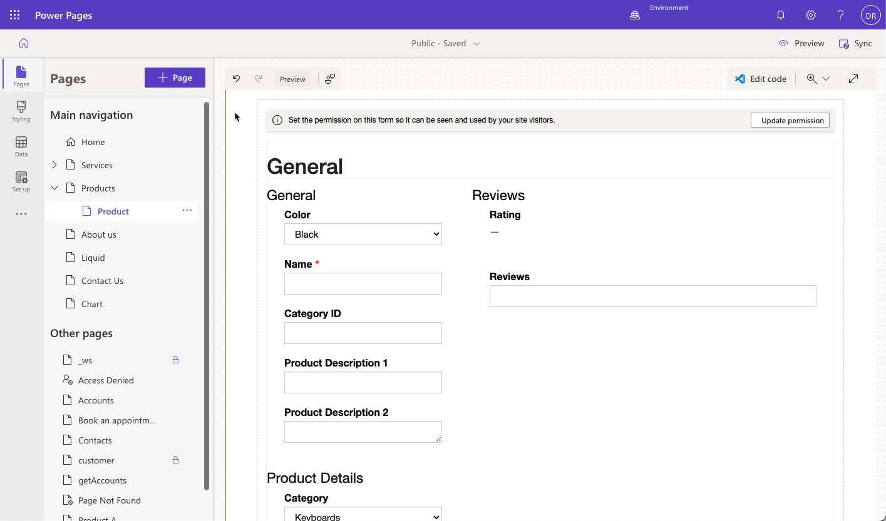

The purpose of this exercise is to provide you with hands-on experience in adding a list and a form to a Power Pages website.

## Learning objectives

The objective of these exercises is to help you learn how to:

- Add a list component to a webpage.

- Add a form component to a webpage.

- Set up the list component to drill down and view details of the row.

### Prerequisites

The prerequisites for completing these exercises include:

- Access to the Power Apps maker portal.

- Default sample Microsoft Dataverse apps and data (optimally); however, you can use other Dataverse tables with data.

- A provisioned Power Pages website. If you don't have a provisioned website, go to [Create a site with Power Pages](/power-pages/getting-started/create-manage/?azure-portal=true) to create one.

> [!TIP]
> The exercises work best when you have sample data to work with. When you provision a Dataverse environment, you can add sample apps and data. Review the [Create Environment](/power-platform/admin/create-environment#create-an-environment-with-a-database/?azure-portal=true) steps to provision a Dataverse environment with sample apps and data.

## Scenario

Your organization has provisioned a Power Pages website and wants to display a list of available products on a public webpage. Another requirement is to give visitors the ability to drill down and view other details.

## High-level steps

To finish the exercise, complete the following tasks:

- Create table permissions to allow read access to the Dataverse table.

- Create a webpage and add a list component that's linked to the Dataverse table.

- Create a child webpage with a form component to display details for the Dataverse table.

- Modify the list component to allow visitors to drill down and view the detail row on the form page.

### Create a table permission row

Access to any Dataverse table is controlled by table permissions. To allow read-only access to the Products table, follow these steps:

1. Sign in to [Power Pages](https://make.powerpages.microsoft.com/?azure-portal=true).

1. Select the target environment in the upper-right corner.

1. Locate your website and then select **Edit** to open Power Pages design studio.

1. Select the **Set up** tab.

1. Select **Table permissions** in the **Security** section.

   > [!div class="mx-imgBorder"]
   > 

1. Select **+ New permission** and then fill in the following information:

   - **Name** - Product

   - **Table** - Product (sample_product)

   - **Access Type** - Global

   - **Permission to** - Read

1. Select **Add roles** and then add **Anonymous Users** and **Authenticated Users**.

1. Select **Save**.

   > [!div class="mx-imgBorder"]
   > 

1. The sample product form might contain a subgrid with product reviews. To avoid receiving an "access denied" message for the product reviews subgrid, repeat steps 4-6 and create a Global Read table permission row for the Review table. 

### Create a webpage for the list

To create a webpage that contains the list component in Power Pages design studio, follow these steps:

1. Select the **Pages** tab.

1. Select **+ Page**.

1. Enter **Products** for the page name.

1. Make sure that the **Start from blank** page template is selected and then select **Add**.

### Add and set up a list component

To add and set up a list component, follow these steps:

1. On the page canvas, select the **List** component.

1. In the component properties dialog, enter the following values:

     - **Choose a table** - Product (sample_product) or choose another table from your own app

     - **Select the data views** - Active Products

     - **Name your list** - Product List

1. Select **Done**.

1. Select **Preview > Desktop** from the command bar and then make sure that a list of product data rows from Dataverse displays.

   > [!div class="mx-imgBorder"]
   > 

### Create a webpage for the form

Your next task is to create a webpage to contain the **Form** component to view row details. This webpage is a child page of the **Products** page.

1. Select the **Pages** tab.

1. Locate the **Products** page that you created previously.

1. Select the ellipsis (**...**) and then select **Add a new subpage**.

1. Enter **Product** for the page name.

1. Make sure that the **Start from blank** page template is selected and then select **Add**.

### Add and set up a form component

To add and set up a form component, follow these steps:

1. On the page canvas, select the **Form** component.

1. If prompted to select an existing form, select **New Form**.

1. In the component properties dialog, enter the following values:

   - **Choose a table** - Product

   - **Select a form** - Information

   - **Name your copy of the selected form** - Product Details

1. Select the **Data** tab and then set the **Data from this form** dropdown list to **Is read-only**. 

1. Select **OK**. The form preview should appear on the page canvas.

   > [!div class="mx-imgBorder"]
   > 

### Modify the list to navigate to the form component

Your final task is to modify the list page to navigate to the form component when a row is selected.

1. Select the **Pages** tab and then locate the **Products** page that contains the list component.

1. Select the list component on the canvas and then select **Edit list**.

1. On the **List settings** dialog, select the **Actions** tab.

1. Turn on the **View Record** toggle and then fill in the following information: 

     - **Target Type** - Form

     - **Form** - Product Details

1. Select **Done**.

1. Select **Preview > Desktop** from the command bar and then make sure that a list of product rows from Dataverse displays. The product names are now hyperlinks. 

1. Select a product name to view the details form.

> [!NOTE]
> If you receive the "You don't have the appropriate permissions" message for the product reviews subgrid, repeat steps in the **Create table permission row** task to create the Global Read table permission for the Review table. 

> [!div class="mx-imgBorder"]
> 
