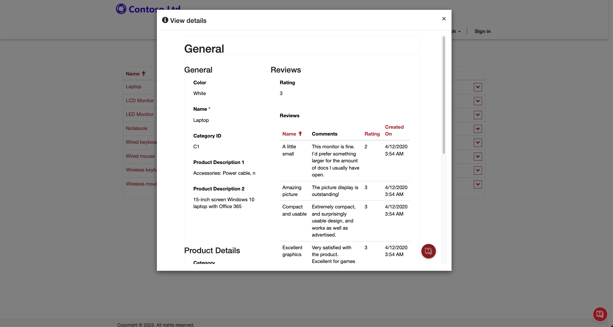
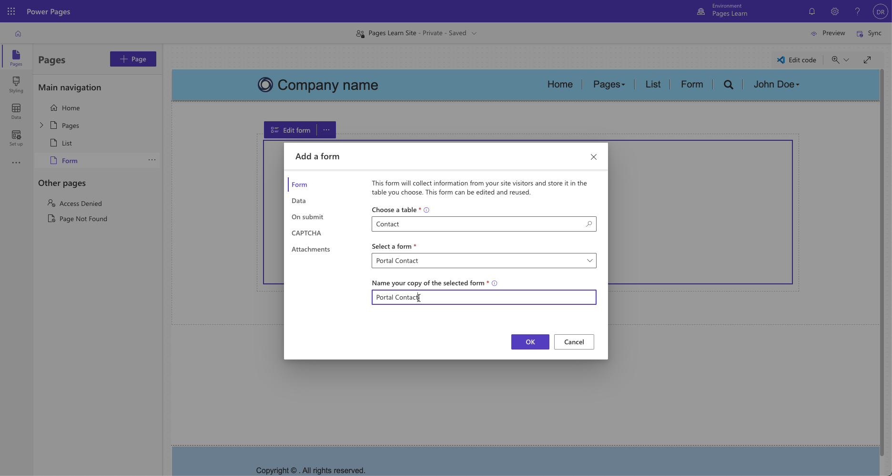
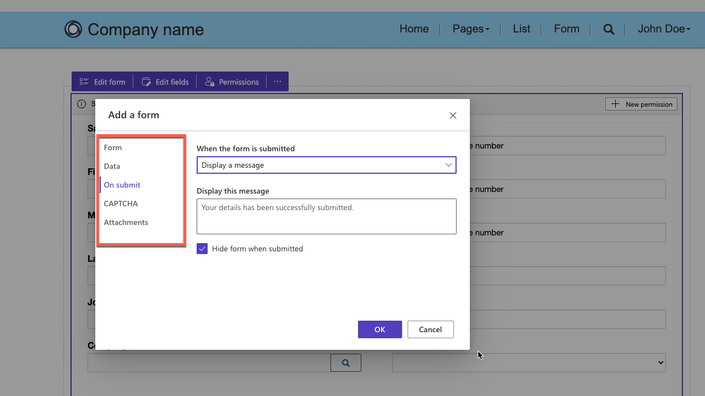
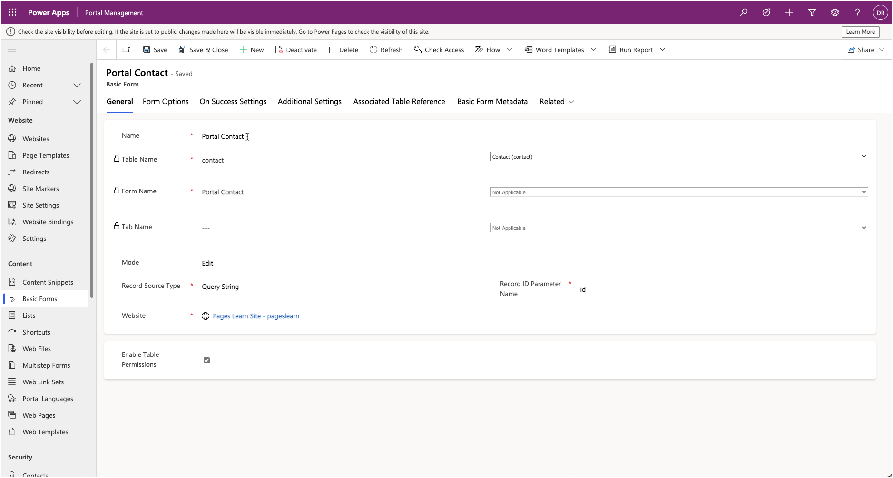
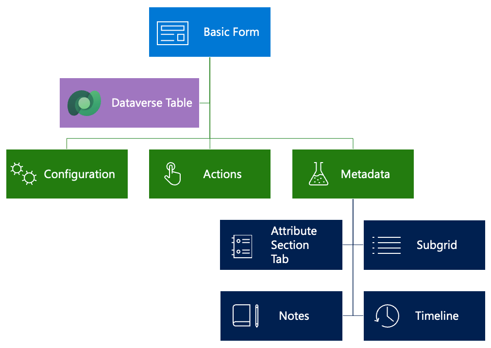
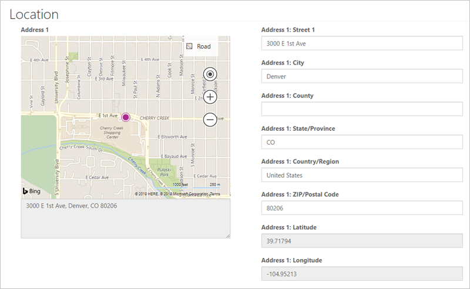

Forms add the ability for webpages to interact with rows in a specific table by using a model-driven form definition as a layout template. Similar to lists, forms are data-driven configurations that allow users to add a form to collect or display data on the website without the need for a developer to create a custom form. You can define forms by using model-driven forms and you can place them into webpages on the website.

Forms can display most column types and subgrids, a choices column type (see [Configure a choices column for Power Pages](/power-pages/configure/choices-column?azure-portal=true)), and code components (see [Use code components in Power Pages](/power-pages/configure/component-framework?azure-portal=true)).

> [!div class="mx-imgBorder"]
> [](../media/form-sample.png#lightbox)

## Common uses

The following table explains the common scenarios where you can use forms.

| Scenario | Description                                                  |
| -------- | ------------------------------------------------------------ |
| **Layout** | Set up and use forms in read-only mode as a layout mechanism. Think of forms as informational pages about employees, products, or any other Microsoft Dataverse table. For example, you might have a custom table in your Dataverse instance that describes open positions that are available within your organization. Instead of crafting a special template to render the page, you can create a separate model-driven form for the table, create a new webpage by using Power Pages design studio, and then add a **form** component to the page. Any published changes in a form layout in a model-driven app will automatically apply to the webpage. |
| **Information capture** | Use forms on the website for data capture from anonymous or authenticated users. For example, a simple lead form might be rendered on a **Contact Us** page to record anonymous requests as leads in Dynamics 365 Sales. For authenticated users, a website might use a survey page to collect product feedback from customers into a custom Product Feedback table. |
| **Record management** | Forms allow various combinations of create, retrieve, update, and delete (CRUD) operations on a table to be defined within a set of related webpages. For example, customers can retrieve and read their own cases and create new ones, partners can edit their company profiles, and employees can view the list of assets that are allocated to them by the company. |
| **Web apps** | When you use forms with lists and subgrids, and with the functionality extended by JavaScript, they allow developers to build complete web applications. |

## Create a form

When you're creating a new form, your first step is to decide the **Table** and **Form** that you're rendering. While reuse of forms that are part of a model-driven app is possible, the common practice is to design Power Pages-specific, model-driven forms (that might or might not be included in the model-driven apps). 

> [!div class="mx-imgBorder"]
> [](../media/form-create.png#lightbox)

- Power Pages forms are more concise with less information presented, especially when external audiences are involved.

- Power Pages processes are separate from the internal use of a staff-facing, model-driven app (including Dynamics 365 apps). Dedicated forms are easier to maintain because you need to manually apply changes in the model-driven apps to the Power Pages forms, giving you an opportunity to review the requirements and assess usability aspects.

- Certain limitations exist on the form and columns that are rendered. For more information, see [About forms](/power-pages/configure/basic-forms?azure-portal=true).

- Client-side business rules and JavaScript, which are essential parts of a model-driven form, won't run on the Power Pages website. This factor is easy to overlook and might result in unintended consequences. 

- Special considerations need to be given when you're rendering related rows, notes, and a timeline because not all functional aspects are supported (or required) on the website.

### Mode

You can select the form mode on the **Data** tab of the form properties dialog. The form mode defines if the form is used to generate a layout, capture the data, or provide full editing capabilities for Dataverse rows. The form mode can be any of the following options:

- **Read Only** - Power Pages design studio refers to this option as **is read-only**.

- **Insert** - Design studio refers to this option as **Create a new record**. 

- **Edit** - Design studio refers to this option as **Update an existing record**.

> [!NOTE]
> A form that's in **Edit** mode will be rendered as **Read Only** if the user doesn't have write privileges for the row.

If the mode is **Insert**, no extra information is required. For **Read Only** and **Edit** modes, the form needs to "know" the table row to display and update. The **Record Source Type** setting defines how this information is passed to the form:

- **Query String** - This setting is default when you're creating a form in design studio. When a page that contains the form is displayed, the row identifier is expected to be part of the query string, such as `https://contoso.powerappsportals.com/contacts/edit/?id=<contact guid>`. Usually, this setting is done automatically when the form is linked to a list. This setting is the most common. 

- **Current Portal User** - You can set up this option within the Portal Management app. When you select this option, the form will load the information from the current website user row without using extra information from the page URL. Commonly, you'd use this option to render a user profile form. In this case, you'll need to set the **Table Name** column to **Contact** because website users are represented by the contact table.

- **Record Associated to Current Portal User** - You can set up this option within the Portal Management app. Selecting this option allows you to edit associated rows, such as the current user's parent account details. Make sure that you specify **Relationship Name** to identify the row to edit. The table type that's selected must match the selection in the **Table Name** column. This option is useful in partner scenarios where the partner organization would have multiple website users. You could authorize some of these users to edit the parent account row.

**Table**, **Form**, **Name**, and **Mode** are the required properties to render the form.

## Set up the form

More configuration options to control form appearance and behavior are available within design studio.

> [!div class="mx-imgBorder"]
> [](../media/form-settings.png#lightbox)

### Form tab

On the **Form** tab, you can select a **table**, a **form** for that table, and the form **name** (which you can't change after it's been created). 

### Data tab

On the **Data** tab, you can change the **form mode**. 

### On submit tab

The **On submit** setting determines the actions that are taken when the form is successfully submitted:

- **Display a message** - Shows a message when the form is submitted.
- **Redirect to webpage** - Automatically navigates to a webpage on success of the form submission.
- **Redirect to URL** - Redirects to a URL (website or external).

### CAPTCHA tab

The **CAPTCHA** feature determines if a captcha should be displayed for anonymous or authenticated users. 

### Attachment tab

On the **Attachment** tab, you can select whether a user can upload files, and you can specify maximum attachment size and restrictions on the file types.

## Other form settings

More configuration settings are available for forms in the Portal Management app. To access a form in the Portal Management app, follow these steps:

1. Select the form component on the page in the Power Pages design studio.

1. Select the **Edit form** command. 

1. In the **Form settings** dialog, select the **Data** tab.

1. Select **Open Portal Management App** under the **Configurations** heading.

> [!div class="mx-imgBorder"]
> [](../media/form-metadata.png#lightbox)

Forms can include **Actions** for the user to interact with the row. Detailed configurations for each form element are available by using more **Form Metadata** rows.

> [!div class="mx-imgBorder"]
> [](../media/form-overview.png#lightbox)

### Configuration

The following sections describe the different ways that you can set up forms by using the Portal Management app.

#### Form options

Most form options support customization of the Cascading Style Sheets (CSS) elements to change visual appearance. You can specify text elements, such as labels, messages, and tooltips, in multiple languages. For example, the default message after the form submission is "Saved," but you can customize it for each enabled website language.

Another form option includes **Control validation behavior**, where you can determine whether to mark all columns as required regardless of the form setting, for example.

#### Other settings

More settings define other aspects of form behavior, such as styling, translation of the UI elements, and so on. 

> [!TIP]
> Some settings and configuration options are hidden. Select the **Advanced settings** checkbox to display all available options.

- **Associate current portal user on insert** - Use this option to keep track of which website contact has created or updated the row. This setting creates a website equivalent of the **Created By** and **Modified By** columns in Dataverse. You can also set parental relationships where applicable. For example, if a new account row is created, you might want to set the current contact as a primary contact automatically.

- **Add attach file** - Many options are available to add a file upload control to your form. Configuration is flexible and supports multiple files, storage options, MIME type, and size restrictions (for example, you can restrict uploads to images up to 2 MB in size). 

- **Geolocation** - You can set up a form to display a map control to display an existing location as a pin on a map or to provide a user with the ability to specify a location. The form's map control requires other configurations to tell it what the various location columns are, to assign values to them, or retrieve values from them. For more information, see [Geolocation configuration for forms](/power-pages/configure/add-geolocation?azure-portal=true).

> [!div class="mx-imgBorder"]
> [](../media/form-geolocation.png#lightbox)

#### Associated Table Reference

The **Associated Table Reference** feature provides a way to associate the current row that's being created or updated with another target row. This feature is useful if you have multiple steps with multiple table types and want to relate the resulting rows, or if the page is passed in a query string of a row ID that you want to associate. 

For example, you might have an event page that displays information about an upcoming webinar. You want to include a registration button that redirects visitors to the registration page where the registration form is displayed. You can pass the event identifier in a query string, and when the registration form is submitted, you'll be able to automatically link the registration information to the event.

### Actions

Because a form deals with an individual table row, you can run numerous actions against this row, such as Update, Delete, Deactivate, and so on. You can set up these actions, which at runtime are displayed as command buttons, by selecting **Additional settings > Action Button Configuration**. 

All commands include options to rename the buttons and change their placement on the form. 

### Form Metadata

**Form Metadata** rows allow you to control the appearance and behavior of individual form elements, including:

- Appearance of the columns, sections, and tabs. Additionally, you can define an individual column's default values, validation behavior, and other aspects.

- Subgrids configuration, which allows you to define actions for related rows, similar to table list actions.

- Behavior of notes and timeline sections and if you can add new rows. Commonly, you'd use this option to allow website users to enter comments about the row, for example, a case in process.

## Add a form to your website

A form defines the required behavior but doesn't contain information about how and where on the website the form should be rendered. Two methods to render a form on a website are:

- Specify the form explicitly as a target for a list action, such as Create, Update, or Edit. In this case, the form is rendered in a modal pop-up window. Certain limitations apply when the form is rendered in a pop-up window. For example, the ability to create related rows from subgrids isn't available.

- Add a form component to a webpage in the Power Pages design studio, as you would for a list. This action places a Liquid tag on the webpage copy to render the form.

   ```twig
   
   ```

Because forms can submit information back to the server for processing, you have less control over the rendering of forms as compared to the lists.
