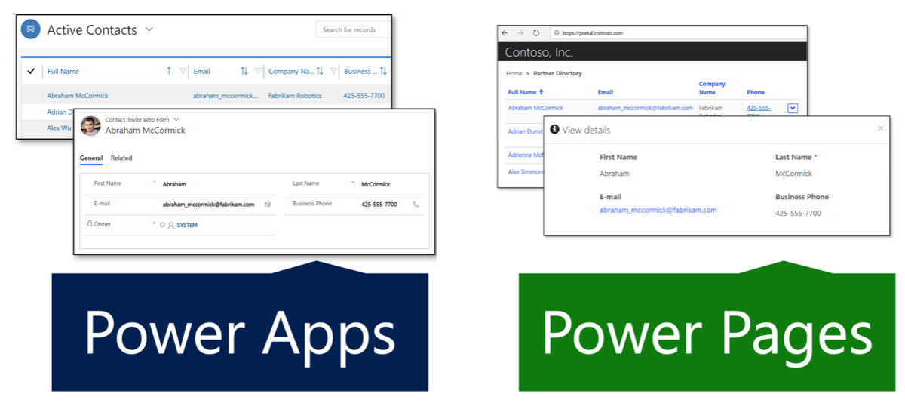

A typical use case of Microsoft Power Pages websites is to extend functionality from Microsoft Dynamics 365 applications, such as Dynamics 365 Sales or Dynamics 365 Customer Service, to internal and external audiences. The website templates that are based on Dynamics 365 apps offer built-in functionality to these audiences by adding features such as case life cycle, knowledge article access, partner opportunity management, and so on.

Additionally, Power Pages websites can extend Microsoft Power Apps applications that are built on Microsoft Dataverse. Then, they can display the data and business logic and make them available on your website to an external audience, based on user permissions. 

Consider the following scenarios:

- You have extended case management features of Dynamics 365 Customer Service. Your app now handles product warranties, return management authorization (RMA), refunds, and product replacements. You can extend the Customer self-service portal to bring this functionality to your customers, allowing them to register the warranty, make a claim, fill in an RMA form directly on the site, and so on.

- You have built a Power Apps app in Dataverse to track charitable donations, from individual and corporate donors, and fundraising campaigns. You can build a website to allow individuals to donate online and for employers to view and match their employees' donations.

- You use Dataverse to track the progress of your certification programs from the application process to the evaluation of various skill assessments to awarding a certification level to a candidate. You can set up a Power Pages website to allow online applications, provide access to update evaluations, and allow candidates to view their progress.

> [!NOTE]
> A Power Pages website can only access Dataverse data in the same instance where the website is provisioned. Connecting to multiple instances and accessing data across the instances or across the tenants isn't supported.

Using model-driven apps from Power Apps is a low-code approach that can help you build unique line-of-business applications. For more information, see [Overview of building a model-driven app with Power Apps](/power-apps/maker/model-driven-apps/model-driven-app-overview?azure-portal=true)). Part of the app creation process is to define the model and UI elements, such as views and forms. For more information, see [Understand model-driven app components in Power Apps](/power-apps/maker/model-driven-apps/model-driven-app-components/?azure-portal=true)). 

Power Pages websites extend these UI elements to the web by using the following data-aware components:

- **Lists** - Define how the list of Dataverse rows is displayed on the website pages. They're defined by one or more model-driven app table views and include functionality such as filtering and sorting.

- **Forms** - Add the ability for the website pages to interact with the rows in a specific table by using a model-driven app form definition as a layout template.

- **Multistep forms** - Render one or more model-driven app forms on a Power Pages website with support for a single or multi-step navigation and conditional branching logic.

> [!div class="mx-imgBorder"]
> 
