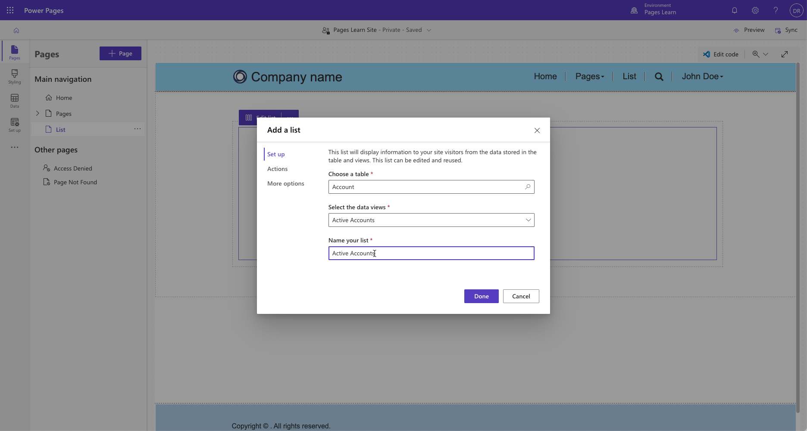
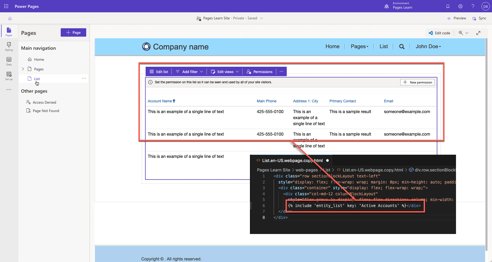
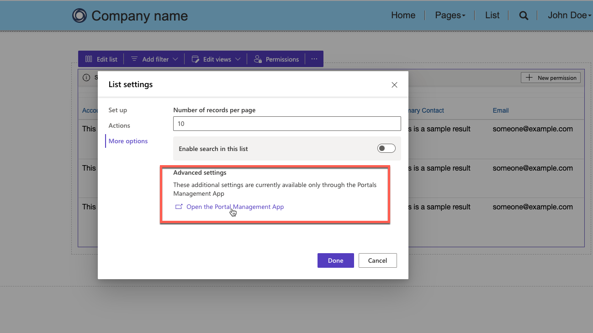
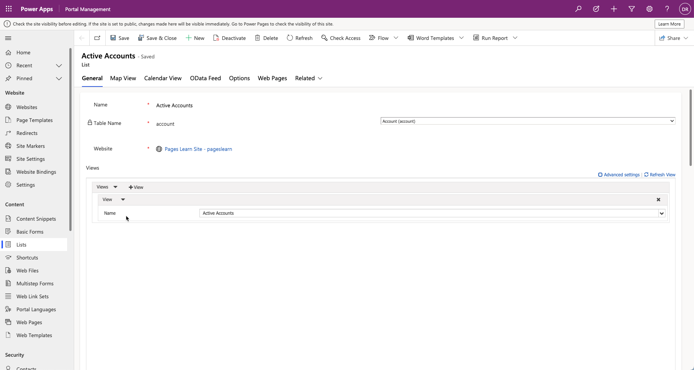
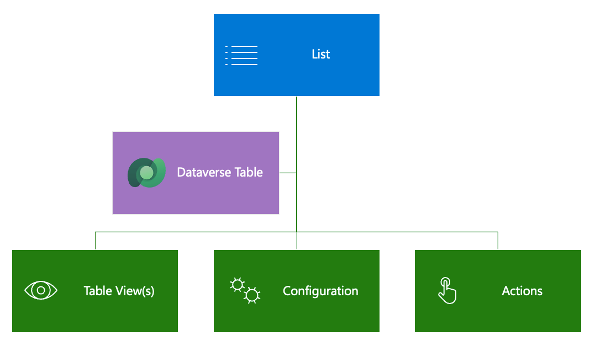
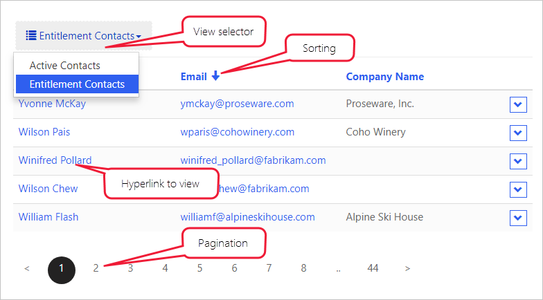
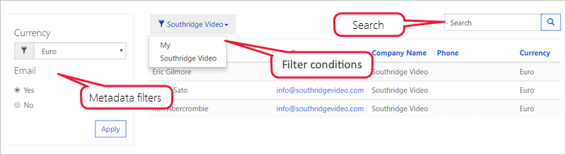
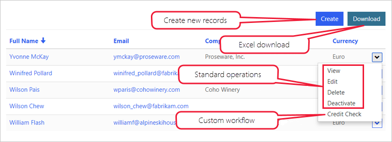

The **List** component allows a maker to display a list of Microsoft Dataverse rows on a webpage by using configuration only. You can define lists by using model-driven app views, and you can further set up lists to filter data based on table permissions. Lists can have more features enabled, such as running workflows and navigating to show detail rows. 

## Create a list 

You can add a list as a component to a webpage in Power Pages design studio. When placing the list component on a page, you'll need to select an existing list or set the properties of the new list. A list can be as simple or as complicated as your business requirements specify. The only required properties for the list are the target **table**, one or more **data (table) views**, and the **list name**.

> [!div class="mx-imgBorder"]
> [](../media/list-design-studio.png#lightbox)

### List rendering

Adding a list component in Power Pages design studio adds the corresponding Liquid tag to the webpage content.

When the webpage is requested, the list rendering process is as follows:

1. The webpage is retrieved.

1. The webpage renders the list based on the Liquid tag that was added when the list component was added to a webpage.

    ```twig
    
    ```
    
    > [!div class="mx-imgBorder"]
    > [](../media/list-liquid-tag.png#lightbox)

## Set up the list

Power Pages design studio provides a modern interface for creating and setting up a list where you can complete the following tasks:

- Define name, table, and views for the list on the **Set up** tab of the **List settings** window.

- Enable create, view, edit, and delete operations on the table rows and define how they're implemented (form, webpage, or URL) on the **Actions** tab.

- Set up the list filters by using table columns (the **Add filter** command on the list menu).

- Allow visitors to download the data that's displayed in the list (the setting on the **Actions** tab).

- Change the number of rows for each page on the **More options** tab.

- Enable search within the list on the **More options** tab.

Additionally, you can customize all list features and properties by using the Portal Management app. To access the list in the Portal Management app, follow these steps:

1. Select the list component on the page in the Power Pages design studio.

1. Select the **Edit list** command. 

1. On the **List settings** dialog, select the **More options** tab.

1. Select **Open the Portal Management App** under the **Advanced settings** heading.

   > [!div class="mx-imgBorder"]
   > [](../media/list-more-options.png#lightbox)

The list that you previously created in Power Pages design studio will open.

> [!div class="mx-imgBorder"]
> [](../media/list-portal-management-app.png#lightbox)

Lists are highly configurable and have many settings that define the list behavior. Lists can also include actions for the user to interact with the items on the list.

> [!div class="mx-imgBorder"]
> [](../media/list-overview.png#lightbox)

The following sections explain the most common features and settings of lists. 

> [!NOTE]
> Most options that add interactive elements, such as buttons, support customization of the elements in multiple languages. For example, if multiple views are enabled, you can customize the name for each of the views in the view selector for each of the enabled website languages.

### Views

Selected view(s) define the Dataverse table columns, list layout, and the default sort order. 

- **Multiple views** - If more than one view has been specified, a drop-down list is rendered to allow the user to switch between the views. 

- **Sorting and pagination** - Sorting is enabled on the displayed columns and the page size is configurable.

> [!div class="mx-imgBorder"]
> [](../media/list-features.png#lightbox)

### Configuration

The following sections describe the different types of configurations that are available in lists.

#### Filter and search

Lists provide you with several options to filter and search list data:

- **Search** - When search is enabled, the website renders a text search box. It's similar to the quick search feature in model-driven apps. Quick search runs across the view columns and allows you to locate the information within the larger lists by using plain text input. Website users can use the asterisk wildcard character to search on partial text.

- **Filters** - You can filter rows in the list on any list columns, including ranges, lookups, choice(s) column values, and custom FetchXML expressions. Website users have access to an interactive filtering panel when the list is rendered. 

> [!IMPORTANT]
> In the Portal Management app, **filters** are called **Metadata filters**.

> [!div class="mx-imgBorder"]
> [](../media/list-features-filtering.png#lightbox)

- **Filter conditions** - You can filter the list data by the current website user, the current website user's parent account, and the current website. This feature, which is configurable in the Portal Management app, enables some common scenarios without needing more setup:

    - List of product reviews that are left by the current user

    - List of campus buildings for the current user's department (account)

    - List of all draft pages for the current website, only when multiple websites are provisioned 

If the current website user and current website user's parent account filters are enabled, Power Pages will render a drop-down list so that the user can view their own data (**My**) or their parent account's data (account name will be displayed).

### Actions

You can associate actions with lists to enable commands for each list, such as **Create** and **Download** (as a Microsoft Excel spreadsheet), or commands for each row, such as **View** or **Edit**, and to trigger workflows.

> [!div class="mx-imgBorder"]
> [](../media/list-features-commands.png#lightbox)

For more information, see [Lists overview](/power-pages/configure/lists?azure-portal=true).

Now that you've reviewed how the lists are built and rendered, you can learn how Power Pages can display and interact with individual data rows.
