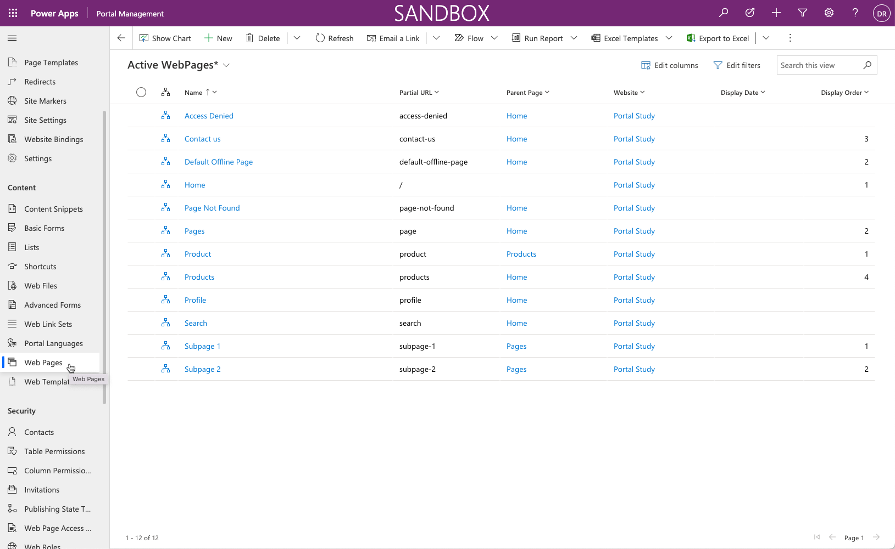
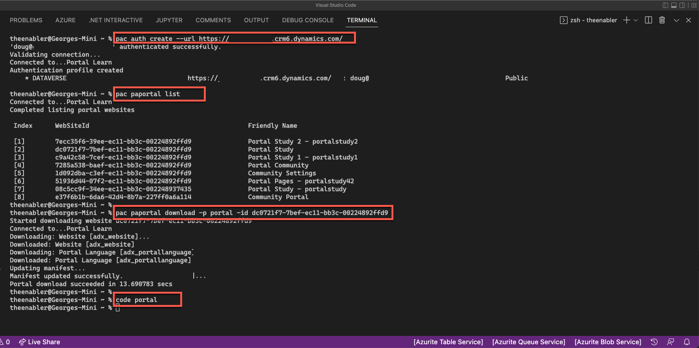
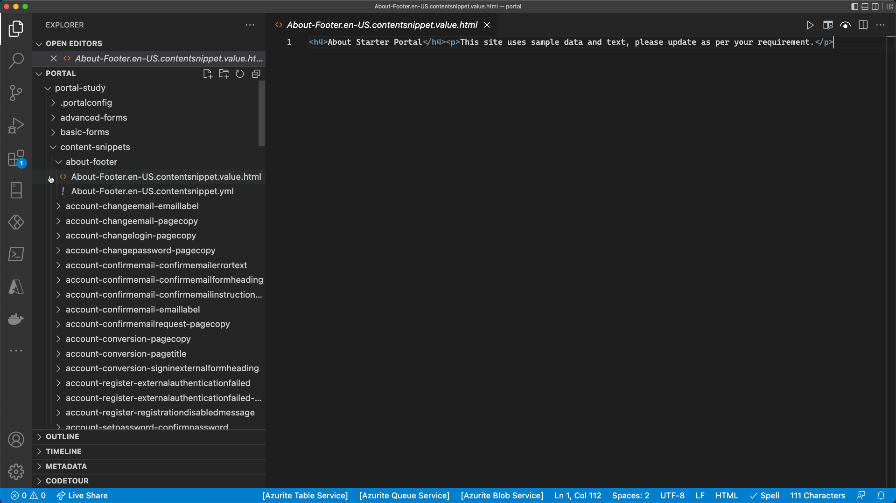
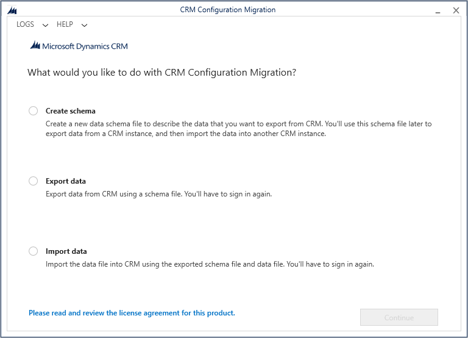
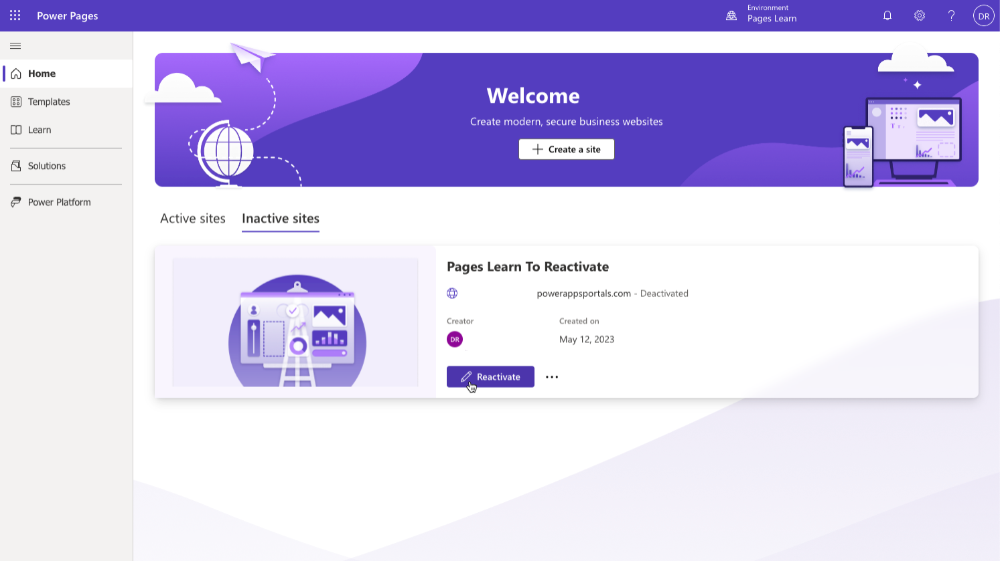

## Development life cycle

Application lifecycle management (ALM) is important as the applications that your organization builds become more complex and more of your company depends on their stability.

If you create a model-driven app from Microsoft Power Apps, a Microsoft Power Automate flow, or any other object to address a business requirement in a Microsoft Dataverse environment, you would typically contain these assets in a Dataverse solution and then export the single solution file from one environment to another. You can also unpack the solution file into discrete file components and then upload it to a source control system (such as Microsoft Azure DevOps) that will maintain a repository of the solution and track the various changes. Microsoft and its community provide many tools to automate the ALM process.

For more information, see [Application lifecycle management (ALM) with Microsoft Power Platform](/power-platform/alm/?azure-portal=true).

## Website content

Power Pages website content, also referred to as website metadata, is stored directly within Dataverse. When you provision a Power Pages website, the template that you choose will populate many Power Pages-specific Dataverse tables with data that describes the website structure, navigation, webpages, content, list and form configurations, table permissions, and so on. As you set up the website by using Power Pages design studio or other tools, you're changing or adding to the website content.

> [!div class="mx-imgBorder"]
> 

The challenge is determining how to move the website content from one environment to another because you can't include table rows in a Dataverse solution file. Model-driven apps from Power Apps have built-in features to export and import data; however, these features work for a single table and must be sequenced based on data relationships.

Website content is stored in several interconnected, unique tables. Additionally, functionality is built into the Power Pages solutions, which is triggered when rows are created. For instance, when a webpage row is added to the website, a corresponding webpage row is created for each provisioned language. Using an import tool in this scenario might inadvertently duplicate webpage rows.

## Tools
To move website content between environments, you can use tools that are available from the community and Microsoft.

### Microsoft Power Platform CLI

[Microsoft Power Platform CLI](/power-platform/developer/cli/introduction) (command-line interface) is a simple, one-stop CLI that empowers developers and ISVs to perform various operations in Microsoft Power Platform that are related to environment life cycle, authentication, and work with Microsoft Dataverse environments, solution packages, websites, code components, and so on. 

Microsoft Power Platform CLI enables continuous integration/continuous deployment (CI/CD) for the website configurations. You can now commit the website configuration data to source control and move it to any environment by using Microsoft Power Platform CLI.

Features and capabilities that Power Pages benefits from with the support of Microsoft Power Platform CLI include:

- Download/upload website configuration data to/from the local file system

- Track changes to website configuration by using a source control system

- Move website configurations across organizations or tenants

- Set up CI/CD pipelines more easily

To quickly test Microsoft Power Platform CLI capabilities, follow these steps:

1. Open **Visual Studio Code**. If you don't have Visual Studio Code installed, follow the [Setting up Visual Studio Code](https://code.visualstudio.com/docs/setup/setup-overview) instructions that are applicable to your platform.

1. Select **View > Extensions**.

1. Search for **power platform**. Locate and select **Power Platform Tools**.

1. Select **Install**.

1. Select **Terminal > New Terminal**.

1. Enter `pac auth create --url https://yourorg.crm.dynamics.com`. This command opens a browser window to authenticate and create an authentication profile for you to use.

1. Enter `pac paportal list` to list all websites in your Dataverse environment. Select and copy the **WebSiteId** value of the website that you want to download.

1. Enter `pac paportal download -p portal -id paste-websiteid-here` to start downloading the website data into the **Portal** folder.

1. Enter `code portal` to open the folder with the downloaded data in an editor window.

   > [!div class="mx-imgBorder"]
   > 

1. Browse the website source in the editor window. 

   > [!div class="mx-imgBorder"]
   > 

1. When you're done, close the editor. If you need to remove the folder that you created during the download, enter `rm -r portal` in the terminal window.

This tooling is a step toward a comprehensive application lifecycle management (ALM) story where the enterprise developers and ISVs can create, build, debug, and publish their extensions and customizations quickly and efficiently. For more information, see [What is Microsoft Power Platform CLI?](/power-platform/developer/cli/introduction?azure-portal=true) and  [Power Platform CLI support for Power Pages](/power-pages/configure/power-platform-cli?azure-portal=true).

### Microsoft Power Platform Build Tools for Azure DevOps

If your organization uses Azure DevOps as part of ALM, you can use Microsoft Power Platform Build Tools to automate common build and deployment Microsoft Power Platform-related tasks in Azure Pipelines. Microsoft Power Platform Build Tools includes the following tasks for Power Pages-specific functions.

- **Power Platform Download PAPortal** - Download Power Pages website content from the current Dataverse environment.

- **Power Platform Upload PAPortal** - Upload Power Pages website content to the current Dataverse environment.

For more information on using Azure DevOps for application lifecycle management (ALM), see [Microsoft Power Platform Build Tools for Azure DevOps](/power-platform/alm/devops-build-tools/?azure-portal=true). For more information about Power Pages management task description and syntax, see [Build Tools tasks for Power Pages management](/power-platform/alm/devops-build-tool-tasks?azure-portal=true#power-pages-management-tasks). 

### GitHub actions

Similar to Microsoft Power Platform Build Tools tasks, you can use GitHub actions if your organization uses GitHub as part of application lifecycle management. 

For more information, see [GitHub Actions for Power Pages](/power-platform/alm/devops-github-available-actions?azure-portal=true#portal-tasks).

### Configuration Migration tool

The **Configuration Migration** tool is an application that you can run as a Windows desktop application or invoke as a PowerShell cmdlet. The tool can export and import a set of Dataverse rows and maintain the table relationships.  

> [!div class="mx-imgBorder"]
> 

> [!NOTE]
> The **Configuration Migration** tool is designed for smaller datasets (specifically configuration data, such as website content) and isn't suited for high-volume data migrations or integrations.

The **Configuration Migration** tool uses a schema file to determine which Dataverse tables to export to a data file. Microsoft has a predefined schema file for each website template to identify the specific website Dataverse tables.

After you've set up your Power Pages website configuration, you can run the **Configuration Migration** tool to export your website configuration to an XML file by using the schema that corresponds to your template.

Ideally, the website configuration file should be uploaded to a source control repository where the changes can be tracked and used to deploy to other environments.

You'll also need to deploy configuration changes that are made to Dataverse, such as new tables and model-driven forms and views that are used by website lists and forms. You would move this configuration by using *solutions*. For more information, see [Solutions Overview](/power-apps/maker/common-data-service/solutions-overview/?azure-portal=true).

On your destination environment, you can run the **Configuration Migration** tool to import the website configuration file to update the website configuration.

> [!CAUTION]
> Using the **Configuration Migration** tool will copy over and overwrite the existing website configuration. Situations could arise where content is specific to the environment (for example, hyperlinks to specific URLs). After the data has been migrated, you might need to update some content directly in the destination website.

### Create a new website with migrated data

When you import the website configuration data into another environment for the first time, an inactive website record is created. 

To activate the migrated website, on the Power Pages home screen in the target environment, select the **Inactive sites** tab, select **Reactivate** for the target website, and then specify the new website name and a new web address when prompted.

> [!div class="mx-imgBorder"]
> 

For more information, see [Migrate Power Pages website configuration](/power-pages/admin/migrate-site-configuration?azure-portal=true).
