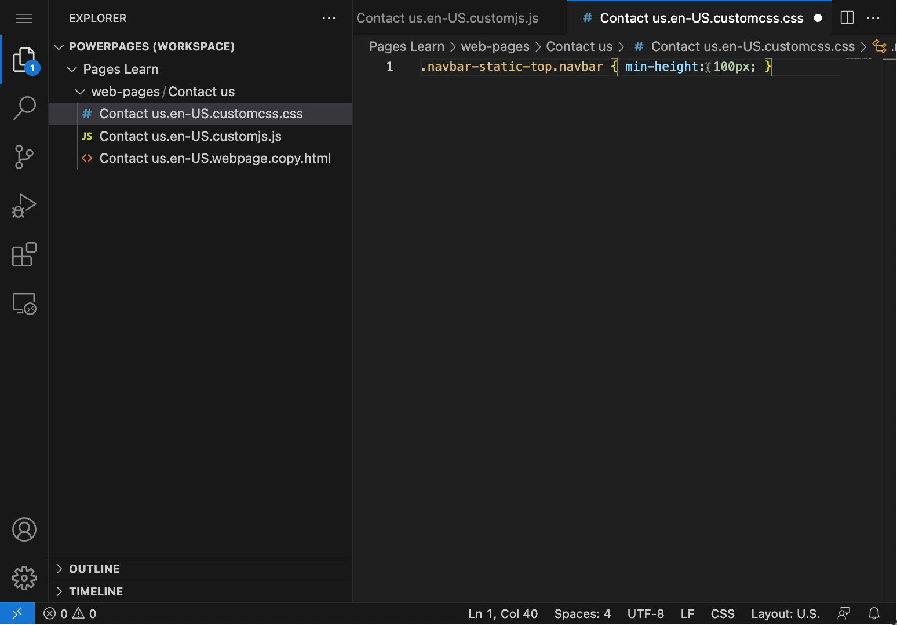
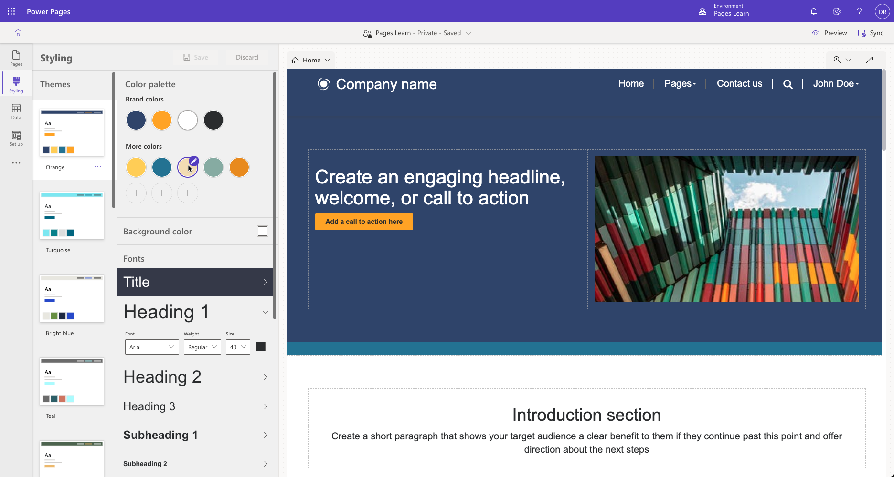
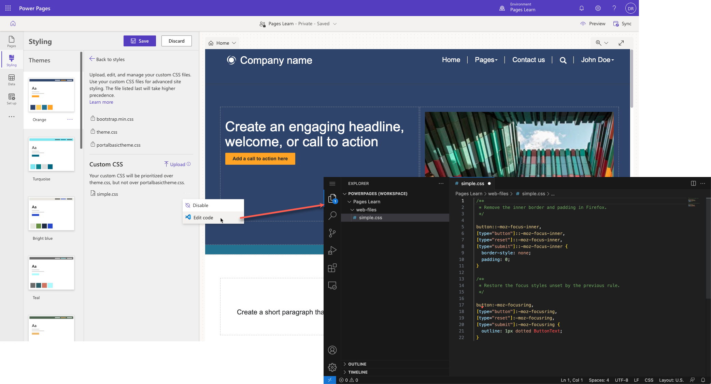
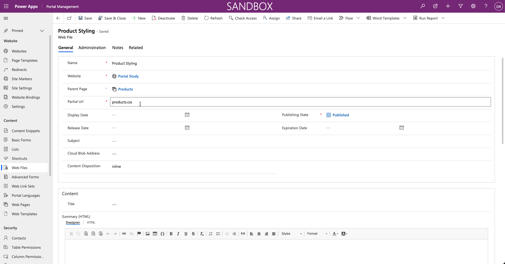
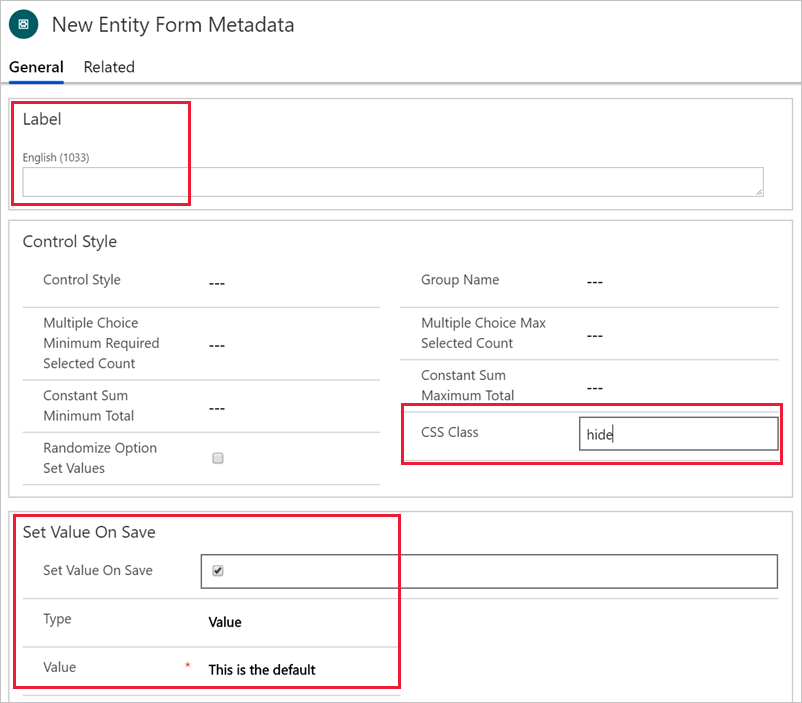

Cascading Style Sheets (CSS) is a language that determines the style of a webpage by describing how its HTML elements are to be displayed, including text, fonts, colors, backgrounds, borders, and margins.

Changing the style of your website pages can be as simple as applying CSS statements directly to a page. When you edit the page content by using Visual Studio Code, CSS is available as a separate file. That file is included as part of the page content, and CSS applies to that page. For example, if you need to increase the height of the upper navigation bar on a home page to fit a logo, you can edit the CSS file and then add a custom CSS statement.

```css
.navbar-static-top.navbar { min-height: 100px; }
```

> [!div class="mx-imgBorder"]
> [](../media/page-css.png#lightbox)

> [!NOTE]
> CSS statements that are added to a webpage will apply to that webpage only.

This approach works for small adjustments on a single page, but a better approach is to record customizations in one or more CSS files and then apply them to the entire website or parts of it.

## Power Pages themes

Power Pages uses the [Bootstrap front-end framework](http://getbootstrap.com/?azure-portal=true) to control the design and layout of the website. Bootstrap is a package of HTML and CSS design templates for typography, forms, buttons, navigation, and other elements, including optional JavaScript extensions. One appealing, out-of-the-box feature of Bootstrap is that it offers responsive layout; it automatically adjusts your website so that it has a pleasing appearance on all devices from small phones to large desktops.

A theme determines the appearance of all pages on your website to ensure visual consistency. It controls the navigational structure, the banner, colors and fonts, and other visual elements of a webpage.

You can implement Power Pages templates by using standard Bootstrap components with minimal core custom styles. As a result, you can take advantage of the customization options that Bootstrap provides to tailor the themes in a way that's applied consistently to the entire website.

## Apply customizations

Power Pages offers a comprehensive collection of themes and tools for designing your website. Select from several themes to use on your website and further personalize them by using the styling options.

The **Styling** workspace in Power Pages design studio controls what CSS styles are applied to the website, and it enables you to implement universal site designs. You can incorporate company branding modifications and view alterations in the app window's right-side preview. Styling provides multiple predesigned themes, and for each, you can modify the color scheme, background color, font types, button designs, and section spacing.

### Themes

Themes create an overall appearance and behavior for the site by defining styles for various text elements, buttons, links, and section layouts. If the site requires other customizations, you can use the **Manage CSS** feature.

In the **Styling** workspace, you can choose from the available themes. After selecting a theme, you can further customize individual elements to create the desired styling.

> [!div class="mx-imgBorder"]
> [](../media/theme-selection.png#lightbox)

### Manage CSS

To access the **Manage CSS** feature, select the ellipsis (**...**) menu and then select **Manage CSS** on the theme tile. 

All Power Pages websites have the following files already included on all pages: `bootstrap.min.css`, `theme.css`, and `portalbasictheme.css`. These files define styles for your entire website. You can upload more CSS files by using the **Upload** link and then editing in Visual Studio Code editor. For more information, see [Manage CSS files in Power Pages](/power-pages/configure/manage-css/?azure-portal=true).

> [!div class="mx-imgBorder"]
> [](../media/css-edit.png#lightbox)

Consider the following factors when determining how to approach style modifications for your website:

- Create complete styling for the entire site and then replace the content of a CSS file. This process works well if you have access to good designers who can ensure that all relevant elements are defined. This approach creates centrally controlled styling and ensures consistency throughout the website.

- Redefine only the elements that require modification, such as color and font size. Create and upload the CSS file that contains only these incremental adjustments. This process works well if your target design is close to the design that's included with the selected template and only minor styling modifications are required. This approach allows incremental modifications that can be undone.

> [!WARNING]
> If you decide to overwrite `bootstrap.min.css` or `theme.css` files, make sure that you download a backup copy of these files prior to replacing them. If your replacement CSS is invalid or incomplete, you might not be able to undo the replacement and will need to restore the content of these files if the website is rendered non-functional.

## Apply customizations to specific website areas

You can add customizations to specific pages or sections of your website by adding a **Web File** record by using the Portal Management app with a CSS file attachment. You need to specify the parent page in the **Web File** record so that the styles will be applied to the parent page and all descendants of that page. This approach makes it possible for you to build fully customized sections of your site.

> [!div class="mx-imgBorder"]
> [](../media/custom-theme-section.png#lightbox)

> [!IMPORTANT]
> The partial URL must end in **.css** for Power Pages to recognize it and apply it to the webpage and its child pages.

### Customize Bootstrap

The standard way to create a custom version of Bootstrap is [through the official Bootstrap site](http://getbootstrap.com/customize/#less-variables/?azure-portal=true). However, due to the popularity of Bootstrap, many other sites have also been created for this purpose. These sites might provide a user-friendly interface for Bootstrap customization or predesigned versions of Bootstrap for you to download. [The official Bootstrap customizer](http://getbootstrap.com/customize/?azure-portal=true) site has more information about Bootstrap customization.

> [!TIP]
> When you're customizing Bootstrap, only select elements that require modification. For example, if you want to replace the standard fonts with your corporate standard fonts, select the **Typography** component of Bootstrap. This approach will help reduce the chances of accidentally rewriting other CSS elements.

After you've customized Bootstrap, it will generate one or more files that you would want to upload as web files. Unless your intent is to completely *replace* the original styles, make sure that you avoid using `bootstrap.css`, `bootstrap.min.css`, `theme.css`, or `theme.min.css` files in your partial URLs because of Power Pages handling of CSS files.

### CSS for simple adjustments

CSS is often overlooked when simple adjustments are required, such as hiding the element or adjusting margins to fit a wide label. Bootstrap framework is the foundation of the styling in Power Pages websites, and it defines many styles that control appearance and multi-column responsive layout. For example, if you want to hide a particular column and submit a default value instead of collecting the user input, you can use **Table Form Metadata** for the column and then define the following parameters:

- Set **Label** to a single space.

- Set **CSS Class** to **hide**.

- Set the default value as required.

> [!div class="mx-imgBorder"]
> [](../media/hide-default.png#lightbox)

Instead of resorting to JavaScript, you can accomplish this task by using configuration only. Using CSS, where possible, has certain advantages:

- CSS applies on load; it's faster because you don't have to wait for the document to finish loading.

- CSS is always on and continues to apply to the relevant elements, even if JavaScript changes the document structure and adds or removes the elements.

- For certain tasks that are related to an element's visibility and responsive layout, CSS can be simpler to use than JavaScript, meaning less maintenance and less room for error.
