The purpose of this hands-on lab is to demonstrate how to add JavaScript code to a page to render data from Microsoft Dataverse as a chart by using an external charting library with the data that's retrieved from Dataverse by using portals Web API.

The exercises work best when you have sample data to work with. Depending on the environment that you're working with, you might want to install some sample data to assist with the exercises. Microsoft Power Platform provides you with the ability to add sample data as needed. If the environment that you're working in doesn't have sample data installed, follow the steps in the [Add or remove sample data](/power-platform/admin/add-remove-sample-data/?azure-portal=true) documentation to install the sample data into your environment.

## Learning objectives

The objective of these exercises is to help you learn how to:

- Set up site settings and table permissions to enable portals Web API requests.

- Add inline code to a content webpage to retrieve and transform the data by using the portals Web API.

- Use an external JavaScript library to plot the transformed data.  

## Prerequisites

For this exercise, make sure that the following parameters are set up in your environment:

- A provisioned Power Pages website. If you don't have a Power Pages website available, follow the instructions in the [Create a site with Power Pages](/power-pages/getting-started/create-manage/?azure-portal=true) documentation to create one.

- Access to the Power Pages maker home page.

## High-level steps

To finish the exercise, complete the following tasks:

1. Create site settings and table permissions that allow portals Web API read requests to the accounts table.

1. Create a content page and add JavaScript code that retrieves and transforms the data.

1. Add a charting library to the page and JavaScript code by using the library to build a graph with the retrieved data.

## Detailed steps
Follow the detailed steps to complete this lab.

### Enable portals Web API requests

This section will show you how to enable portals Web API requests to the **accounts** table. 

#### Create site settings
To create site settings, follow these steps.

1. Sign in to [Power Pages](https://make.powerpages.microsoft.com/?azure-portal=true) home.

1. Select the correct environment in the upper-right corner.

1. Select  the ellipsis (**...**) menu and then select **Portal management**.

   The Portal Management app will open in a new tab.

   > [!div class="mx-imgBorder"]
   > [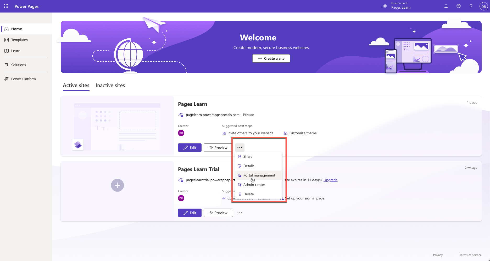](../media/portal-management-app.png#lightbox)

1. Select **Site Settings**.

1. Select **+ New** and then enter the following information:

    - **Name** - Webapi/account/enabled

    - **Website** - Select your website

    - **Value** - true

1. Select **Save**.

    > [!div class="mx-imgBorder"]
    > [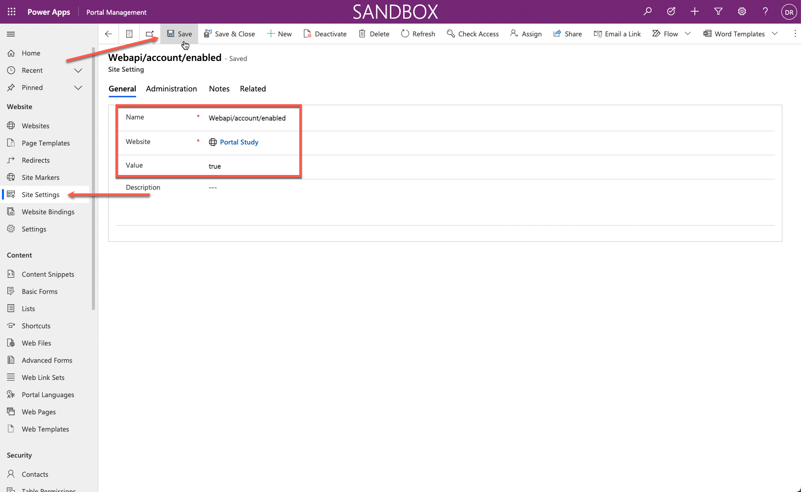](../media/site-settings.png#lightbox)

1. Select **+ New** and then enter the following information:

    - **Name** - Webapi/account/fields

    - **Website** - Select your website

    - **Value** - name,numberofemployees,revenue

1. Select **Save & Close**.

#### Create table permissions
To create table permissions, follow these steps.

1. Switch to Power Pages home.

1. Select **Edit** for the target website to open Power Pages design studio.  

1. Select the **Set up** workspace and then select **Table permissions**.

   > [!div class="mx-imgBorder"]
   > [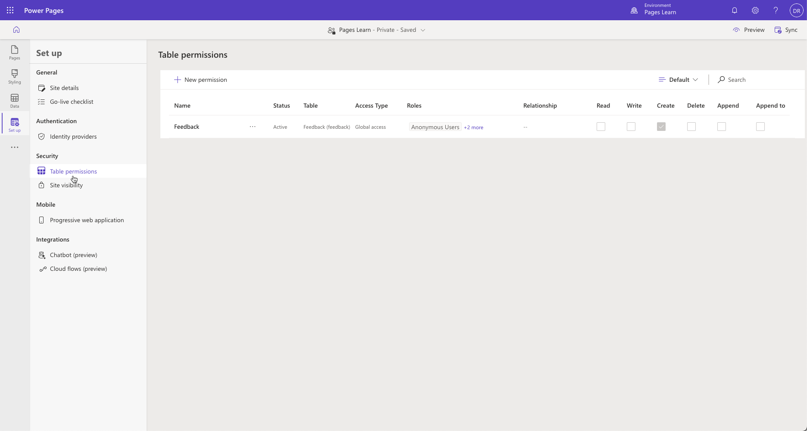](../media/table-permissions.png#lightbox)

1. Select **+ New permission** and then fill in the following information:

    - **Name** - Account

    - **Table** - Account (account)

    - **Access type** - Global

    - **Permission to** - Read

1. Select **Add roles** and then add **Anonymous Users** and **Authenticated Users**. 

1. Select **Save**.

   > [!div class="mx-imgBorder"]
   > [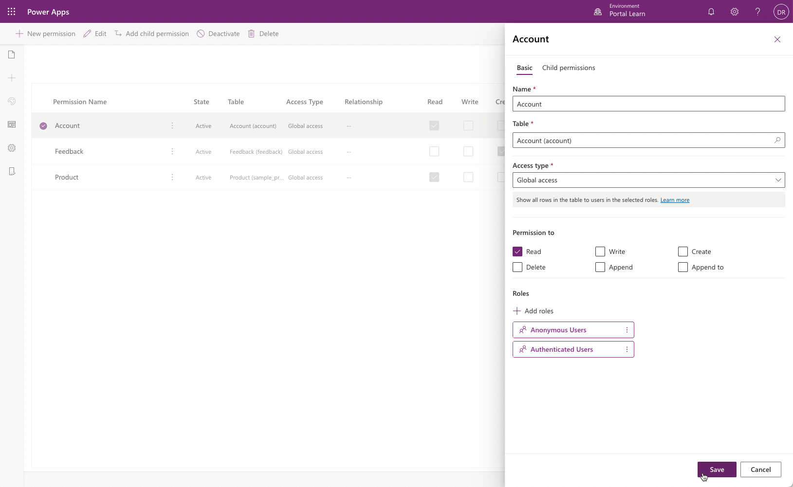](../media/global-read-accounts.png#lightbox)

#### Test the Web API
To test the Web API, open the following URL: `https://yourwebsite.powerappsportals.com/_api/accounts?$select=name,numberofemployees,revenue`

Your output should resemble the following image.

  > [!div class="mx-imgBorder"]
  > [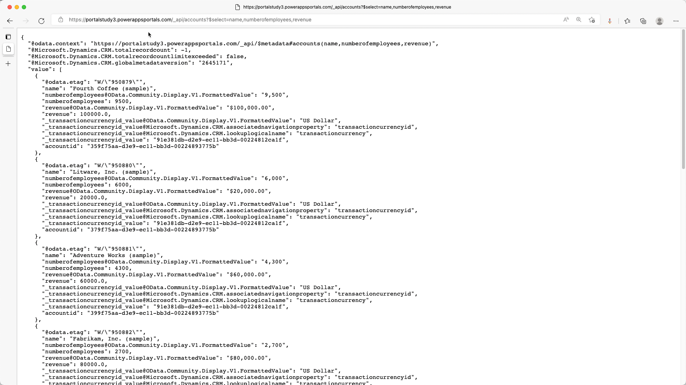](../media/output.png#lightbox)

### Create a content page and retrieve data

To create a content page and add JavaScript code that retrieves and transforms the data, follow these steps:

1. In design studio, select the **Pages** workspace then select **+ Page**.

1. Enter **Chart** as the **Page name**.

1. Make sure that the **Add page to main navigation** option is selected.

1. Select the **Start from blank** layout.

1. Select **Add**.

1. Select **Edit code**.

   > [!div class="mx-imgBorder"]
   > [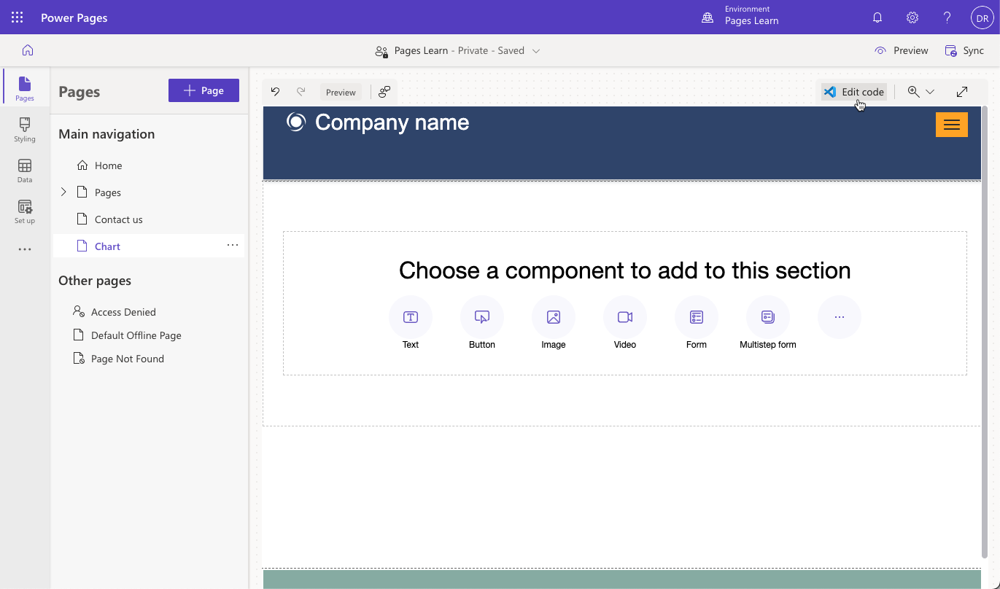](../media/new-page.png#lightbox)

1. In the pop-up dialog, select **Open Visual Studio Code**.

1. In the Visual Studio Code editor, select the **Chart.en-US.customjs.js** file.

1. Append the following script:

     ```javascript
     function makeChart(rawData) {
       // transform raw data into plotting array
       var rData = rawData.value.map(({
         name,
         revenue,
         numberofemployees
       }) => ({
         "x": numberofemployees,
         "y": revenue,
         "z": (!revenue) ? 1 : numberofemployees / revenue,
         "name": name
       }));
       console.log(rData);
     }
     // retrieve accounts data using portals Web API
     $(document).ready(function() {
       $.get('/_api/accounts?$select=name,numberofemployees,revenue', makeChart, 'json');
     });
     ```

1. Press the **Ctrl + S** keyboard shortcut (**⌘ + S** on Mac) to save the file.

      > [!div class="mx-imgBorder"]
      > [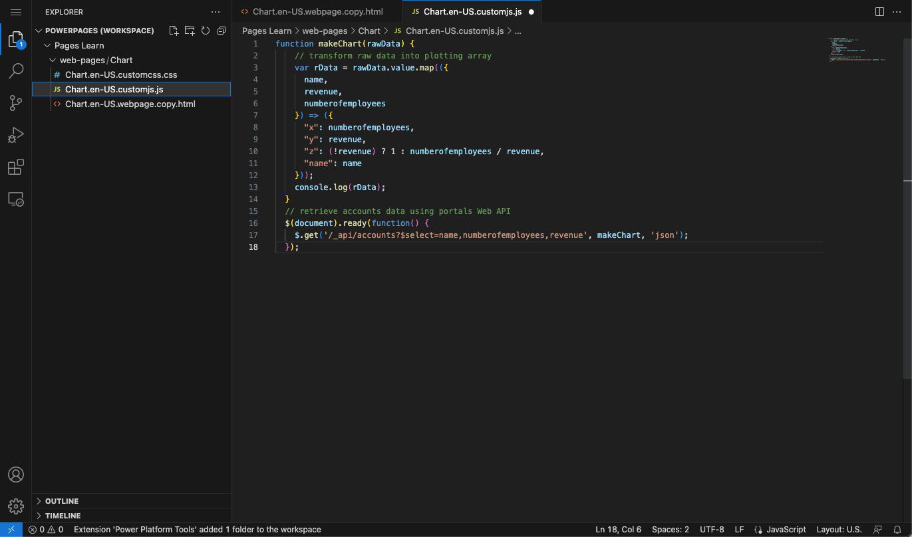](../media/retrieve-data.png#lightbox)

1. Close the **Visual Studio Code** tab. Select **Sync** when prompted to synchronize the changes.

1. Select **Preview > Desktop**.

1. When the page is displayed, press the **F12** key to display browser developer tools.

1. Verify that the console output contains the same data as previously retrieved, except that it's now showing as transformed.

   > [!div class="mx-imgBorder"]
   > [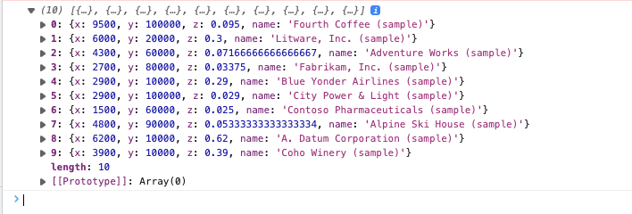](../media/data-transformed.png#lightbox)

1. The data structure is now prepared for plotting. Assign the appropriate labels to data points:

      - **name** - Company name

      - **x** - Number of employees

      - **y** - Company revenue in thousands

      - **z** - Revenue for each employee (calculated)

### Add external library functionality

This exercise uses Highcharts.js library (free for personal or non-profit use) to create a bubble chart based on the data.

1. Switch to design studio.

1. Select the page footer and then select **Edit code**.

1. In the pop-up dialog, select **Open Visual Studio Code**.

   > [!div class="mx-imgBorder"]
   > [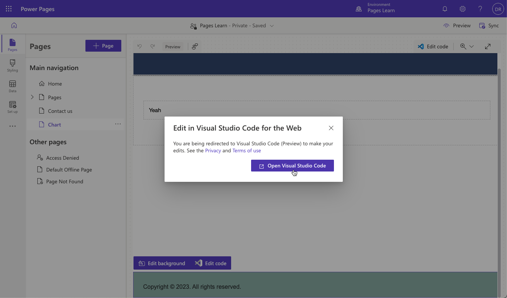](../media/footer-edit.png#lightbox)

1. Append the following code at the end of the file.

    ```html
      <script src="https://code.highcharts.com/highcharts.js"></script>
      <script src="https://code.highcharts.com/highcharts-more.js"></script>
    ```

1. Press the **Ctrl + S** keyboard shortcut (**⌘ + S** on Mac) to save the file.

1. Close the **Visual Studio Code** tab.

1. Select **Edit code** on the toolbar to open Visual Studio Code for the page.

1. Select the **Chart.en-US.customjs.js** file.

1. Modify the file to change the **makeChart** function as follows:

    ```javascript
    function makeChart(data) {
      console.log(data);
      var rData = data.value.map(({
        name,
        revenue,
        numberofemployees
      }) => ({
        "x": numberofemployees,
        "y": revenue,
        "z": (!revenue) ? 1 : numberofemployees / revenue,
        "name": name
      }));
      console.log(rData);
    
      // new code to plot the data
      Highcharts.chart($('.mychart')[0], {
        title: {
          text: "Customers efficiency"
        },
        legend: {
          enabled: false
        },
        xAxis: {
          title: {
            text: "Number of employees"
          }
        },
        yAxis: {
          title: {
            text: "Turnover ($K)"
          }
        },
        tooltip: {
          pointFormat: '<strong>{point.name}</strong><br/>Employed: {point.x}<br>Turnover ($K): ${point.y}',
          headerFormat: ''
        },
        series: [{
          type: 'bubble',
          data: rData
        }]
      });
    }
    
    // retrieve accounts data using portals Web API
    $(document).ready(function() {
      $.get('/_api/accounts?$select=name,numberofemployees,revenue', makeChart, 'json');
    });
    ```

1. Press the **Ctrl + S** keyboard shortcut (**⌘ + S** on Mac) to save the file.

1. Select the **Chart.en-US.webpage.copy.html** file.

1. Insert the following code into the inner `<div>` element:

      ```html
        <figure>
          <div class="mychart"></div>
        </figure>
      ```

1. Press the **Ctrl + S** keyboard shortcut (**⌘ + S** on Mac) to save the file.

    > [!div class="mx-imgBorder"]
    > [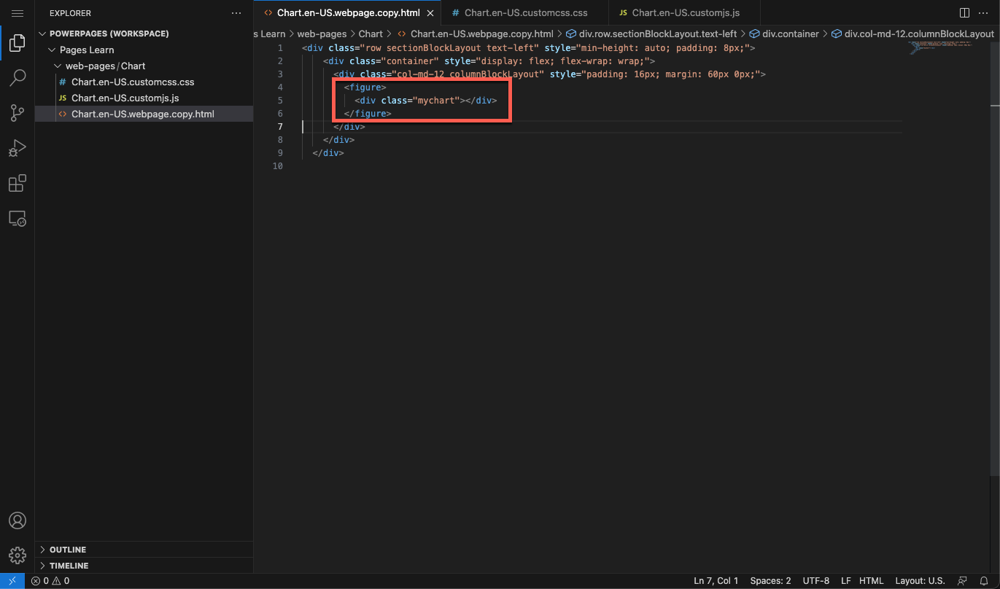](../media/page-content.png#lightbox)

1. Close the **Visual Studio Code** tab then select **Sync** to synchronize the changes.

1. Select **Preview > Desktop**.

1. The output should now include the bubble chart. Hover your cursor over the bubbles to verify the data.

> [!div class="mx-imgBorder"]
> [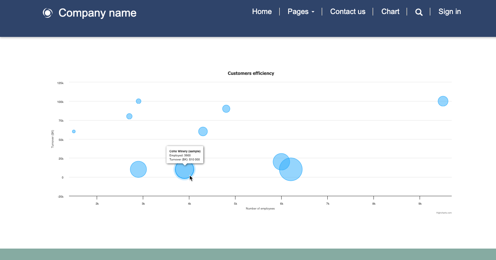](../media/chart.png#lightbox)
