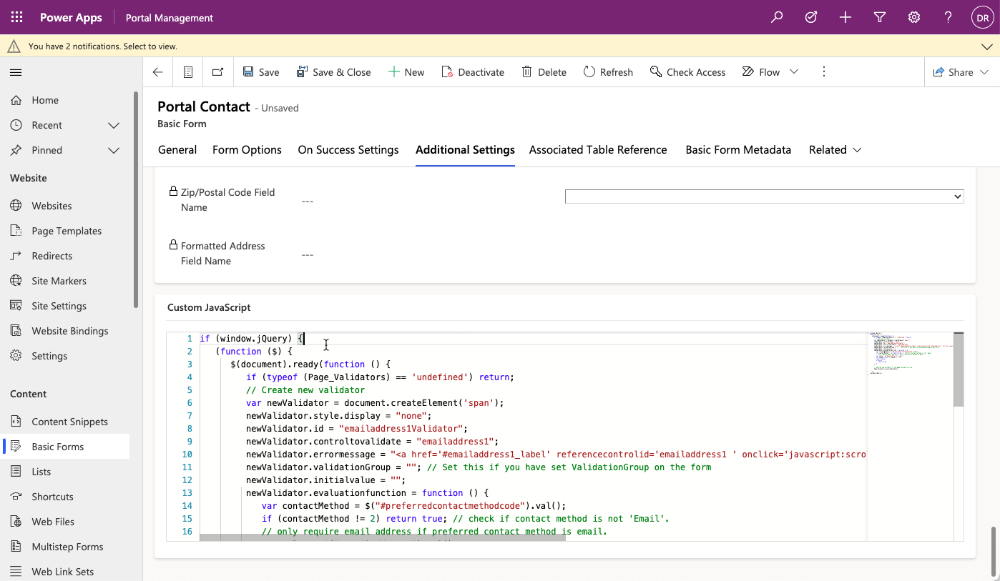
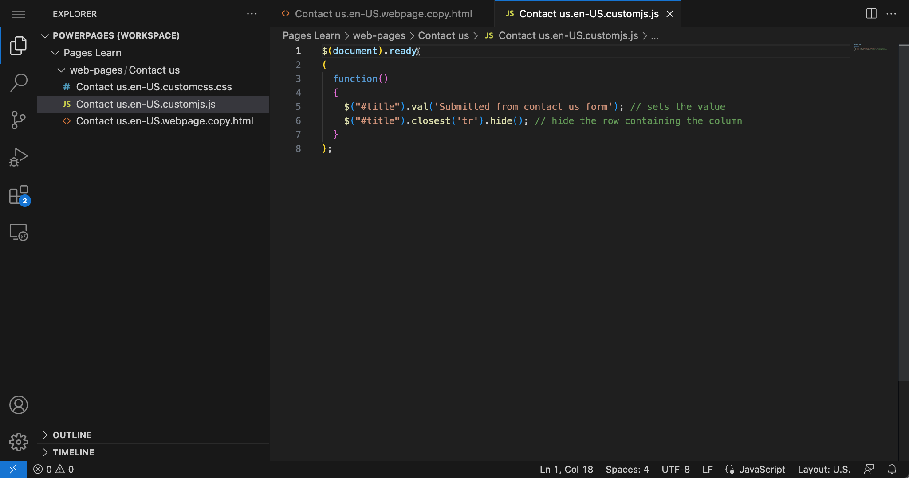

Power Pages websites don't support client-side business rules or custom JavaScript processes that are available for model-driven forms.

**Lists**, **Forms**, and **Multistep Forms** include a custom JavaScript column that allows developers to add scripts that implement the required functionality when a specific list or form is loaded.

> [!div class="mx-imgBorder"]
> [](../media/javascript-form.png#lightbox)

You can add custom JavaScript directly to a website page by using the Visual Studio Code editor. With the Portal Management app, you can also include the script as part of a web template, making the functionality available to any page based on that template.

The functionality can range from hiding controls and replacing input controls with user-friendly equivalents, to invoking external web services and implementing sophisticated integration scenarios.

Out of the box, Power Pages websites include the [jQuery](https://jquery.com/?azure-portal=true) library that makes manipulation of page content and appearance a reasonably simple task.

### Controls and columns

A default **Contact Us** form creates a row in the **Feedback** table in Microsoft Dataverse. That row includes a mandatory **Title** column that's displayed on the form with the label **Subject**. This column could be confusing to site visitors. You can't use CSS to hide the control because it leaves the red asterisk that indicates that the column is mandatory. JavaScript helps make your job of hiding the column relatively simple. To set this column to a predefined value and then hide it, follow these steps:

1. Open the **Contact Us** page in Power Pages design studio. 

1. Select **Edit code** and then wait for Visual Studio Code to open.

1. Select the **Contact us.en-US.customjs.js** file.

   > [!IMPORTANT]
   > The name of the file includes the language code that might be different in your environment.

1. Add the following script to the file:

   ```javascript
   $(document).ready
   (
    function()
    {
    $("#title").val('Submitted from contact us form'); // sets the value
    $("#title").closest('tr').hide(); // hide the row containing the column
    }
   );
   ```

   > [!NOTE]
   > Some Power Pages templates use the **Feedback** table and the **Title** column. Some Microsoft Dynamics 365 templates might use a different table (such as **Lead**) and a different column (such as **Subject**). Check the **Contact Us** page and form that's used in your website and then change the script if required.

   > [!div class="mx-imgBorder"]
   > [](../media/javascript-page.png#lightbox)

1. Use the **Ctrl + S** keyboard shortcut (**⌘ + S** on Mac) to save the file.

1. Close the browser tab with the Visual Studio Code editor then select **Sync** in design studio to synchronize the changes.

1. Select **Preview > Desktop**. 

   A new window should open showing the **Contact Us** form, with the **Topic** column (label **Subject**) hidden.

JavaScript is a simple way to add supplementary behavior or functionality to your Power Pages website. You can add it directly to a page or add it to the **Form** configuration through the Portal Management app or as part of a web template, depending on your scoping needs. Additionally, you can use script on the form to complete the following actions:

- Implement business rules.

- Add dependencies between elements, such as dependent choice columns.

- Perform other form validation.

- Call portals Web API or external services.

These options provide reasonable alternatives to client-side business rules and scripting in model-driven forms.

For more information, see [Add custom JavaScript to a form](/power-pages/configure/add-custom-javascript?azure-portal=true).
