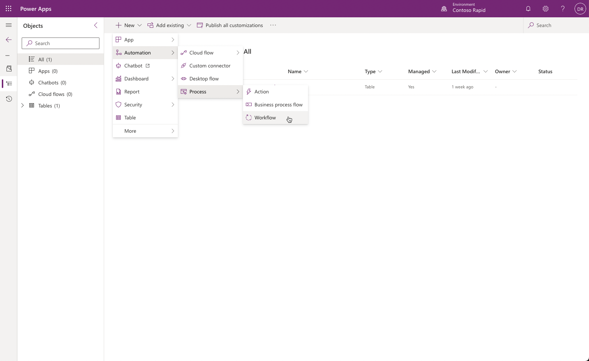
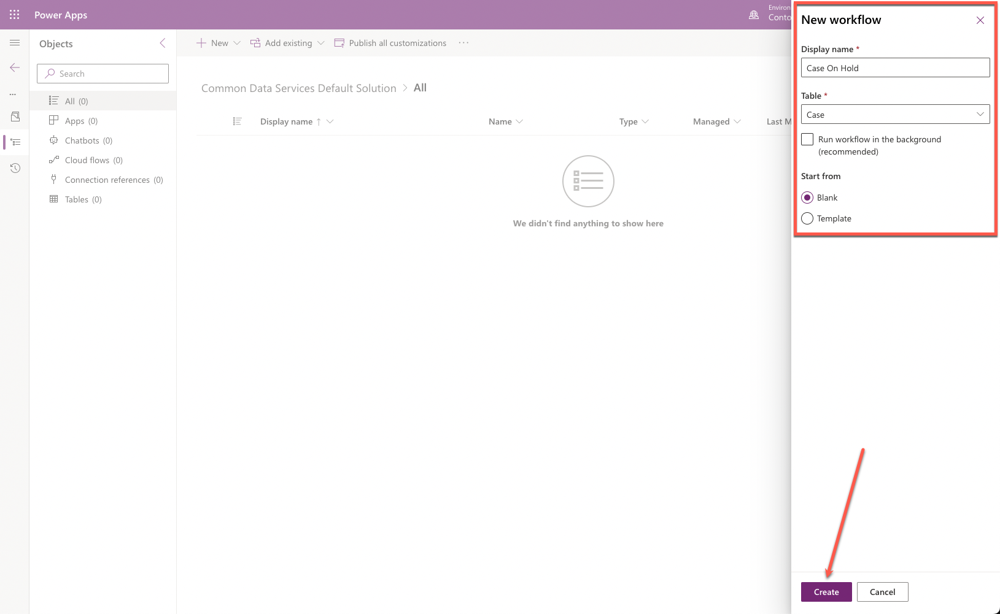
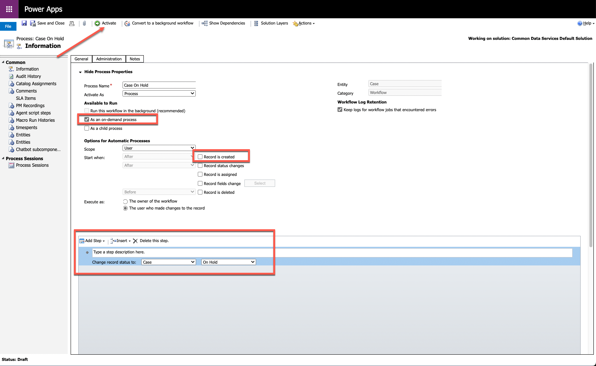
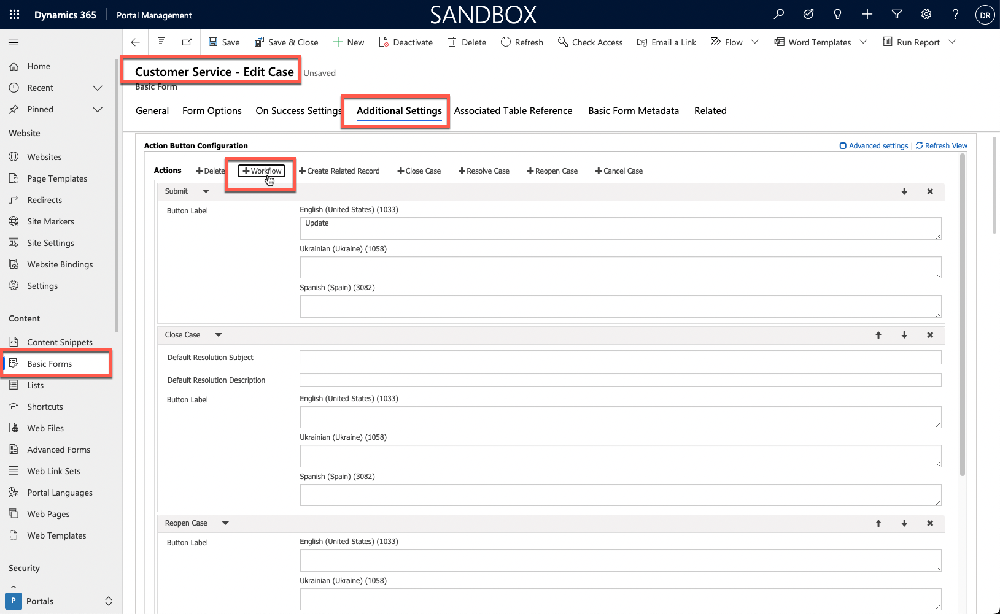
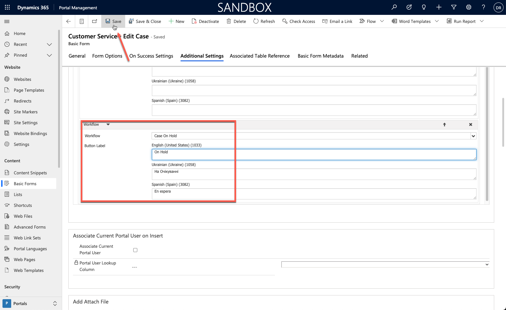
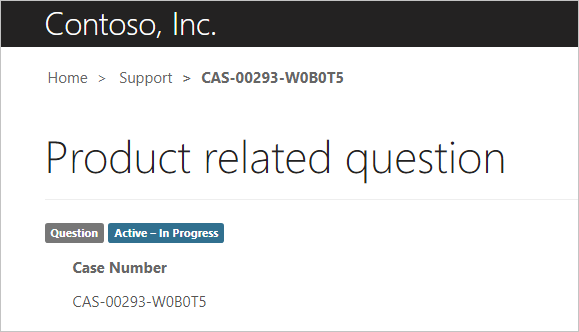
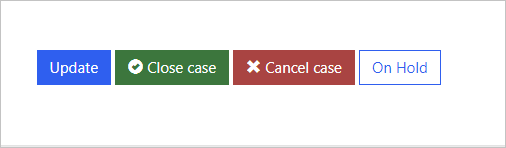
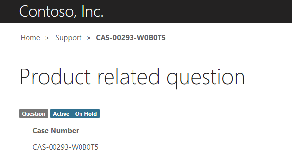
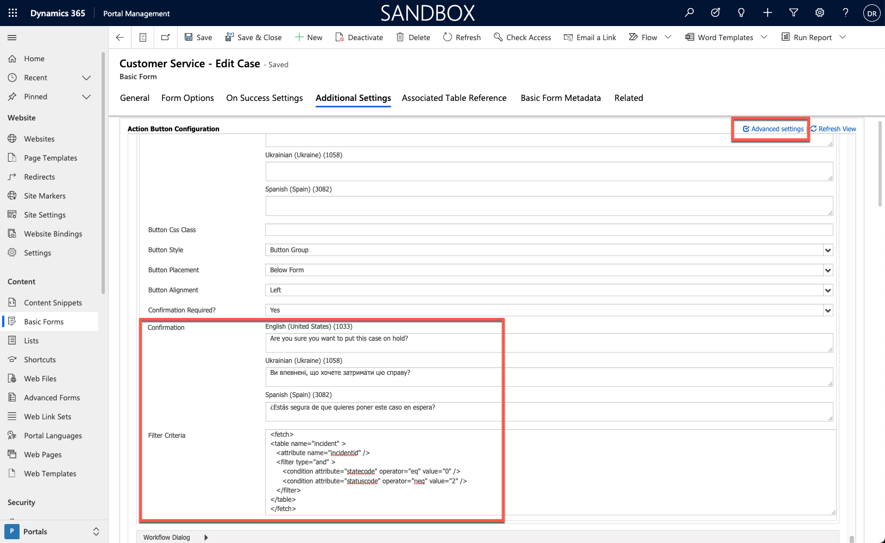
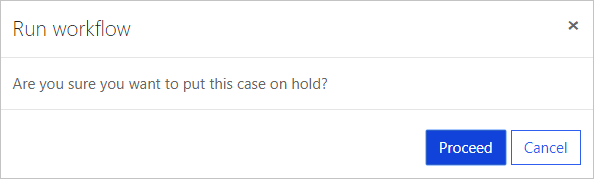

The purpose of this hands-on lab is to introduce the process of extending basic forms with more actions.

Exercises work best when you have sample data to work with. Depending on the environment that you're working with, you might want to install sample data to assist with exercises. Microsoft Power Platform lets you add sample data as needed. If the environment that you're working in doesn't have sample data installed, follow the steps in the [Add or remove sample data](/power-platform/admin/add-remove-sample-data/?azure-portal=true) documentation to install sample data into your environment.

## Learning objectives

The goal of these exercises is for you to learn how to:

- Create a new workflow for a case table.

- Set up a new workflow action for basic forms.

- Add a user prompt for a workflow action.

- Apply a conditional filter to an action button.

**Estimated time to complete this exercise:** 15 to 20 minutes

## Prerequisites

The prerequisites for completing tasks in this exercise are:

- System Administrator access to a Microsoft Dataverse instance with the Microsoft Dynamics 365 Customer Service app installed. If you don't have a Dynamics 365 instance with the app installed, you can provision a Dynamics 365 Customer Service trial by going to [Start a Free Trial for Microsoft Dynamics 365](https://dynamics.microsoft.com/dynamics-365-free-trial/?azure-portal=true).

- A provisioned Customer self-service, Community, or Partner website. If you don't have a Power Pages website available, follow the [Create a site with Power Pages](/power-pages/getting-started/create-manage/?azure-portal=true) instructions, but make sure that you select one of the mentioned templates.

## Scenario

Your organization has provisioned a Power Pages website to extend the case management capabilities of the Dynamics 365 Customer Service app.

The business wants customers to have the ability to place an active case on hold with the following parameters:

- When a website user selects the button, they should receive a confirmation message.

- Only active cases that aren't already on hold should display the interface to website users.

To finish the exercise, complete the following tasks:

1. Create a real-time workflow for the **Case** table that sets the case status to **On Hold**.

1. Add a workflow action button to the existing **Edit Case** form.

1. Add a confirmation message.

1. Add filter criteria to show the button only for active cases that aren't on hold.

### Create a workflow process

Before you enable more actions for the basic form, you'll need to create a workflow that's called by the form. In the following steps, you'll create a real-time workflow for immediate visual feedback on the basic form.

1. Sign in to [Power Apps](https://make.powerapps.com/?azure-portal=true).

1. Select a target environment by using the environment selector in the upper-right corner.

1. Select **Solutions**.

1. Select **Microsoft Dataverse Default Solution**.

   > [!NOTE]
   > Depending on your environment version, the solution could also be named **Common Data Services Default Solution**.

   > [!TIP]
   > Use search functionality and search for **default** to quickly locate the solution.

1. Select **New > Automation > Process > Workflow**.

   > [!div class="mx-imgBorder"]
   > [](../media/add-classic-workflow.png#lightbox)

1. Enter the following values in the side panel:

   - **Display name** - Case On Hold

   - **Table** - Case

   - **Run workflow in the background** - Clear this option

   - **Start from** - select **Blank**

1. Select **Create**.

   > [!div class="mx-imgBorder"]
   > [](../media/workflow-properties.png#lightbox)

1. In the new window that opens, select **As an on-demand process**.

1. Clear the **Record is created** checkbox.

1. Select **Add Step > Change Status**.

1. Change the row status to **On Hold**.

1. Select **Activate**.

   > [!div class="mx-imgBorder"]
   > [](../media/workflow-steps.png#lightbox)

1. Select **Close**.

### Create an action button

After the workflow has been created, you can add a workflow action button to the case basic form and then set up this button to call the workflow.

1. Sign in to [Power Pages home](https://make.powerpages.microsoft.com/?azure-portal=true).

1. Select the correct environment in the upper-right corner.

1. Select the website, select the ellipsis (**...**) menu, and then select **Portal Management**.

1. In the Portal Management app, select **Forms** (it could also be called **Basic Forms**).

1. Select **Customer Service - Edit Case**.

1. Select the **Additional Settings** tab.

1. Select **Workflow**.

   > [!div class="mx-imgBorder"]
   > [](../media/add-workflow-basic-form.png#lightbox)

1. Enter the following values for the **Workflow** action (you might need to scroll to locate it):

   - **Workflow** - Select **Case On Hold**

   - **Button Label** - On Hold

1. Select **Save**.

   > [!div class="mx-imgBorder"]
   > [](../media/workflow-action-details.png#lightbox)

1. Don't close the window.

### Test

To test that your new workflow action button works, follow these steps:

1. Open your website in a new browser window: `https://yoursite.powerappsportals.com`.

1. Sign in as an existing customer.

1. If you don't have a customer account, follow these steps in the Portal Management app:

   1. Select **Contacts**.

   1. Select **New**.

   1. Switch to the **Portal Contact** form.

   1. Enter your name of choice.

   1. Select **Web Authentication**.

   1. Enter the username of your choice.

   1. Select **Login Enabled**.

   1. Select **Save**.

   1. Select **Change Password** and then enter the new password of your choice.

   1. Add the **Authenticated Users** web role to the contact row.

   1. Sign out as a system administrator.

   1. Sign in as the new user.

1. Select **Support** on the upper menu bar.

1. Select an existing case. If no existing cases exist, create and save a new case row.

   The case should show as **Active - In Progress**.

   > [!div class="mx-imgBorder"]
   > 

   The lower part of the case window should show the new **On Hold** button.

   > [!div class="mx-imgBorder"]
   > 

1. Select the **On Hold** button. A message stating "The workflow has been initiated" will display.

   The window will refresh, and the case status will change to **Active - On Hold**.

   > [!div class="mx-imgBorder"]
   > 

1. Scroll down and verify that the **On Hold** button is still present.

### Enhance the action button

Having the workflow button visible at all times doesn't make sense in certain scenarios, such as for disabled cases. You can enter extra information to enhance the user experience.

1. Switch to the Portal Management app.

1. Select **Basic Forms**.

1. Select **Customer Service - Edit Case**.

1. Select the **Additional Settings** tab.

1. Select **Advanced settings** and then locate the **Workflow** action.

1. Enter the following values:

   - **Confirmation Required** - Yes

   - **Confirmation** - Are you sure you want to put this case on hold?

1. In the **Filter Criteria** box, copy and paste the following FetchXML:

   ```xml
   <fetch>
   <table name="incident" >
      <attribute name="incidentid" />
      <filter type="and" >
         <condition attribute="statecode" operator="eq" value="0" />
         <condition attribute="statuscode" operator="neq" value="2" />
      </filter>
   </table>
   </fetch>
   ```

   This FetchXML ensures that the button is only visible when the case is active (`statecode eq 0 (Active)`) and the status reason column isn't **On Hold** (`statuscode neq 2 (On Hold)`).

   > [!div class="mx-imgBorder"]
   > [](../media/button-enhancement.png#lightbox)

1. Select **Save**.

### Test the action button
Next, you'll test the action button by following these steps:

1. Open the website and sign in as a user.

1. Select **Support**.

1. Create a new case and then enter data of your choice.

1. Select **Save**.

1. Confirm that the status is **Active - In Progress** and that the **On Hold** button is visible.

1. Select **On Hold**. The confirmation will display.

   > [!div class="mx-imgBorder"]
   > [](../media/confirmation.png#lightbox)

1. Select **Cancel**.

1. Select **Close case** and then select **Yes** when prompted.

The case status should state **Resolved - Problem Solved**. Only the **Reopen Case** button should be visible.

## Extra exercise

You might want to add a **Resume** workflow and an action button to the form. The action button should only be visible when the case is on hold.

This exercise shows how Power Pages helps you extend forms, effectively converting simple data entry forms into a part of a web app.
