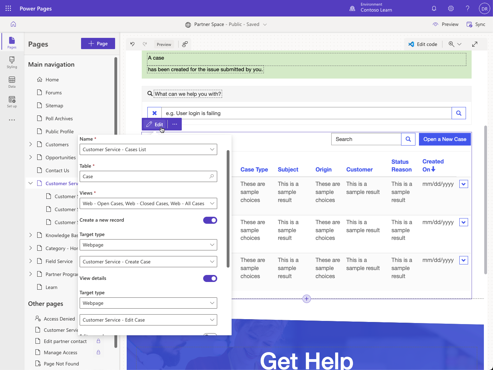

Lists, forms, and multistep forms are the fundamental components that enable Microsoft Dataverse data interactions for website users. You can use each in isolation. A list can display a company directory and allow users to download it as a Microsoft Excel spreadsheet. A form can capture leads on a **Contact us** page. A multistep form can collect anonymous product feedback from site visitors.

However, the real power of Power Pages is in how you can bring these components together by using a data-driven configuration. The following sections explain how you can use the lists and forms together and start building robust and functional web apps instead of isolated webpages.

## Link lists and forms

The case functionality that's included in the Dynamics 365 site templates contains the following features:

- **Forms** - Enable users to create a new case or edit an existing one. These forms use model-driven forms that are defined in a Dataverse environment with the Dynamics 365 Customer Service app.

   > [!div class="mx-imgBorder"]
   > 

- **Lists** - Contain actions that are linked to forms and pages with forms.

   > [!div class="mx-imgBorder"]
   > 

- **Form metadata** - The **Edit Case** form contains metadata to help refine the display of some columns and enable the **Timeline** subgrid for comments. The list includes case-specific actions such as **Close case**.

   > [!div class="mx-imgBorder"]
   > 

You can use this pattern across any existing table in Dataverse and any new table that might be required to meet a customer’s needs. The basic configuration includes:

- Lists that are built on one or more views.

- Forms to create and view individual rows. If the row creation process is complicated, use a multistep form instead.

- Action button configuration on the list to use forms for create, update, and view operations.

- An **On Success** setting for the forms to redirect users back to the list, where applicable.

You can create basic configuration in Power Pages design studio, and it's sufficient for you to get started.

> [!div class="mx-imgBorder"]
> 

You can enhance this configuration with more settings by using the Portal Management app.

## Advanced settings

Power Pages extends Dataverse functionality to web audiences, but they aren't a direct replacement for model-driven apps from Power Apps. Power Pages uses model-driven views and forms to define the layout and behavior of lists and forms on the website, but not all features of model-driven apps are available in Power Pages.

No direct equivalents exist for client-side business rules or custom JavaScript. Only HTML and image web resources are supported, and HTML can't rely on scripts that communicate with the parent model-driven form.

You can use advanced settings to implement some features that don't map across from model-driven apps to Power Pages.

### Commands

Lists, forms, and multistep forms include action button configuration that adds per-row actions. For more information about available actions, see [About basic forms (action configuration)](/power-pages/configure/basic-forms?azure-portal=true#basic-form-action-configuration) and [List configuration](/power-pages/configure/list-configuration/?azure-portal=true).

Some commands include the **Filter Criteria** setting. You can use it to enter FetchXML that evaluates and hides the command if the selected row isn't returned by the specified FetchXML query.

### Form metadata

Metadata settings for forms and multistep forms control the appearance and behavior of individual form elements, including columns, sections, tabs, subgrids, and notes.

For example, one of the most common techniques is to specify default values for individual columns. Often, you'd use this technique in combination with hidden columns, for example, hiding a case origin and setting it to **Web**. That approach ensures that all cases that are created through the website have the appropriate case origin set without the need for server-side reinforcement of the rule.

For more information, see [Configure basic form metadata for Power Pages](/power-pages/configure/configure-basic-form-metadata/?azure-portal=true).

### Form subgrids

If a model-driven form includes a subgrid of related rows, the forms and multistep forms display a read-only list of rows by using the default view. To enable actions for the grid, such as **Create**, **Update**, and **Delete**, you'll need to set up those actions by using metadata configuration. Metadata configuration allows you to implement the website equivalent of standard grid commands that are available in model-driven apps. For more information and step-by-step instructions, see [Configure basic form subgrids for Power Pages](/power-pages/configure/configure-basic-form-subgrid?azure-portal=true).

### Notes

Power Pages supports notes out of the box. You can add notes to your forms on the website by adding the **Notes** control to the model-driven form. You can set up the behavior of the **Notes** control by using metadata. For more information, see [Set up notes as attachments for basic and multistep forms](/power-pages/configure/configure-notes/?azure-portal=true).

However, the **Notes** table isn't customizable in Dataverse. As a result, certain restrictions are applied to supported functionality. For example, editing is only allowed by the note's author, no support is offered for approval processes, and the content defines the visibility of notes by using a predefined naming convention. These limitations restrict the use of notes in most scenarios.

Power Pages includes alternative implementations for notes and attachments by using the **Portal Comments** custom activity table.

> [!TIP]
> Consider replacing notes with the **Portal Comments** table if your implementation allows.

You can show portal comments on a form by using the **Timeline** control. No functional difference exists in the Power Pages implementation of the **Notes** and **Timeline** controls, and the same metadata configuration is available. Using portal comments has the following benefits:

- Comment approval by using the **Send** command. Only sent or received comments are visible on the website.

- Tracking of website users who created and received the comment.

- Further customization of the **Portal Comments** table is possible to implement more business requirements.

For a reference to an implementation that uses this table, you can review how case comments are implemented on any Dynamics 365 site templates.

## Extend with workflow

Forms and lists support extensibility by using classic Dataverse workflows. This mechanism is flexible and powerful in exposing more business functionality. You can define a classic Dataverse workflow for the target table and add a workflow action button.

Real-time and background workflows are supported. You can set up the action button to refresh the page or redirect to the destination of your choice after the workflow is called.

For example, you could add a custom **Email Update** button to the case form that invokes a classic workflow to send case details and notes history to the current website user by email.
