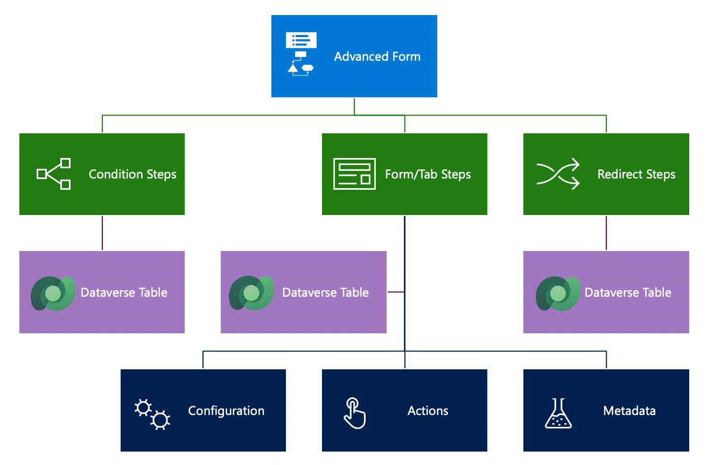
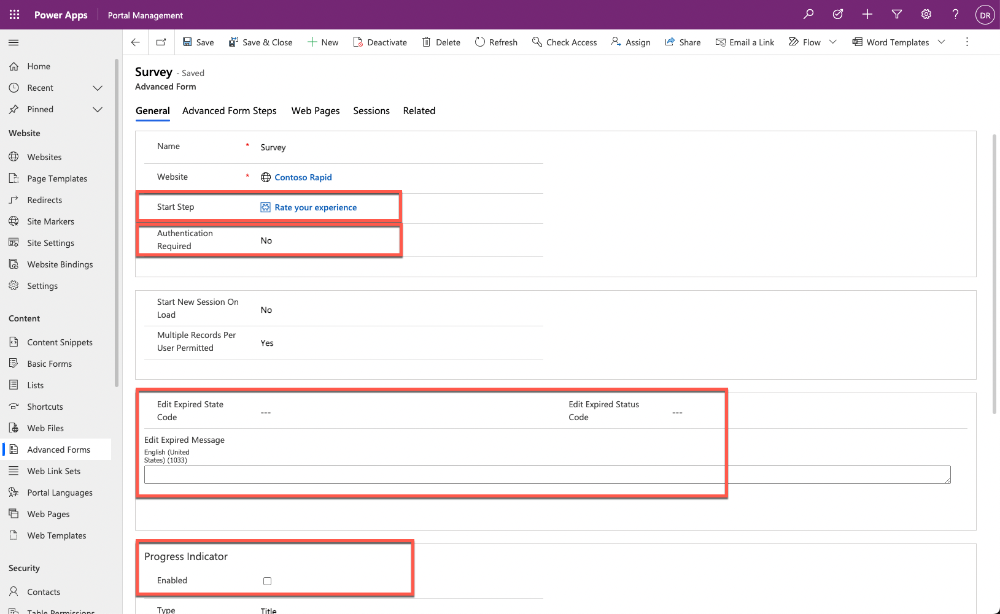

You can create multistep forms, including simple form steps, in Power Pages design studio. Certain advanced features that aren't available in design studio are available in the Portal Management app.

> [!div class="mx-imgBorder"]
> [](../media/web-form-overview.png#lightbox)

## Multistep form properties

Unlike a list or a form, a multistep form isn't linked to any particular Dataverse table. Instead, a multistep form organizes form steps and persists a history of a user's steps as multistep form session rows. Options on the multistep form control top-level preferences for the multistep process.

> [!NOTE]
> Though some properties are not available for configuration in Power Pages design studio, they're included for completeness.

- **Start Step** - Controls the initialization of the form within the portal.

- **Authentication Required** - Associates a form session with a website user. Authenticated multistep forms capture website user information and provide the **Save** and **Resume** capabilities by using sessions.

- **Expiration** - Defines how to handle stale saved sessions and expire them.

- **Progress Indicator** - Is supported where the multistep form includes multiple steps.

> [!div class="mx-imgBorder"]
> [](../media/advanced-form-properties.png#lightbox)

## Multistep form steps

Multistep form steps provide the flow logic of the form’s user experience, such as steps and conditional branching. They also provide details regarding the rendering of a form and more behavior.

> [!IMPORTANT]
> If multistep form steps are modified, previously created history data could now be stale. Whenever steps are changed, we recommend that you delete all multistep form session rows to eliminate a mismatch between the sequence of steps that are logged in the history and the current sequence.

Each multistep form that's presented on the website has one or more steps. These steps share some common properties:

- **Target table** - The Dataverse table that's selected for the step defines available columns and how step data is related to the previous and next steps in the sequence.

- **Next Step** - Each step contains a pointer (a lookup) to the next step, except for terminal steps. Terminal steps don't have a next step and are the last step of the multistep form. With conditional branching, you can have multiple terminal steps.

- **Move Previous Permitted** - This property defines whether the step allows users to return to the previous step. Depending on the logic and the data that's captured, some steps are irreversible while others (typically during the information capture sequence) allow navigation back and forth through the steps.

The following step types are available: **Load Form/Load Tab**, **Redirect**, and **Condition**.

> [!NOTE]
> You can't select the **Condition** step as the start step for a multistep form.

### Load Form and Load Tab steps

The **Load Form** and **Load Tab** step types allow the step to act as a basic form within the overall multistep form process. These steps load a model-driven form with a similar set of available options as a basic form. For more information, see [Define a load form and load tab step type](/power-pages/configure/load-form-step/?azure-portal=true).

Similar to the form configuration, the related multistep form metadata rows contain more behavior modification logic to change or override the functionality of form columns when they're rendered on the website. You can use the multistep form metadata to redefine the behavior of individual columns, sections, tabs, subgrids, notes, and timelines.

#### Redirect step

The **Redirect** step type allows for a redirect of the user's browser session to another page on the website or to an external URL. This step is useful for seamlessly directing the process flow. Configuration is similar to the basic form's **On Success** settings. For more information, see [Add a redirect step type](/power-pages/configure/add-redirect-step/?azure-portal=true).

#### Condition step

The **Condition** step type evaluates an expression. If the expression evaluates to true, then the next step is displayed. If the expression evaluates to false, and if the **Next Step If Condition Fails** is specified, that step is displayed. Combining the **Condition** and **Redirect** steps allows the creation of data-driven process flows.

> [!IMPORTANT]
> Expressions aren't validated at design time. If a specified logical expression is invalid, for example, if it refers to a non-existent table column, the step will fail to run, and a generic error message will display to the user. Keep expressions simple and make sure that the syntax and column references are correct.

For more information, see [Add a conditional step type](/power-pages/configure/add-conditional-step/?azure-portal=true).

## Add a multistep form to your website

A multistep form defines required behavior but doesn't contain information regarding how and where on the website to render the form. The multistep form contains relationships to webpages and a start step to control the initialization of the form within the website.

> [!NOTE]
> You can't select a multistep form as an action target in the list; you can only display it on a webpage.

You can add a multistep form component to a webpage in the Power Pages design studio. This action places a Liquid tag on the webpage to render the multistep form. In advanced scenarios, you can insert this Liquid tag directly into the page source by using Visual Studio Code editor.

```twig

```
