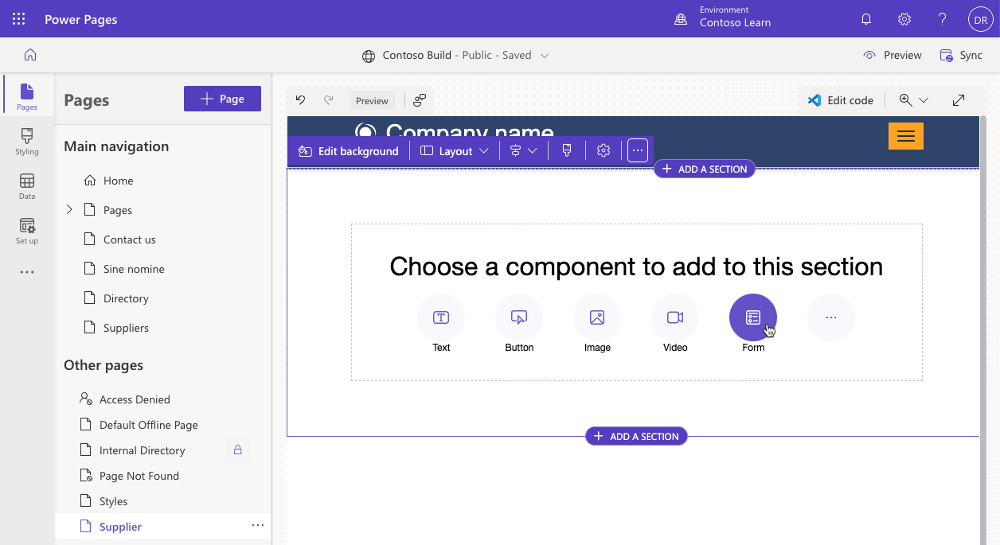
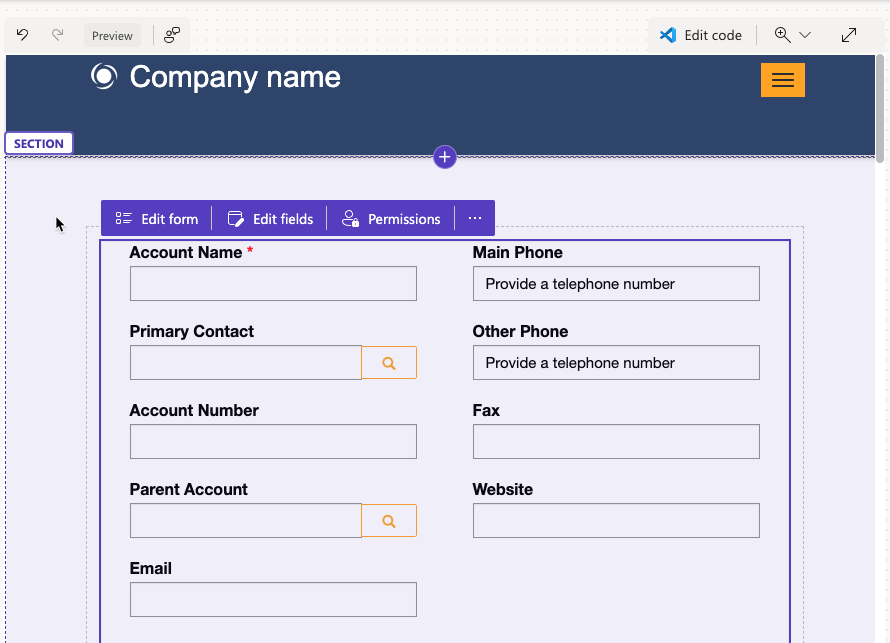
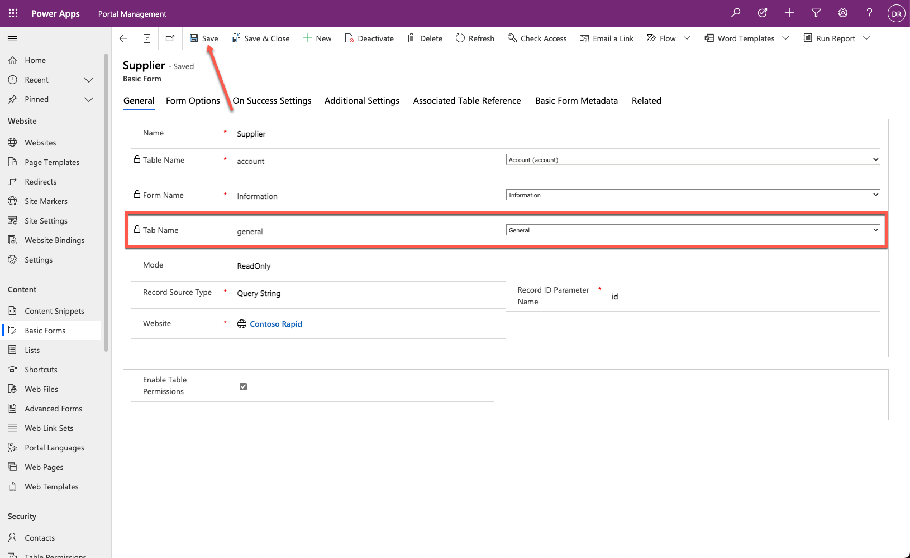
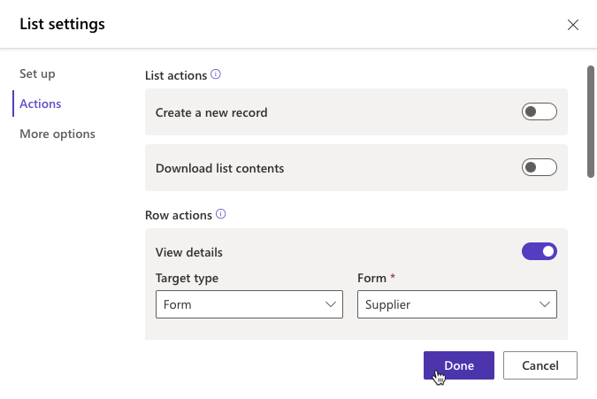

You can add a form to a webpage from the components menu in Power Pages design studio.

> [!NOTE]
> Previously, forms were called basic forms.

## Create a form

Design studio provides a modern maker experience for creating and managing forms. To create a form in the Power Pages design studio, use the following procedure:

1. Sign in to [Power Pages home](https://make.powerpages.microsoft.com/?azure-portal=true).

1. Select the correct environment in the upper-right corner.

1. Select the website and then select **Edit**.

1. Select the **Pages** workspace.

1. Select **Page**.

   - Enter **Supplier** as the page name.

   - Clear the **Add page to main navigation** checkbox.

   - Select the **Start from blank** template.

   - Select **Add**.

1. On the page canvas, in the empty section, select the **Form** component.

   > [!div class="mx-imgBorder"]
   > [](../media/form-insert-component.png#lightbox)

1. Complete the following tasks in the properties dialog. 

   1. Select **New form**.

   1. For **Choose table**, select **Account**.

   1. For **Select a form**, select **Information**.

   1. For **Name your copy of the selected form**, select **Supplier**.

   1. Select the **Data** tab.

   1. For **Data from this form**, select **Is Read only**.

   1. Select **OK** to add the form to the page.

As the page refreshes, the form layout displays directly on the page canvas.

> [!div class="mx-imgBorder"]
> [](../media/form-layout.png#lightbox)

> [!NOTE]
> Scroll down the form that's displayed on the page canvas to verify that all tabs from the Dataverse form are included.

For more information about creating and editing forms in Power Pages design studio, see [Add forms](/power-pages/getting-started/add-form/?azure-portal=true).

## Set up the form

You can create and edit forms directly on the page canvas. However, you won't be able to edit all available settings in the design studio. More configuration options are available in the Portal Management app. To access a form configuration in the Portal Management app, follow these steps:

1. Select the form on the page canvas.

1. Select **Edit form**.

1. Select the **Data** tab.

1. Select **Open portal management app**.

## Simplify form layout
To simplify the form layout, follow these steps:

1. Select **General** as the **Tab name**.

1. Select **Save**.

   > [!div class="mx-imgBorder"]
   > [](../media/entity-form-meta-data.png#lightbox)

1. Return to the Power Pages design studio tab or window.

1. Select **Sync configuration**.

1. The form layout now includes only the columns from the **General** Dataverse form tab.

For more information about setting up forms in the Portal Management app, see [About basic forms](/power-pages/configure/basic-forms?azure-portal=true).

## Add a form to your website

A form defines the required behavior, but it doesn't contain information about how and where on the site the form should render. The two ways to render a basic form in a portal are:

- Explicitly specify the form as a target for a list action, such as **Create**, **View**, or **Edit**. In this case, the form renders in a modal pop-up window. Certain limitations apply when the form is rendered in a pop-up window. For example, the ability to create related rows from subgrids isn't available.

   > [!div class="mx-imgBorder"]
   > [](../media/form-list-properties.png#lightbox)

- Similar to a list, you can add a form component to a webpage in the design studio. This action places a Liquid tag on the webpage copy to render the form. In advanced scenarios, you can insert this tag directly into the page source by using Visual Studio Code editor.

```twig

```

> [!IMPORTANT]
> Access to the forms on the published website is controlled by table permissions. For example, a visitor would require read permissions for the table to access a read-only form. When permissions aren't sufficient, depending on the configuration, the visitor might be redirected to a sign-in page, receive an access denied error message, or view a read-only form instead of an editable one.
