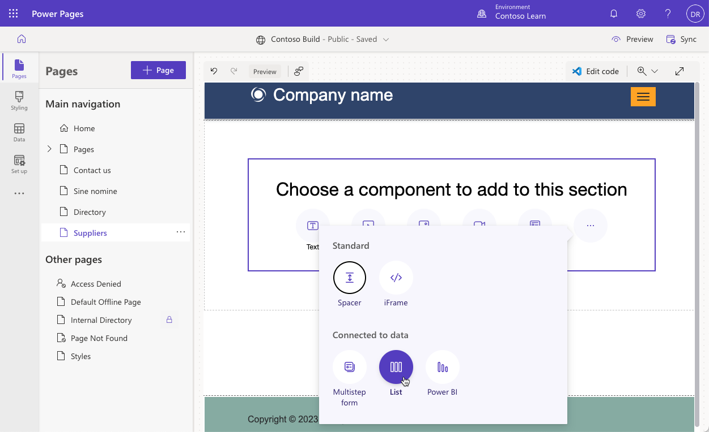
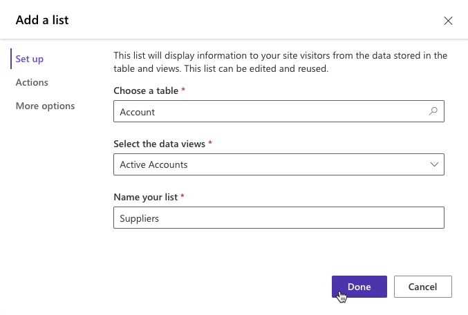
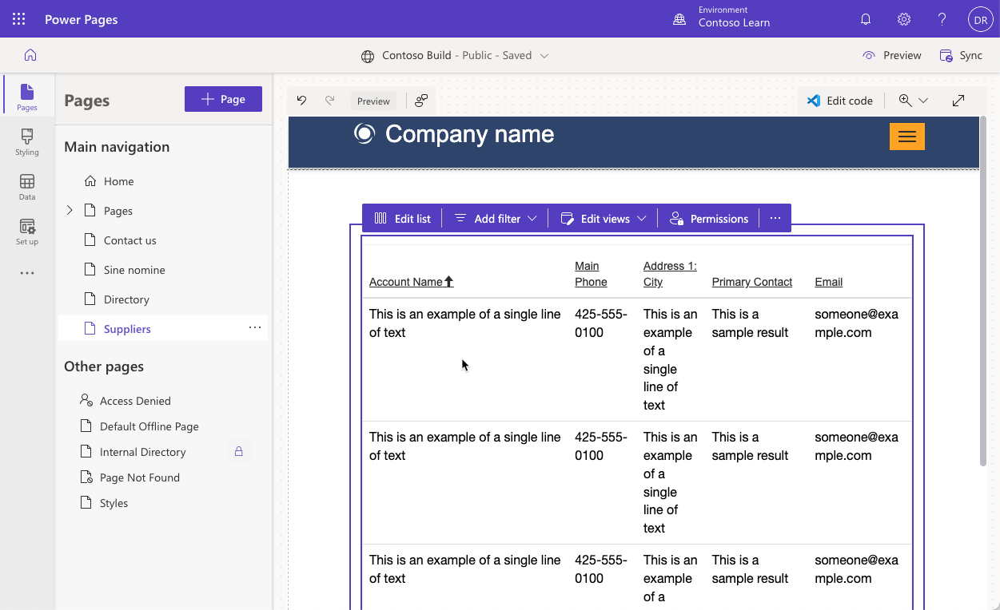
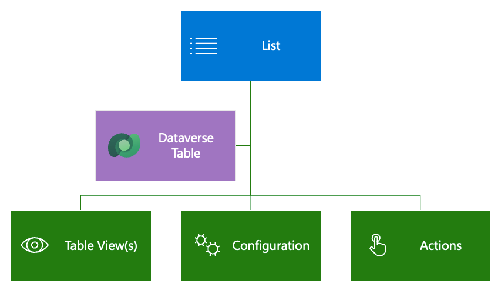
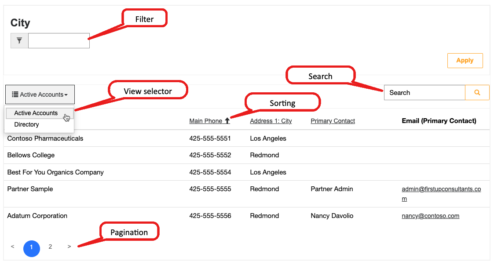
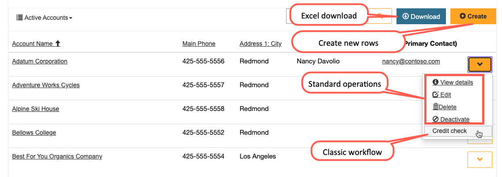

Microsoft Power Pages websites use Microsoft Dataverse to store and interact with business data. You can use pre-existing or create new Dataverse views and forms to build interactive, data-driven webpages.

## Lists

You can add lists to webpages by using Power Pages design studio, where you can set up most of the properties. Additionally, the Portal Management app offers more configuration options for you.

### Create a list

Power Pages design studio provides a maker experience for creating and managing lists. To create a list in the Power Pages design studio, use the following procedure:

1. Sign in to [Power Pages home](https://make.powerpages.microsoft.com/?azure-portal=true).

1. Select the correct environment in the upper-right corner.

1. Select the website and then select **Edit**.

1. Select the **Pages** workspace.

1. Select **Page**, enter **Suppliers** as the page name, select the **Start from blank** template, and then select **Add**.

1. On the page canvas, in the empty section, select the **List** component.

   > [!NOTE]
   > If the **List** component isn't visible, select the ellipsis (**...**) menu to show more components.

   > [!div class="mx-imgBorder"]
   > 

1. Enter the following information in the **Add a list** dialog. If prompted, select **New list**.

   - **Choose a table** - Account
   - **Select the data views** - Active Accounts
   - **Name your list** - Suppliers
 
 1. Select **Done**.

   > [!div class="mx-imgBorder"]
   > 

> [!IMPORTANT]
> Table permissions haven't been set up. If you try to browse the page now, you'll receive a "You don't have permissions to view these records" message. This message is expected.

As the page refreshes, the list layout will display directly on the page canvas.

> [!div class="mx-imgBorder"]
> 

### Set up the list

A list can be as simple or as complicated as your business requirements specify. To begin, the only required properties for the list, other than the name and the website, are the target **Table Name** and one or more **Views**.

Lists are highly configurable and have several settings that define the list behavior. Lists can also include actions for the user to interact with the items on the list.

> [!div class="mx-imgBorder"]
> 

The following sections describe the most common features and settings.

> [!NOTE]
> Most options that add interactive elements, such as buttons, support customization of the elements in multiple languages. For example, if multiple views are enabled, you can customize the name for each view in the view selector for each enabled website language.

### Views

Selected views define the Microsoft Dataverse table columns, list layout, and the default sort order.

- **Multiple views** - If more than one view is specified, a dropdown list will render so that the user can switch between views.

- **Sorting and pagination** - Sorting is enabled on any of the displayed columns, and the page size is configurable.

### Configuration

Filtering and searching functionalities help you set up the data in the following ways:

- **Search** - When list search is enabled, Power Pages renders a text search box. It's similar to the Quick Search feature in model-driven apps. Quick Search runs across the view columns and lets users locate information within larger lists by using plain text input. Website visitors can enter the asterisk wildcard character to search for partial text.

- **Filters** - This feature is also configuration-only. You can filter rows in the list on any list column, including text, lookups, choices, and custom FetchXML expressions. Website visitors have access to the interactive filtering panel when the list is rendered.

  > [!NOTE]
  > Filters in Power Pages design studio are called **Metadata filters** in the Portal Management app. 

> [!div class="mx-imgBorder"]
> 

### Actions

Lists can have actions associated with them to enable commands for each list, such as **Create** and **Download** (as a Microsoft Excel spreadsheet), or commands for each row, such as **View** or **Edit**, and to trigger classic workflows.

> [!div class="mx-imgBorder"]
> 

For more detailed information about list configuration and metadata and how to use them to set up list behavior, see [Lists overview](/power-pages/configure/lists?azure-portal=true).
