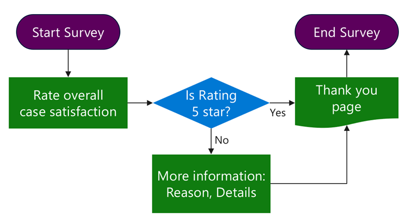
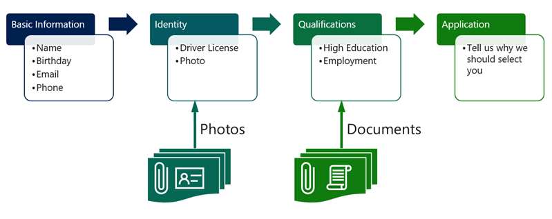

With the **Forms** feature, users can access individual Dataverse rows on the Power Pages website. Often, Microsoft Dataverse rows are too complex to present on a single page, or data requirements exist that include multiple Dataverse tables. The following sections consider scenarios where it isn't effective or even possible to implement data capture on a website by using basic forms.

## Surveys

Consider a scenario where you want to capture feedback from customers after a case is closed. To increase survey completion rates, the business decides to require no other captured information if the customer gives the case handling a rating of five out of five.

> [!div class="mx-imgBorder"]
> 

In this scenario, a multistep form allows you to implement two pages for information capture and to add branching logic.

When you're designing surveys, consider whether you can extend and use a built-in **Feedback** table to capture entries or whether creating a separate table is more appropriate. In general, a **Feedback** table is suitable for shorter, more targeted surveys such as product or case feedback. For more information, see [Configure a table for feedback with Power Apps](/power-apps/maker/data-platform/configure-entity-feedback?azure-portal=true).

## Complex data capture

In an implementation that involves complex data capture, the business accepts applications for online training. The process is selective, and the training is highly specialized and targets a specific audience. Applicants need to satisfy some prerequisites, such as educational and employment requirements.

> [!div class="mx-imgBorder"]
> 

Applicants might not be fully aware of the requirements and might not have all required evidence up front. The application process needs to implement the ability to suspend and resume the application and to handle multiple file uploads. Multiple tables could also be involved. Basic information and identity validation steps update the contact row while the rest of the data is captured in a separate table for the application process.

In this scenario, a **multistep form** is effective in implementing the wizard-style application process with a progress indicator and forward and back navigation.

When you're planning multistep data capture, consider the following questions:

- Is the process streamlined, or does conditional branching exist?

- What tables are involved in the process and how are they related to each other?

- Does the website user need to be authenticated prior to the process start?

- Are users allowed to suspend and resume the process?

- Is a user restricted to a single process, or are multiple processes allowed for each user?

- Do you need to handle notes or file uploads?

- Do you need to include multiple related rows that display by using subgrids?

To help you implement these and similar processes, multistep forms extend the form concept to allow multistep and multiform interactions. Multistep forms allow you to build complex forms, including:

- Single or multistep navigation

- Conditional branching

- Data entry across many tables

- Custom requests that are chained together in a single flow

## Common practices

Use multistep forms sparingly. Though more powerful, they're also more complex to create and maintain than basic forms. As you evaluate the complex business processes, analyze your data capture requirements. If you're dealing with a data entry process for a single table that has numerous columns to capture, consider creating a form with multiple tabs and using the **Auto Generate Steps From Tabs** form option to automatically generate multiscreen data entry with **Next** and **Previous** buttons added as required.

Multistep forms work well when the processes involve branching, span multiple tables, or require suspend and resume functionality. In these scenarios, dividing the process into smaller steps helps make it easier to implement and maintain.

Create a flowchart or a diagram for your process and enumerate the steps. Use a naming convention for the steps so that they can be easily identified, for example:

1. Rating capture

1. Check the rating (condition)

1. Additional details

> [!TIP]
> Because the steps usually need to point to the next step in the sequence, build the steps from last to first so that you can populate the lookups as you create the steps without the need to go back and revise.

No restrictions are on the next step in the sequence. Steps can point to one of the previous steps, including self-creating a loop. This technique is useful for a repeatable data entry, for example, **Add another item?** Make sure that you have a clean conditional exit from the loop.

## Create a multistep form

Power Pages design studio provides a modern experience for creating and setting up multistep forms. To create a multistep form in the design studio, use the following procedure:

1. Sign in to [Power Pages home](https://make.powerpages.microsoft.com/?azure-portal=true).

1. Select the correct environment in the upper-right corner.

1. Select the website and then select **Edit**.

1. Select the **Pages** workspace.

1. Select **+ Page**.

   - Enter a page name of your choice.

   - Select the **Start from blank** template.

   - Select **Add**.

1. On the page canvas, in the empty section, select the **Multistep form** component from the component library.

1. Select **New multistep form**.

1. Enter the required information and then select **OK** to create the form.

1. Add individual steps as required.

You can set up many multistep form features in the design studio. For more information, see [Add a multistep form](/power-pages/getting-started/multistep-forms/?azure-portal=true). You'll still need to set up some features by using the Portal Management app. For more information, see [Define advanced form steps for portals](/power-apps/maker/portals/configure/web-form-steps/?azure-portal=true).
