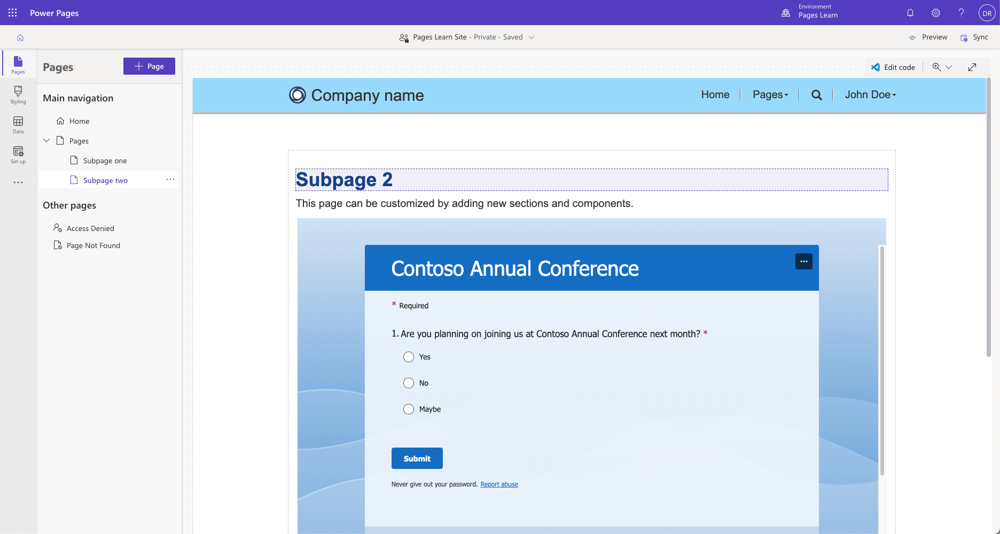

Microsoft Power Pages has many features, such as lists, forms, and the ability to use Liquid template language, that allow an app maker to build powerful web applications. However, you might occasionally need to integrate your website with other web-based technologies to extend your application.

You can add SharePoint document libraries to forms so that portal users can view and upload files that are related to a specific Microsoft Dataverse row.

Additionally, you can add Microsoft Power BI reports and dashboards. Then, you can set up the reports and dashboards as page components to show rich visualizations of data.

When you add components, such as lists and forms, Microsoft Power BI adds the corresponding Liquid tags to a webpage. Liquid template language also has several Dataverse-specific tags that allow you to add items that don't appear as components, such as model-driven charts.

The iframe component allows for the integration of other Microsoft technologies, such as Microsoft Forms, to quickly create surveys, quizzes, and polls, and even canvas apps from Microsoft Power Apps to add to a Power Pages website.

> [!div class="mx-imgBorder"]
> 

> [!NOTE]
> Users will still require appropriate licensing for specific technologies, such as licenses for embedded canvas Power Apps or access to Power BI reports.

Professional developers can also add JavaScript code to a page to more securely access Dataverse by using portals Web API or to communicate with other applications and services by using external REST APIs.

This module examines how you can integrate Power Pages with some of these technologies.
