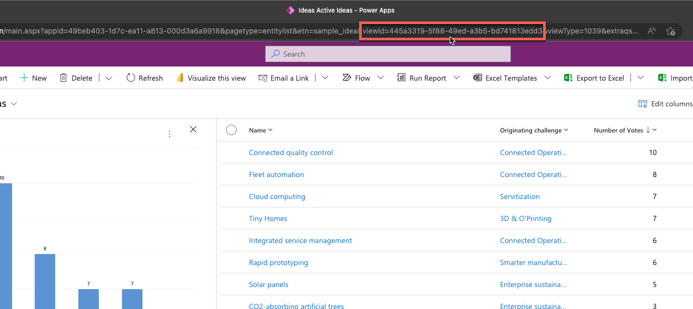
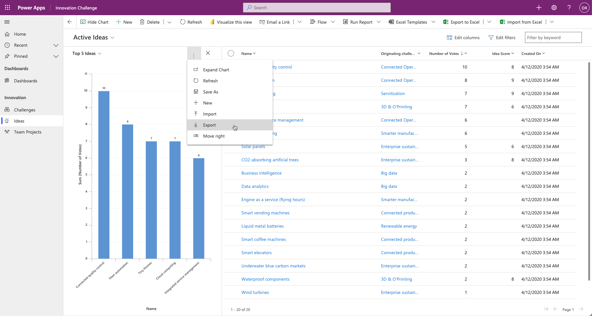
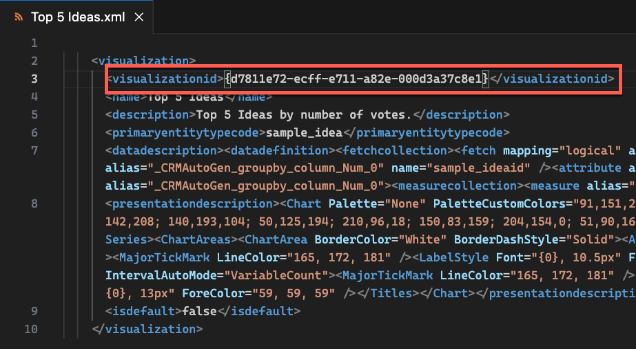

You can add a chart to a webpage by using the Liquid tag [chart](/power-apps/maker/portals/liquid/portals-entity-tags?azure-portal=true#chart). As with any Liquid code, you can add the `chart` tag directly into the page content, embed it inside a content snippet, or add it as part of a web template.

```html

```

Two parameters are available for you to provide with the `chart` tag:

- **`id`** - Visualization identifier of the chart. You can get this parameter by exporting the chart.

- **`viewid`** - Table view identifier when it's opened in the model-driven view editor. If it's not specified, the default view is used.

Showing a model-driven chart in Power Pages doesn't require any other configuration. Only system charts and system views are supported in configuration.

### Parameters

To obtain chart tag parameters, follow these steps.

> [!NOTE]
> This example uses the Innovation Challenge app that's provisioned in the new Dataverse environments when the option to include sample data is selected.

1. Open the model-driven app that contains the chart that needs to be embedded into the webpage.

2. Open the view and the chart.

3. Locate the `viewid` query parameter in the URL, which represents the target view ID.

   > [!div class="mx-imgBorder"]
   > [](../media/chart-viewid.png#lightbox)

4. Select the vertical ellipsis menu and then select **Export**.

   > [!div class="mx-imgBorder"]
   > [](../media/chart-export.png#lightbox)

5. Open the exported file in a text editor and then locate the `visualizationid` element. The content of this element is the target chart ID.

   > [!div class="mx-imgBorder"]
   > [](../media/chart-visualizationid.png#lightbox)

6. Build the Liquid tag by using these parameters.

   ```html
   
   ```

7. You can paste this tag directly into the text element on a webpage.

To allow users to view the chart, ensure that the appropriate **Table Permission** records are created and assigned to applicable web roles to allow read data from the target table. If permission isn't granted, an access denied message will display to the user.

> [!NOTE]
> Different users might have different resulting charts based on their specific table permissions.

Some chart types and some out-of-the-box charts aren't supported. For more information, see [Unsupported charts and chart types](/power-apps/maker/portals/configure/add-chart?azure-portal=true#unsupported-charts-and-chart-types).

For more information and step-by-step instructions, see [Add a chart created in a model-driven Power App to a webpage in Power Pages](/power-pages/configure/add-chart/?azure-portal=true).
