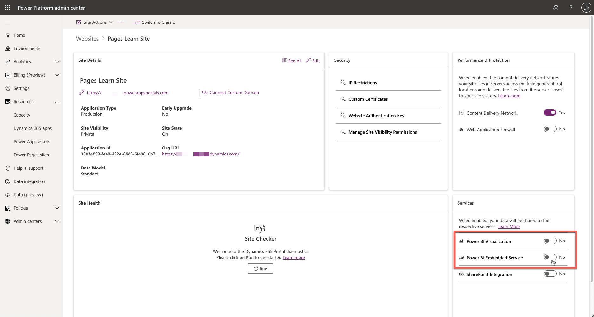
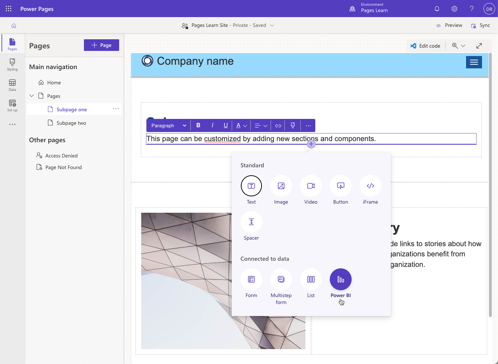
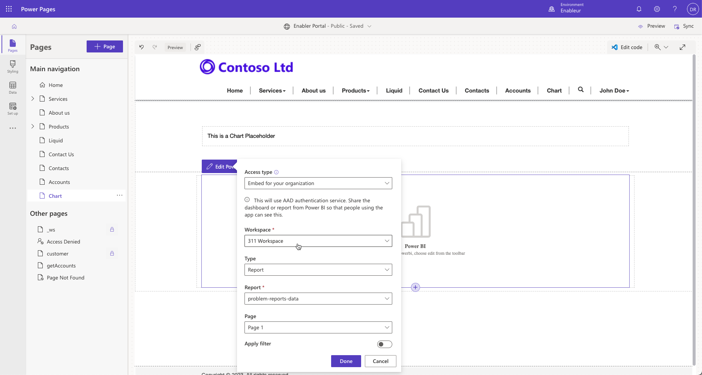
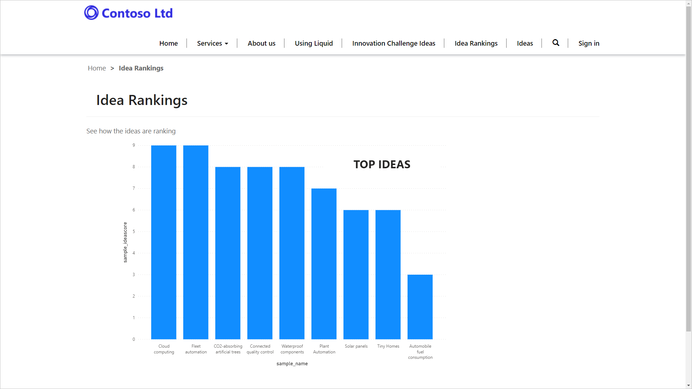
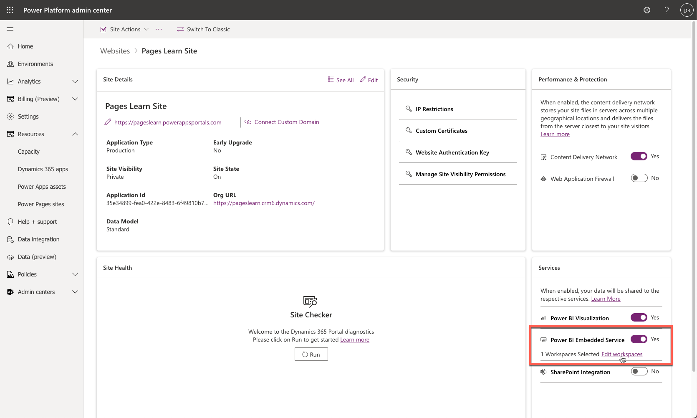

You can add a Power BI report or dashboard to a webpage in a Power Pages site to further extend the website as a powerful web application.

Before you can add a Power BI report to a Power Pages site, you'll need to enable the Power BI visualization or the Power BI Embedded Service in the Power Pages admin center.

> [!div class="mx-imgBorder"]
> [](../media/enable-power-bi.png#lightbox)

- **Power BI Visualization** - Allows you to embed *publish to web* Power BI reports for anonymous visitors or share Power BI reports or dashboards to Power BI Microsoft Entra ID authenticated users (for example, on an Employee self-service portal).
- **Power BI Embedded Service** - Allows you to share the Power BI reports or dashboards to external users who don't have a Power BI license or Microsoft Entra ID authentication setup. This feature uses the *new workspaces* feature of Power BI. For more information, see [Create a workspace in Power BI](/power-bi/collaborate-share/service-create-the-new-workspaces?azure-portal=true).

## Enable Power BI visualization

Enabling Power BI visualization allows a Power Pages maker to add a Power BI component to a webpage and then set up the component to display a Power BI report or dashboard that's available for being published on the web. A report author needs to generate an embed code in the Power BI dashboard.

From the Power Pages design studio, you can add the Power BI component to a webpage. This action adds a Liquid tag to the webpage, which you can further edit and set up in the Visual Studio Code editor, depending on your specific requirements.

> [!div class="mx-imgBorder"]
> [](../media/power-bi-component.png#lightbox)

### Parameters

The `powerbi` Liquid tag accepts the following parameters:

- **path** - Path of the Power BI report or dashboard. If the Power BI report or dashboard is secure, you'll need to provide the authentication type.

   ```html
   
   ```

- **authentication_type** - Type of authentication that's required for the Power BI report or dashboard. Valid values for this parameter for embedded Power BI visualizations are **anonymous** and **aad** (Microsoft Entra ID). The default value is **anonymous**. While adding the Power BI report or dashboard, ensure that it's shared with Microsoft Dataverse Microsoft Entra ID authenticated users.

   ```html
   
   ```

- **tileid** - Displays the specified tile of the dashboard. You'll need to provide the ID of the tile.

  ```html
  
  ```

When the Power BI component is selected in the Power Pages design studio, makers can set the values of these parameters by using the Power BI component dialog.

> [!div class="mx-imgBorder"]
> [](../media/power-bi-property-dialog.png#lightbox)

You can also filter the report on one or more values by selecting **Apply filter** and then specifying the filter expression. For more information, see [Filter a report by using query string parameters in the URL](/power-bi/service-url-filters/?azure-portal=true).

> [!IMPORTANT]
> The anonymous reports don't support filtering.

Filtering can be based on dynamic values, making it optimal for displaying personalized Power BI visualizations. You can also create a dynamic path and save it into a variable by using the `capture` Liquid tag, as shown in the following example:

```html
https://app.powerbi.com/groups/00000000-0000-0000-0000-000000000000/reports/00000000-0000-0000-0000-000000000001/ReportSection01?filter=Executives/Executive eq '{{user.id}}'

```

Before adding the Power BI report or dashboard to a webpage on a Power Pages website, you'll need to share it with the required users.

> [!div class="mx-imgBorder"]
> [](../media/power-bi-page.png#lightbox)

## Enable the Power BI Embedded service

You can also enable and set up the Power BI Embedded service feature within the Power Pages admin center.

When you enable the Power BI Embedded service, make sure that you specify the Power BI workspaces that are available for use on the website in the Power Pages admin center.

> [!div class="mx-imgBorder"]
> [](../media/power-bi-embedded.png#lightbox)

When the Power BI Embedded service is activated, makers can embed Power BI reports on a webpage. This action takes advantage of the features and functionality of the Power BI Embedded service without makers needing to write corresponding code on the website. You'll need to have created a workspace within Power BI and have already added the appropriate reports, dashboards, and tiles.

When you're adding an embedded Power BI report, specify if the audience is your customers (external users) or your internal employees. Employees need to authenticate to the website by using Microsoft Entra ID. When you're adding a report for external users, set the value of `authentication_type` to **powerbiembedded**, as shown in the following example:

```html

```

You can also set the correct authentication type by setting **Access type** to **Embed for your customers** in the property dialog.

> [!div class="mx-imgBorder"]
> [](../media/organization-embedded-power-bi.png#lightbox)

> [!NOTE]
> Power BI sharing requires that appropriate licensing is in place. Licensing requirements depend on the audience and method of sharing.

For more information on setting up Power BI integration, see [Set up Power BI integration](/power-apps/maker/portals/admin/set-up-power-bi-integration/?azure-portal=true).

For more information on sharing and licensing requirements, see [Share Power BI workspace](/power-bi/service-how-to-collaborate-distribute-dashboards-reports#collaborate-with-coworkers-in-an-app-workspace/?azure-portal=true) and [Share Power BI dashboard and report](/power-bi/service-share-dashboards/?azure-portal=true).
