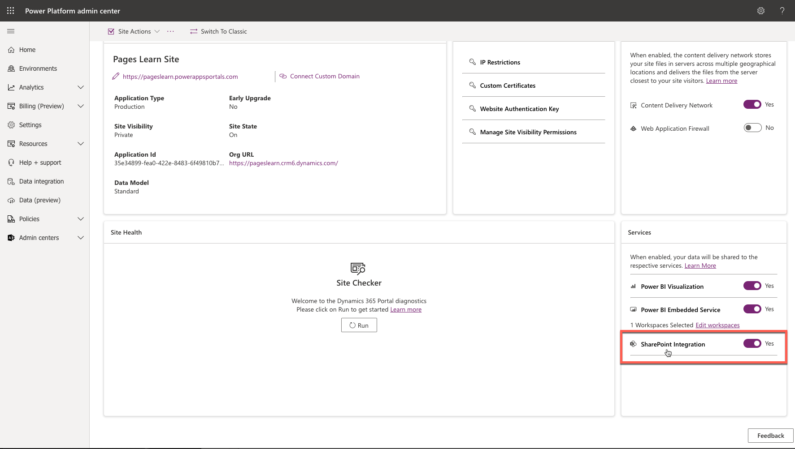

Model-driven Power Apps (including Microsoft Dynamics 365 apps) support integration with SharePoint Online, which enables you to use the document management capabilities of SharePoint that are related to Microsoft Dataverse rows. Power Pages supports the uploading and displaying of documents to and from SharePoint directly on a form in a website. This feature allows website users to view, download, add, and delete documents from a portal. Website users can also create subfolders to organize their documents. Table permissions determine if a user can view, upload, or delete documents.

You can enable SharePoint integration for a website from the Power Pages admin center.

> [!div class="mx-imgBorder"]
> 

The following points apply to the Power Pages integration with SharePoint:

- Document management works only with SharePoint Online.
- Document management is supported with the server-based integration, and a global administrator must give organizational consent.

To work with the document management capabilities of SharePoint from within model-driven apps, follow these steps:

1. Enable document management functionality in the Dataverse environment.
1. Set up SharePoint integration from the Power Pages admin center.
1. Enable document management for tables.
1. Set up the appropriate form to display documents.
1. Create the appropriate table permission and then assign it to the appropriate web role.

Watch the following video to learn how to enable SharePoint integration for your Power Pages website and give website users access to the related documents.

> [!NOTE]
> Some terminology in Dataverse has changed since the video was created. For more information, see [What is Microsoft Dataverse? - Terminology updates](/power-apps/maker/data-platform/data-platform-intro/?azure-portal=true#terminology-updates).

> [!VIDEO https://www.microsoft.com/videoplayer/embed/RE4AprO]

For more information and step-by-step instructions, see [Manage SharePoint documents](/power-apps/maker/portals/manage-sharepoint-documents/?azure-portal=true).
