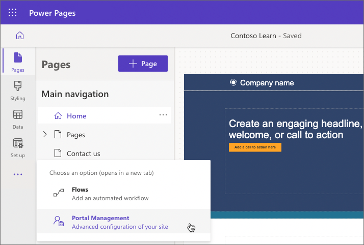

Power Pages stores all information in Microsoft Dataverse including structure, layout, content, and functionality of the site.

The most common questions about the business sites are:

- How do I add and manage content?
- How do I use business data on the site?

Power Pages have several tools and core components that enable these scenarios.

## Tools

**Power Pages design studio** is the primary maker's tool that allows you to quickly create and customize a website. To launch Power Pages design studio, sign in to [Power Pages Home](https://make.powerpages.microsoft.com/), select a site and then select **Edit**.

**Pages**, **Styling**, **Data**, and **Set up** workspaces allow customization of many aspects of a website within a single interface.

Power Pages is an evolution of Power Apps portals. For advanced configurations that aren't available in the Power Pages design studio, the [Portal Management app](/power-pages/configure/portal-management-app) is accessible from the overflow menu.

Administrators can use [Power Pages admin center](/power-apps/maker/portals/admin/admin-overview) to perform advanced administrative actions such as network configuration, logging and troubleshooting, SharePoint and Power BI integration set-up, and more. Admin center can be accessed from Power Pages design studio by selecting **Set up**, then **Site details**, then **Open admin center**.

## Core components

Power Pages inherits the richness and extensibility of Dataverse and includes a few components to hold the site content and access business data.

### Web Pages

Most of a site content is stored as web pages each representing a particular URL. Through parent and child relationships, web pages form the hierarchy of a website.

Web pages can be added and edited by using the Pages workspace in Power Pages design studio or directly in Dataverse by using the Portal Management app. 

## Working with data

The strength of Power Pages is the ability to connect to data stored in Dataverse. With the **Data** workspace in Power Pages design studio, you can easily create, manage, and visualize business data for the site with tables, forms, and lists. 

When a web page is edited in Power Pages design studio, lists and forms can be added to the page content as site components. Inserted list or form will be used to render the page layout by using data from Dataverse. The list and form definitions can include interactivity, for example, providing read-write access to Dataverse table rows.

### Tables

Data workspace provides site makers with access to all tables in the environment. **Tables in this site** displays only the tables that are used on the site pages by a list or a form. You can also create a new table or modify an existing one. Table designer allows you to add new columns and rows to the selected table, much like a spreadsheet.

### Lists

Lists define how a list of Dataverse rows is displayed on the site pages. They're defined by one or more table views and include functionality like pagination, filtering, and sorting.

### Forms

Forms add ability to interact with Dataverse data by using table form definitions as layout templates. Examples of the types of capabilities that are enabled by Forms include:

- Informational pages about employees, products, or any other Dataverse table.

- Data capture from either anonymous or authenticated users, for example, using a Contact us page to record leads in Dynamics 365 Sales or using a survey page to collect product feedback from the customers.

- Support pages that provide read-write access to the customers' cases.

- Any other scenario where Dataverse data needs to be accessed, displayed, captured, and processed by using Power Pages.

There are two types of forms supported in Power Pages, **Forms**, and **Multistep forms**. Forms are used to generate a layout, capture the data, provide read-only access or full editing capabilities for a Dataverse table row. Multistep forms extend forms by allowing data collection or update process to be broken up over multiple steps.

