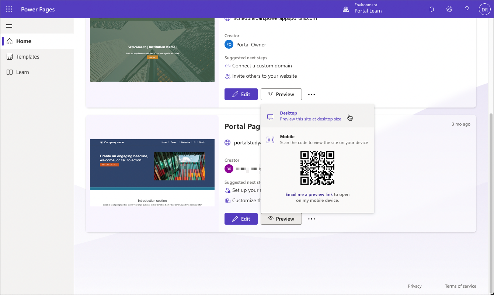
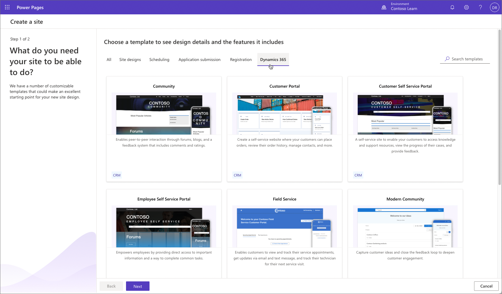
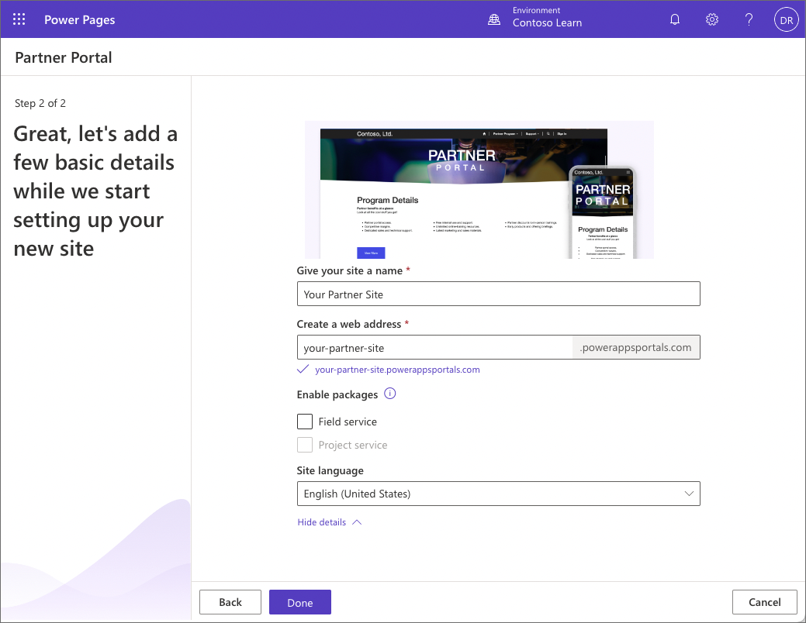

A Power Pages website can be provisioned in a Power Platform environment with Dataverse database. Power Pages comes with a variety of rich, customizable templates targeting specific business scenarios. You can select the template, and specify the name, default address, and language for the website.

> [!IMPORTANT]
> To provision a site, you must be assigned to the System Administrator role in the Dataverse environment selected for the site.

## Provision a website

> [!NOTE]
> A Power Pages site is always created as a trial that can later be converted to a production site.

To provision a Power Pages website:

1. Sign in to [Power Pages](https://make.powerpages.microsoft.com/?azure-portal=true).

1. Select a target environment by using the environment selector in the upper-right corner.

1. Select **+ Create a site**.

1. Select a template then select **Choose this template**.
   

1. Provide a site name and a unique web address.

1. If your Dataverse environment has more than one language provisioned, expand **Show more details** section and select a site language.

   

1. Select **Done**.

   > [!NOTE]
   > It might take a few moments for your new site to be provisioned.You'll be able to modify the name and web address later.

8. Once provisioning is complete, select **Preview** then select **Desktop** to preview your new website.
   

## Dynamics 365 templates

Power Pages is evolution of [Power Apps portals](/power-apps/maker/portals/). It's built on the Power Apps portals platform used by thousands of customers today, providing the same robust capabilities and pro developer experiences. 

> [!VIDEO https://www.microsoft.com/videoplayer/embed/74205e30-2d82-4128-ae84-87d2fc7c9167]

In an environment that contains Dynamics 365 customer engagement apps (Dynamics 365 Sales, Dynamics 365 Customer Service, Dynamics 365 Field Service, Dynamics 365 Customer Insights - Journeys, or Dynamics 365 Project Service Automation) you can continue to use [Dynamics 365 templates](/power-pages/templates/dynamics-365-templates) to accelerate development and deployment. These templates  target diverse audiences such as communities, customers, partners, and employees and can provide a preconfigured environment that is immediately suitable for a number of scenarios:

- Community and Modern Community
- Customer, Employee, and Partner self-service
- Field Service
- Supply Chain Management Customer and Intelligent Order Management

> [!IMPORTANT]
> Available starter templates depend on the Dynamics 365 solutions provisioned in the environment. For example, Intelligent Order Management portal requires [Dynamics 365 Intelligent Order Management](/dynamics365/intelligent-order-management/?azure-portal=true) solution provisioned.

## Provision a Dynamics 365 site

To provision a portal in an environment with Dynamics 365 customer engagement apps: 

1. Sign in to [Power Pages](https://make.powerpages.microsoft.com/?azure-portal=true).

1. Select a target environment by using the environment selector in the upper-right corner.

   > [!IMPORTANT]
   > Make sure selected environment contains Dynamics 365 applications, otherwise no Dynamics 365 templates will be available. If you do not have an environment with a Dynamics 365 app installed, you could [sign up for a Dynamics 365 trial environment](https://go.microsoft.com/fwlink/?linkid=2208427).

1. Select **+ Create a site**.

1. Select **Dynamics 365** tab.
   

   > 

1. Select a template then select **Choose this template**.

1. Provide a site name and a unique web address.

1. If your Dataverse environment has more than one language provisioned, expand **Show more details** section and select a site language.

   > [!TIP]
   > To create a portal in a different language, you must first [enable the language in the environment](/power-platform/admin/enable-languages#enable-the-language) so that it becomes available in the language drop-down list.

1. If Partner portal template is selected, you can additionally include Field Service or Project Service add-ons. These options are enabled if you have Dynamics 365 Field Service or Dynamics 365 Project Service Automation installed, respectively.
   

1. Select **Done** to start the portal provisioning process. After portal provisioning has completed, the portal will appear in the list of Power Pages sites.

> [!VIDEO https://www.microsoft.com/videoplayer/embed/RE4yoJw]
