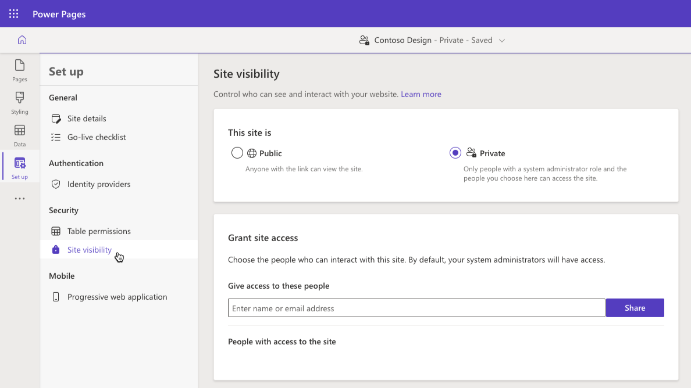
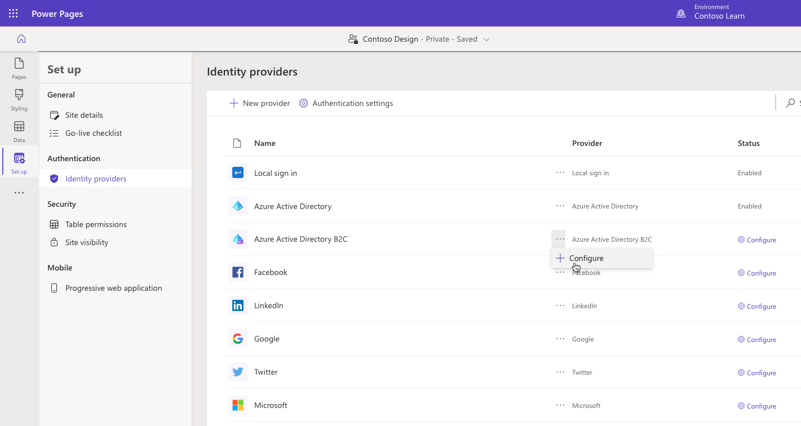
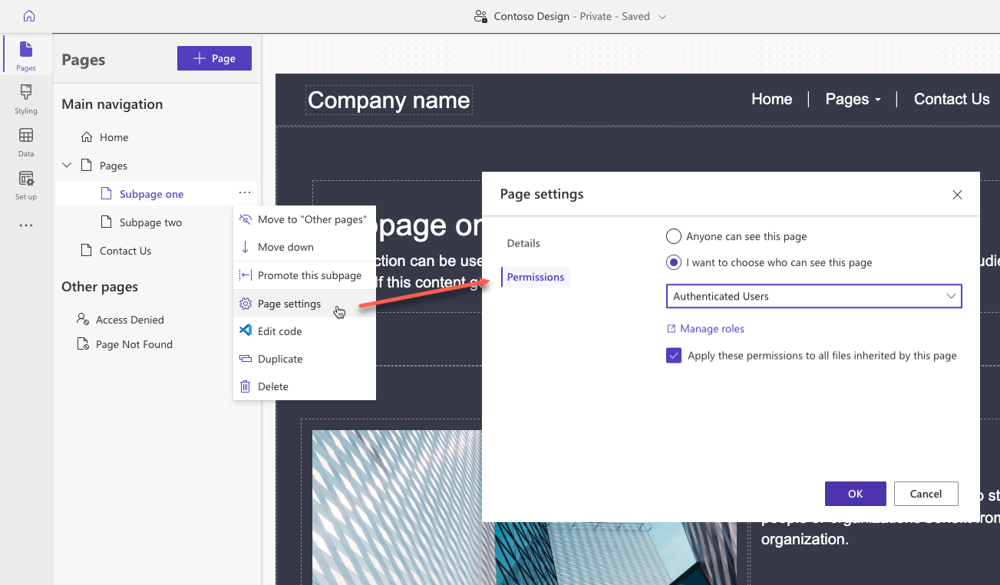

Power Pages has a robust security model to ensure that business information is protected and is only accessible by the correct stakeholders. This model fully supports authentication - who can access the website, and authorization - what information are they allowed to access. Authentication and authorization are implemented in Power Pages by the following main components:

- **Site visibility** allows you to manage who has access to your website.
- **Authenticated users** in Power Pages are represented in Microsoft Dataverse by contacts.
- **Table permissions** define access to rows in Dataverse tables regardless of how and where they are accessed in Power Pages.  
- **Page permissions** are used to grant or deny access to the individual pages on the website. 
- **Web roles** link together users and permissions to define user access to Dataverse data and website content.

You can use Power Pages design studio and Portal Management app to manage Power Pages security.

- Power Pages design studio makes security configuration simpler for the most common scenarios.
- Portal Management app allows management of all site security aspects but requires in-depth understanding of the Power Pages security model.

## Site visibility

The Power Pages site visibility feature allows you to manage who has access to your website. Site visibility can be set to either public or private.

* Public sites are accessible over internet and any changes to the site are visible to external visitors immediately. 
* Setting visibility to private is useful if your site is in development and you wish to limit access to specific people in your organization.

To access site visibility settings in Power Pages design studio, select **Set up** workspace, then select **Site visibility** under **Security** section.

> [!IMPORTANT]
>
> * All new sites created in Power Pages are private by default. When the website is ready to go live, you can change the site visibility to public.

## Authentication

Power Pages users can authenticate by using the following methods:

- **Local sign in** - Forms-based authentication with the information stored securely in the Dataverse contact row.

- **External authentication** - Credentials and password management are handled by external identity providers such as Azure Active Directory B2C, Microsoft, Twitter, Facebook, and more.

Site administrators can configure any combination of authentication options in Power Pages design studio using **Identity providers** option under **Authentication** section in **Set up** workspace.

> [!IMPORTANT]
> Azure Active Directory B2C is a recommended identity provider for authentication. If another provider support is required, then it can be configured in Azure Active Directory B2C.

## Authorization

After the user is authenticated and associated with a contact, Power Pages uses web roles to define what a user is allowed to do. 

A **Web role** allows administrators to control user access to the site content and Dataverse data. A web role can be associated with the page, table, and column permissions defining granular access to the site pages and the rows and columns in the Dataverse tables.

For example, to access read permissions for a page in **Pages** workspace in Power Pages design studio, select  the ellipses next to the page you want to manage permissions for, choose **Page Settings**, then select **Permissions** tab.

A Power Pages user might be assigned to one or more web roles at a time. Access rules and permissions of individual roles are combined to calculate the resulting permissions set.
