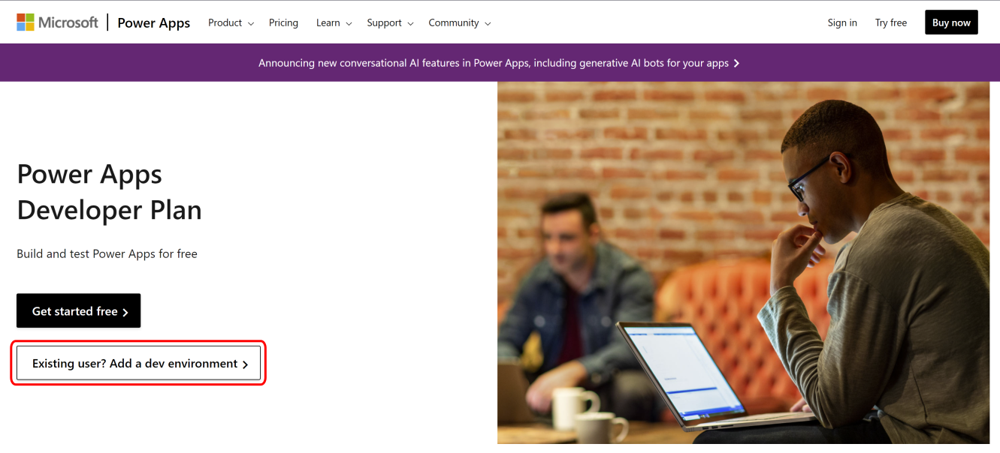
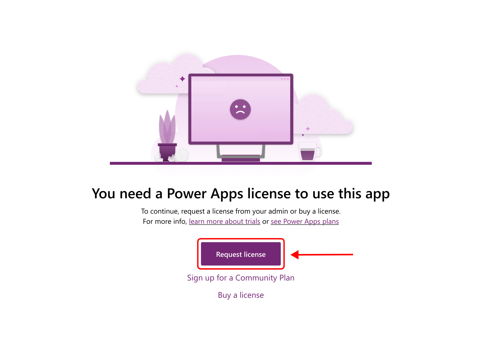
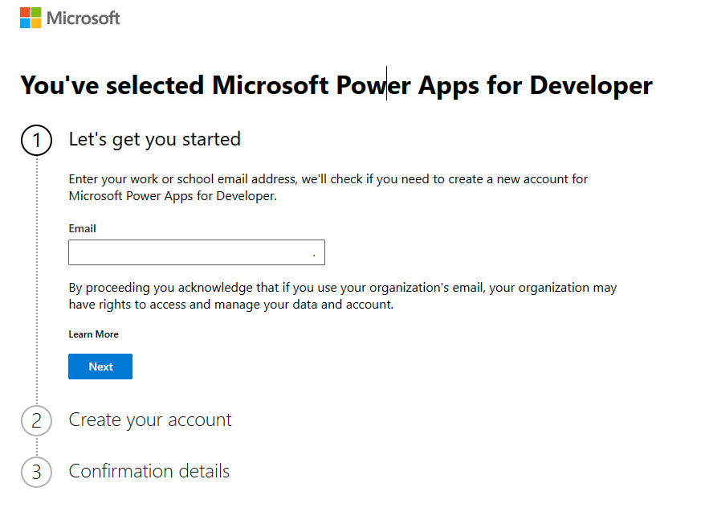
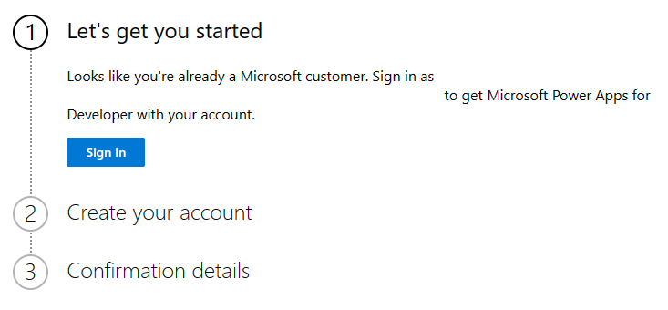
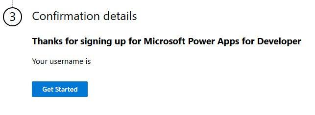

[Dataverse](/power-apps/maker/data-platform/data-platform-intro) is the data source for Power Pages. With Microsoft Dataverse, makers can use Power Apps to create model-driven apps and to work with data by using a view of data records in a grid or list. Then, makers can use a form to add, update, and view each record.

Power Pages sites are unique, but they have components that use these model-driven app views and forms as a foundation to build interactive, data-driven webpages. Your Power Pages site requires a Dataverse environment. To add a Dataverse environment to your trial, you'll create a Developer Environment.

> [!IMPORTANT]
> If you have already signed up for a developer environment, you cannot sign up for another. You will instead receive an error.

1. Go to [Power Apps Developer Plan](https://aka.ms/PowerAppsDevPlan/?azure-portal=true).

1. Select **Existing User**.

   > [!div class="mx-imgBorder"] 
   > 

1. From here, select **Request license**.

   > [!div class="mx-imgBorder"] 
   > 

1. Enter the email address that you created in the previous exercise.

   > [!div class="mx-imgBorder"] 
   > 

1. Select **Sign In**, ensure that **Country or Region** is filled in, and then enter the **Business phone number**.

   > [!div class="mx-imgBorder"] 
   > 

1. Select **Get Started**.

   > [!div class="mx-imgBorder"] 
   > 

The environment that you created is named [**FirstName LastName]'s Environment**. The system will add Dataverse to the environment, but it might take up to five minutes.

You've now created a developer environment.