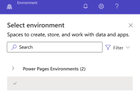
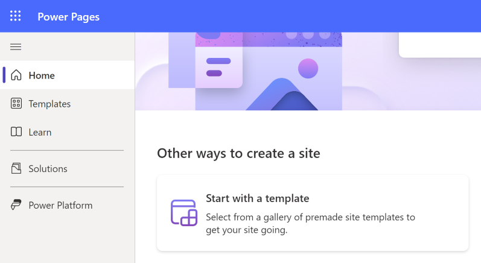
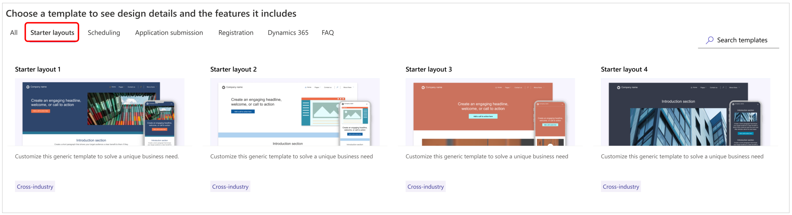
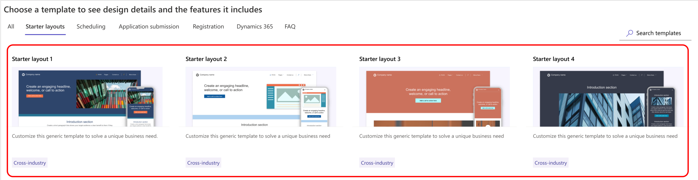
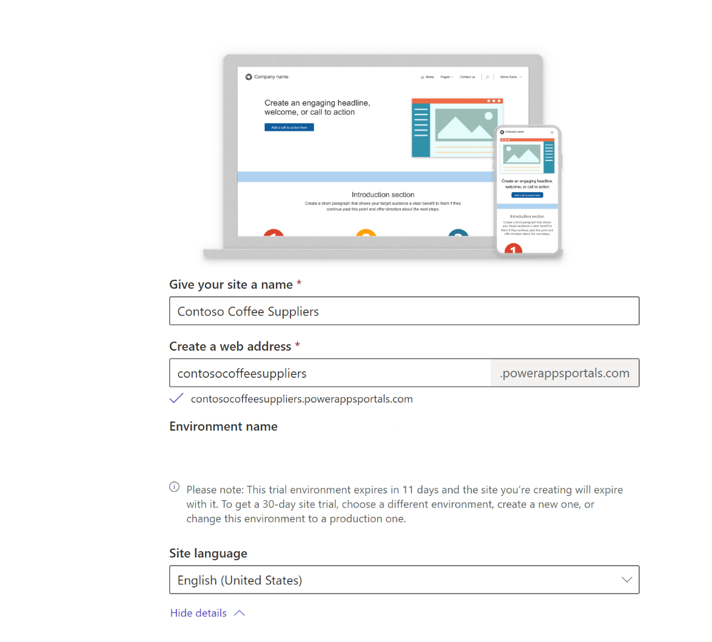
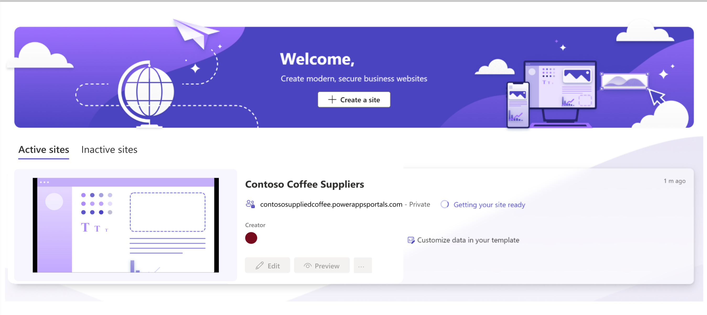
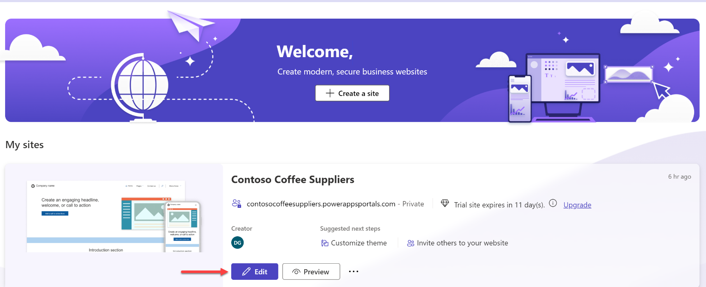

In this exercise, you'll create a website with Power Pages.

1. Go to [Power Pages](https://make.powerpages.microsoft.com/?azure-portal=true).

1. In the upper-right corner, confirm that you're in your developer environment (**[FirstName LastName]'s Environment**). If not, select the environment's name to switch to the developer environment. Don't select the default environment.

	> [!div class="mx-imgBorder"] 
	> 

1. Select **Get Started**.

1. A series of questions will appear, asking about your level of creating websites. Pick any option (it doesn't affect the process).

1. If you don't see the starter popup, follow these steps instead of the previous step:

   1. Select **Templates** from the left-side navigation.

		> [!div class="mx-imgBorder"] 
		> 

   1. Select the **Starter Layouts** tab from the available tabs.

		> [!div class="mx-imgBorder"] 
		> 

1. Choose between **Starter layout 1**, **Starter layout 2**, or **Starter layout 3** and then select **Choose this template**.

	> [!NOTE]
	> If you'd like to use the simplest layout, select **Template 1**. This is the layout used for the remainder of these lab guides.

	> [!div class="mx-imgBorder"] 
	> 

1. Choose a name for the website, and modify the web address if needed. Later, if you convert from a trial to a production pages site, you can upload a certificate for a domain name that you own. Select **Done**.

	> [!div class="mx-imgBorder"] 
	> 

   > [!NOTE]
   > If you receive an error that a Dataverse database is missing, it means that Dataverse isn't yet installed in the developer environment. Wait a few minutes before trying again.

You'll need to wait until the provisioning is complete before moving on to the next steps. While the website is provisioning, you can view its status update on [Power Pages](https://make.powerpages.microsoft.com/?azure-portal=true).

> [!div class="mx-imgBorder"] 
> 

A fully provisioned Power Pages site will now have a selectable **Edit** button, as shown in the following screenshot.

> [!div class="mx-imgBorder"] 
> 

Power Pages design studio will offer you a short tour.

Now, you've provisioned a Power Pages website.