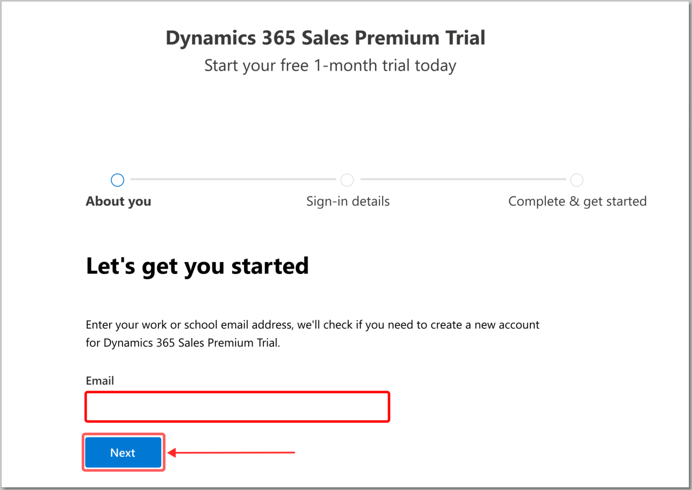

In this exercise, you'll create a test tenant by following these steps:

1. If you're using Microsoft Edge, open an InPrivate browsing session. If you're using Chrome, open an Incognito window. Using a private browsing session helps ensure that you're opening a browser where you aren't already signed in to Microsoft services with your corporate credentials.

1. Go to [Microsoft Dynamics 365 Sales Premium Trial sign up](https://signup.microsoft.com/get-started/signup?OfferId=82272b45-36d5-4226-8cee-576b70f7aaac&ali=1&products=82272b45-36d5-4226-8cee-576b70f7aaac&ru=https%3A%2F%2Fadmin.powerplatform.microsoft.com%2Fenvironments%3Fopen%3Dnew%26type%3DTrial%26template%3DD365_SalesPremiumTrial&azure-portal=true).

1. Enter your work email in the form and then select **Next**.

   > [!div class="mx-imgBorder"]
   > 

   > [!IMPORTANT]
   > You might get an alert that you're already using that email address. If so, select **Create a new account** instead, and skip the next step.
   >
   > [!div class="mx-imgBorder"]
   > 

1. Select **Set up account**.

   > [!div class="mx-imgBorder"]
   > 

1. Enter information in the following fields and then select **Next**.

   - **First Name**

   - **Last Name**

   - **Business phone number**

   - **Company Name** (we recommend that you use a fictitious company name)

   - **Company size**

   - **Country or region**

   > [!div class="mx-imgBorder"]
   > 

1. Validate that the phone number that you've entered is one where you can receive a verification code through text or call. Select **Send Verification Code**.

   > [!div class="mx-imgBorder"]
   > 

1. When prompted, enter the verification code that you've received through text, and then select **Verify**.

1. When prompted, enter a unique, fictitious business domain in the dialog. Select **Check availability**. After you've verified that the business domain is available, select **Next**.

1. Enter a username and password. Select **Sign up** after you've confirmed the password.

1. You'll receive a success message. Make sure that you write down the credentials that you created.

   > [!div class="mx-imgBorder"]
   > 

You've now created a trial tenant.
