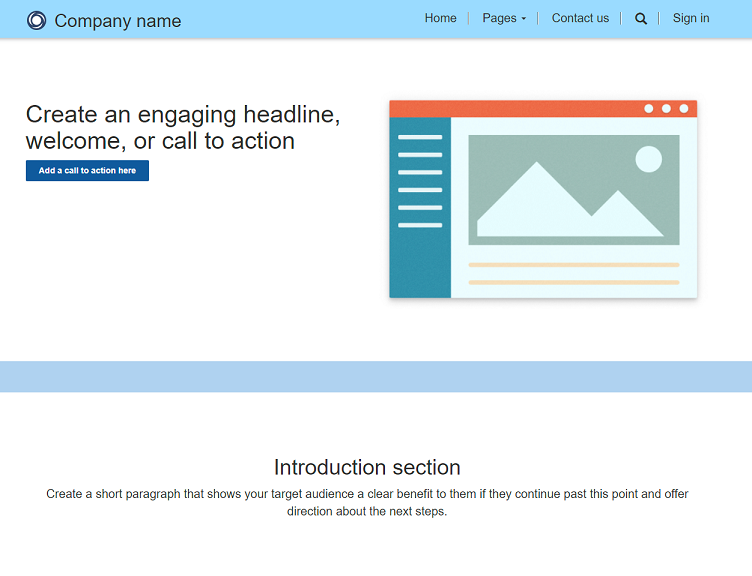

The Power Pages design studio is an intuitive interface where low-code makers can build and set up rich business web apps. It consists of four workspaces, each of which is covered in the labs.

1. If you don't already have it open, open the [Power Pages maker portal](https://make.powerpages.microsoft.com/?azure-portal=true).

1. In the upper-right corner, validate that you aren't in the default environment and that you're in your Dataverse environment.

   > [!div class="mx-imgBorder"] 
   > 

1. On the **Home** page, under **Active sites**, identify the Power Pages site that you previously created and then select **Edit**.

   > [!div class="mx-imgBorder"] 
   > 

1. Power Pages design studio will load, and then you'll be prompted to take a tour. Follow the prompt to explore Power Pages design studio.

   > [!div class="mx-imgBorder"] 
   > 

1. After you've completed the tour, in the upper-right corner of the workspace, select **Preview**. When you select **Preview**, the config cache is cleared, and the changes that you've made within the design studio will become immediately visible on the web, as opposed to needing to wait for the cache to clear asynchronously.

1. Select **Desktop** after the **Preview** icon has stopped processing.

   > [!div class="mx-imgBorder"] 
   > 

1. The first time that you preview your site, you might be asked to accept a permissions request. Select **Accept**.

1. Follow the prompt to sign in. All new sites that you create in Power Pages are private by default, which means that only you (the site maker) and users to whom you have explicitly granted access are able to view the site. You need to sign in so that the site can verify that you have access. You'll learn how to make your site public in a later lab.

Your Power Pages site will load in a new tab.

> [!div class="mx-imgBorder"] 
> 

You've now completed the prerequisites for the Power Pages in a Day course. You've also viewed what your created Power Pages site looks like out of the box. In the following modules, you'll customize them for the Contoso Coffee brand and use case.