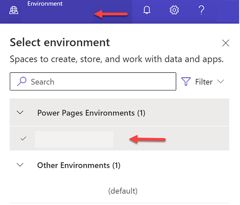
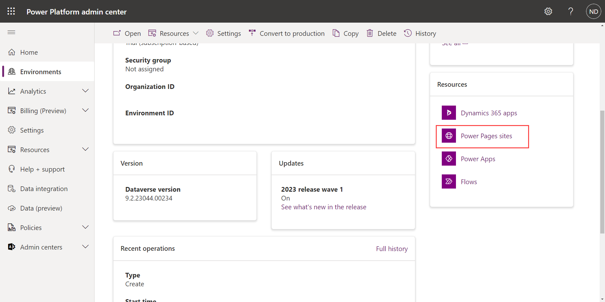
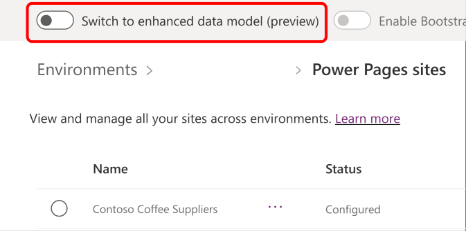
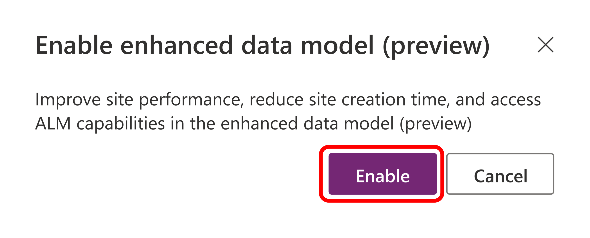

The enhanced data model is a new way of storing website configuration information in Microsoft Dataverse. The enhanced data model requires a smaller Dataverse table footprint, and you can use it to add websites to solutions. Websites that you provision by using the enhanced data model are ready in a fraction of the time over using the standard data model.

Follow these steps to set up your Dataverse environment to use the enhanced data model for Power Pages.

1. Go to the [Microsoft Power Platform admin center](https://aka.ms/ppac/?azure-portal=true).

   > [!NOTE]
   > You will need to sign in with the credentials you used when creating your tenant and environment.

1. On the left-side navigation, select **Environments**. From here, you'll see a list of all the environments for your tenant, including their type and properties.

1. Select the environment that you've been working with for these labs, then select **Detailed View** from the ribbon at the top of the page.

   > [!div class="mx-imgBorder"] 
   > 

1. Select the **Power Pages sites** link inside of the **Resources** panel.

   > [!div class="mx-imgBorder"] 
   > 

1. Locate the **Switch to enhanced data model** option. If it's disabled for this environment, enable it by selecting the toggle.

   > [!div class="mx-imgBorder"] 
   > 

1. In the pop-up window, select **Enable**.

   > [!div class="mx-imgBorder"] 
   > 

The process to convert the environment to the enhanced data model takes a few moments.