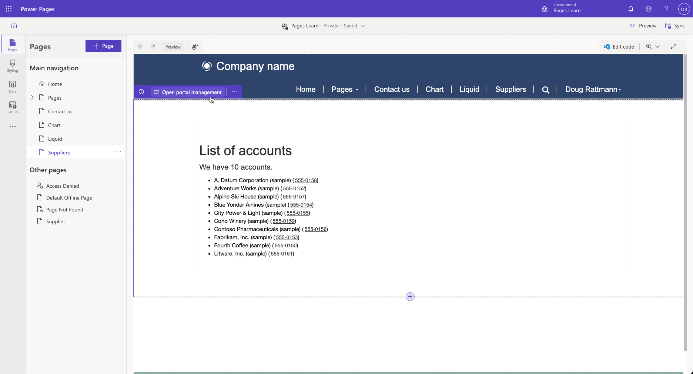
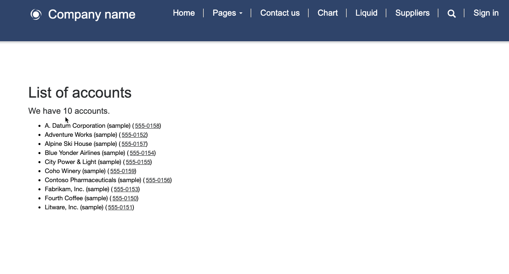

The purpose of this hands-on lab is to access Microsoft Dataverse data by using Liquid.

The exercises work best when you have sample data to work with. Depending on the environment that you're working with, you might want to install some sample data to assist with the exercises. Microsoft Power Platform allows sample data to be added as needed. If the environment that you're working in doesn't have sample data installed, follow the steps in the [Add or remove sample data](/power-platform/admin/add-remove-sample-data/?azure-portal=true) documentation to install the sample data into your environment.

## Learning objectives

The goal for these exercises is for you to learn how to:

- Enter Liquid code as part of the page content.

- Access Dataverse data by using Liquid.

- Add conditional statements to display only available data.

## Prerequisites

For this exercise, you need to have the following parameters set up in your environment:

- A provisioned Power Pages website. If you don't have a website available, follow the [Create a site with Power Pages](/power-pages/getting-started/create-manage/?azure-portal=true) instructions.

- Access to the Power Pages design studio.

## High-level steps

In this exercise, you'll display selected Dataverse records by adding some HTML and Liquid code to the webpage copy section by using the Power Pages design studio code editor.

1. Open your website in Power Pages design studio.

1. Add a **Suppliers** webpage.

1. Add HTML and Liquid code that lists all active accounts.

1. Preview the results in design studio and in a browser.

1. Add Read table permissions for the account table and verify results in a browser.

## Detailed steps
Follow the detailed steps in this section to complete the exercise.

### Launch Power Pages design studio

Follow these steps to launch Power Pages design studio:

1. Sign in to [Power Pages](https://make.powerpages.microsoft.com/?azure-portal=true).

1. Select the correct environment in the upper-right corner.

1. Select the website and then select **Edit**. 

### Create the Suppliers webpage

To create the **Suppliers** webpage, follow these steps:

1. Select the **Pages** workspace.

1. Select **+ Page**.

   - Enter **Suppliers** as the page name.

   - Select the **Start from blank** template.

   - Select **Add**.

### Edit the source code

To edit the source code to list all active accounts, follow these steps:

1. Select the content on the page canvas and then add a text component.

1. Replace the component placeholder with the following text:

    ```php
    <h2>List of accounts</h2>
    
    <p>We have {{ entityview.total_records }} accounts.</p>
    <ul>
      
      <li>{{ account.name }}
        
        (<a href="tel:{{ account.telephone1 }}">{{ account.telephone1 }}</a>)
        
      </li>
      
    </ul>
    
    ```

1. Select **Sync**.

1. The list of current accounts should display on the page canvas, including hyperlinked telephone numbers where they're present.

   > [!div class="mx-imgBorder"]
   > [](../media/liquid-exercise.png#lightbox)

   > [!IMPORTANT]
   > Design studio allows you to enter Liquid by using a standard text component. After you've saved and synced the page, Power Pages will convert the text component into an advanced component indicating that inline editing is no longer available. You can still access the Liquid code in Visual Studio Code editor, which you can launch by selecting the **Edit code** button. 

1. Select **Preview > Desktop**. The displayed webpage should only contain the text, "We have 0 accounts."

    > [!NOTE]
    > This result is expected because, at runtime, Power Pages will deny access to table rows unless a table permission record exists to allow access to the data.

### Add table permissions

To display the list of account records when you're browsing a page, you'll need to add table permissions.

> [!WARNING]
> In this exercise, you'll add global read permissions on the Account table for all visitors. This setup isn't a typical security configuration; it's used for demonstration purposes only.

To add table permissions, follow these steps:

1. Select the **Set up** workspace and then select **Table Permissions**.

1. Select **+ New**.

1. Enter the following values:

   - **Name** - Suppliers

   - **Table** - Select the **Account** table

   - **Access type** - Select **Global access**

   - **Permission to** - Select **Read**

1. Select **Add roles**.

1. Select **Anonymous users** and **Authenticated users**.

1. Select **Save**.

1. Select **Preview > Desktop**.

   A list of the accounts should display.

   > [!div class="mx-imgBorder"]
   > [](../media/list-accounts-anonymous.png#lightbox)
