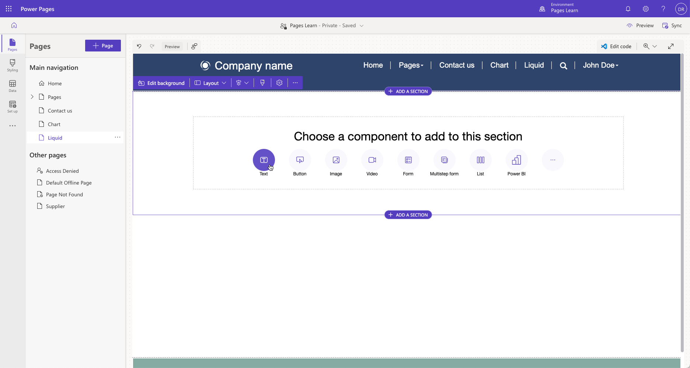
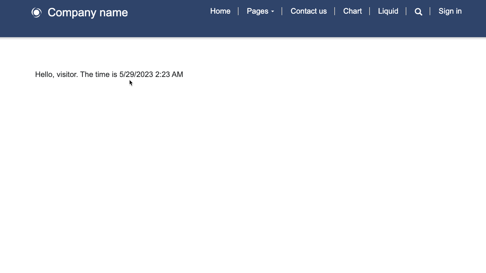

Microsoft Power Pages generates output based on Microsoft Dataverse data. The fundamental question in this architecture is: How can I take *this* data and insert it into *that* output?

The data in this question would commonly refer to Dataverse data, and the output is usually HTML or plain text.

Because Power Pages uses a software as a service (SaaS) model, access to the server code isn't provided. Website makers need to edit their own templates, which is where Liquid template language comes in.

Liquid is an [open-source template language](http://liquidmarkup.org/?azure-portal=true) that's integrated natively into Power Pages. It acts as a bridge between Dataverse data and the HTML or text output that's sent to the browser. You can use Liquid to add dynamic content to pages and to create various custom templates. Additionally, Liquid provides access only to the data and operations that the website security settings explicitly allow.

## Add Liquid code to webpages

You can use Liquid code anywhere in the portals where you can enter HTML or text content, including web templates, webpages, and content snippets.

1. Sign in to [Power Pages](https://make.powerpages.microsoft.com/?azure-portal=true).

1. Select the correct environment in the upper-right corner.

1. Select the website and then select **Edit**. 

1. Select the **Pages** workspace.

1. Select **+ Page**.

   - Enter **Liquid** as the page name.

   - Select the **Start from blank** template.

   - Select **Add**.

1. Select the content on the page canvas and then add a text component.

   > [!div class="mx-imgBorder"]
   > [](../media/liquid-start.png#lightbox)

1. Replace the component text placeholder with the following text:

   ```twig
   Hello, visitor. The time is {{ 'now' | date: 'g' }}
   ```

1. Select **Preview > Desktop**.

   The webpage preview will open and display the current UTC time.

   > [!div class="mx-imgBorder"]
   > [](../media/liquid-start-result.png#lightbox)

> [!NOTE]
> After the page content is synced, the page preview in Power Pages design studio might only display the "Hello, visitor. The time is" text. The Liquid code is still on the page, and you can view it in the page source by selecting **Edit code** on the toolbar. 
