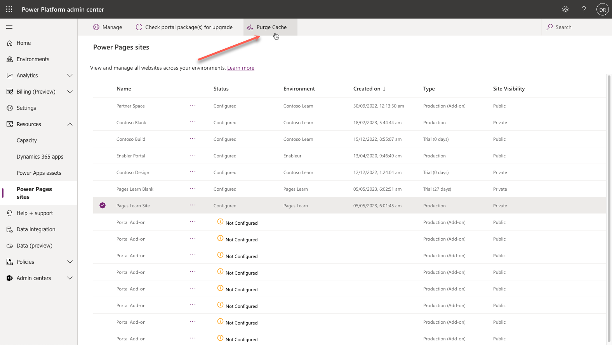

The purpose of this hands-on lab is to show how the Site Checker can identify potential portal issues.

## Learning objectives

By the end of these exercises, you'll be able to:

- Run the Site Checker.
- Respond to the mitigation advice.
- Rerun the Site Checker to confirm that the issue has been addressed.

**Estimated time to complete this exercise:** 10 to 15 minutes

### Prerequisites

For this exercise, you'll need to have the following components set up in your environment:

- A provisioned Power Pages website. If you don't have a Power Pages website available, follow the [Create a Dataverse starter portal - Power Apps](/power-apps/maker/portals/create-portal/?azure-portal=true) instructions to create one.
- Access to the Microsoft Power Apps maker portal.
- Access to Power Pages admin center.

## High-level steps

In this exercise, you'll make a few changes to the settings in your website metadata. Next, you'll run the Site Checker tool from the Power Pages admin center and then evaluate the results. After you've addressed the issue, you'll rerun the Site Checker to ensure that the issue has been resolved.

The high-level steps are as follows:

1. Locate the `Header/OutputCache/Enabled` site setting and then update the value to **False**.

1. Purge the website cache.

1. Run the Site Checker.

1. Note the warning message for the header output cache.

1. Locate the `Header/OutputCache/Enabled` site setting and then update the value to **True**.

1. Purge the website cache.

1. Run the Site Checker.

1. Note that the warning for the Header Output cache has been cleared.

## Detailed instructions
The following sections outline the detailed instructions to the high-level steps.

### Disable header output cache
Your first task is to disable header output cache by following these steps:

1. Sign in to the [Power Apps maker portal](https://make.powerapps.com/?azure-portal=true).

1. Make sure that the correct environment with the portal provisioned is selected in the environment selector in the upper-right corner.

1. From the **Apps** list, select the **Portal Management** app to open the app in a new window.

1. Select **Site Settings**.

1. Locate the `Header/OutputCache/Enabled` site setting.

   > [!TIP]
   > Use the search functionality and look for **header** to quickly locate the row.

1. Update the value to **False** and then select **Save**.

   

1. Leave the **Portal Management** app open.

### Clear portal cache
To clear portal cache, follow these steps:

1. In a new window or tab, sign in to the [Microsoft Power Platform admin center](https://admin.powerplatform.microsoft.com/?azure-portal=true).

1. In the left pane, expand **Resources** and then select **Power Pages sites**.

1. Select the target website.

1. Select **Purge Cache** on the command bar.

1. Select **OK** when prompted.

   > [!div class="mx-imgBorder"]
   > 

1. Wait for the operation to complete.

### Run Site Checker
Next, you'll run the Site Checker.

1. Select the target website name to open Power Pages admin center.

1. Select the **Run** button in the **Site Health** pane.

3. The header output cache has a warning. Expand the message to get more details.

   > [!div class="mx-imgBorder"]
   > 

### Enable header output cache
To enable header output cache, follow these steps:

1. Return to the **Portal Management** app.

1. Update the `Header/OutputCache/Enabled` site setting to **True** and then select **Save**.

### Check the issue resolution
Your last task is to check the issue resolution.

1. Repeat the previous steps to clear the website cache.

1. Repeat the previous steps to run Site Checker.

1. Verify that the header output cache issue has been resolved.

> [!div class="mx-imgBorder"]
> 
