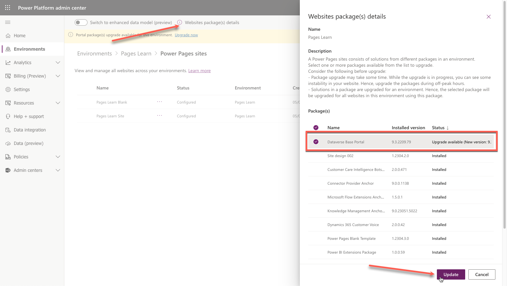

An administrator's role goes beyond ensuring that a Power Pages website is running correctly; it also includes setting up the site to run efficiently and quickly. Numerous tools are available to help administrators check the settings and status of a Power Pages site and provide users with clear messaging if the website is undergoing maintenance.

## Site Checker

The **Site Checker** feature is available in the Power Pages admin center and runs diagnostic checks to protect and advise of common issues that might be encountered when people are operating a website.

To run the Portal Checker, follow these steps:

1. Sign in to the [Microsoft Power Platform admin center](https://admin.powerplatform.microsoft.com/?azure-portal=true).
1. In the left pane, expand **Resources** and then select **Power Pages sites**.
1. Select the target website to open Power Pages admin center.
1. Select the **Run** button on the **Site Health** pane.

   > [!div class="mx-imgBorder"]
   > 

   After a few minutes, a list of diagnostic results will display.

   > [!div class="mx-imgBorder"]
   > 

The result also provides mitigation steps or links to help you understand the impact of the issue and how to resolve it.

For more information, see [How to run Site Checker](/power-pages/admin/site-checker?azure-portal=true).

## Enable maintenance mode

As an administrator, you might have occasions when you don't want website users to visit or sign in to the Power Pages website. The reason could be because you're migrating or updating a series of webpages and functionality. Alternatively, you might be uploading a large dataset that you don't want to be available on the website until the load process is complete.

While you can shut down the website, selecting this option presents the website visitors with a message that the website can't be found, leaving the visitors wondering what has happened.

> [!div class="mx-imgBorder"]
> 

Within the Power Pages admin center actions is the **Enable Maintenance Mode** option. Selecting this option provides the website visitors with a more informational page indicating that the website is temporarily unavailable.

> [!div class="mx-imgBorder"]
> 

You can also replace the maintenance mode page with a custom HTML page that's hosted elsewhere and publicly accessible. For more information, see [Maintenance mode for a website](/power-pages/admin/enable-maintenance-mode?azure-portal=true#enable-maintenance-mode).

## Website upgrades

A benefit of software as a service (SaaS) applications is that many of the software components are updated automatically and regularly. Several Power Pages components, such as Azure app services and the various tools, are updated automatically.

An administrator can also opt to receive early updates in the Power Pages admin center.

> [!div class="mx-imgBorder"]
> 

> [!CAUTION]
> You should opt for early updates in development or testing websites only. This approach ensures that your production website remains operational in the unlikely event that an early update might cause issues with your website application.

While underlying infrastructure is maintained automatically, website solutions aren't automatically updated. An administrator might be advised of the available solution updates from the Microsoft 365 message center.

A Power Pages website consists of solutions from different packages in an environment. You can use the Microsoft Power Platform admin center to view the details and update the installed packages.

> [!IMPORTANT]
> Solutions in a package are upgraded for an environment. The selected package is upgraded for all websites in the environment that's using the package.

To check and update website package(s) in an environment, follow these steps:

1. Sign in to the [Microsoft Power Platform admin center](https://admin.powerplatform.microsoft.com/?azure-portal=true).

1. In the left pane, expand **Resources** and then select **Power Pages sites**.

1. Select the target website.

1. Select **Check portal package(s) for upgrade** in the upper part of the page.

   > [!div class="mx-imgBorder"]
   > 

1. If upgrades are available, you're prompted to go to the upgrade page. Select **OK** to open the environment website page.

1. On the environment website page, select **Websites package(s) details**.

1. Select packages with the available updates and then select **Update**.

   > [!div class="mx-imgBorder"]
   > 

> [!IMPORTANT]
> Updating packages might take some time. We recommend that you update the website solutions during an appropriate maintenance window to avoid possible performance degradation and website instability.
