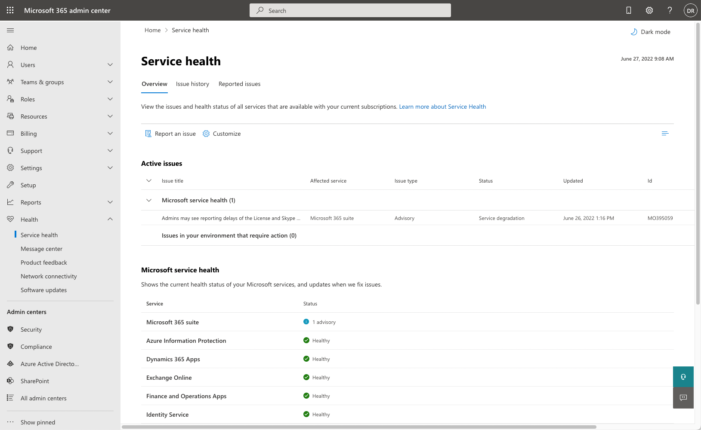
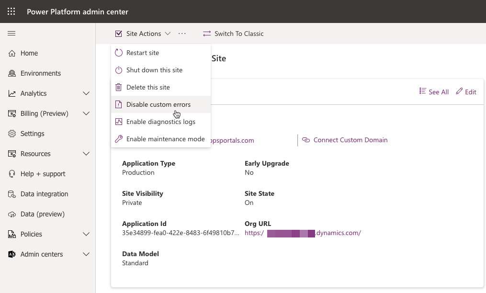
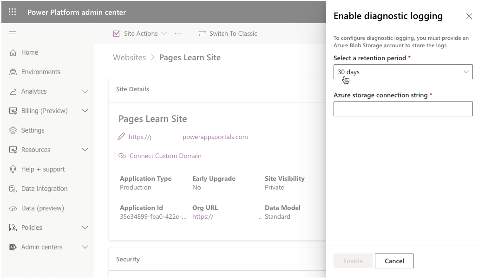

One key responsibility of a Power Pages administrator is to ensure that the website is available and running without errors. Power Pages provides tools to help administrators and developers identify, troubleshoot, and resolve runtime issues.

## Power Pages website issues

If the entire website is inaccessible, an administrator can investigate numerous possibilities:

- Whether the website has been enabled or not
- If other Microsoft Dataverse apps are accessible
- Issues that might have occurred with the infrastructure services that Power Pages depends on, such as Microsoft Entra ID or Azure App Service
- If advisories exist in the [Service health - Microsoft 365 admin center](https://admin.microsoft.com/adminportal/home?#/servicehealth)

> [!div class="mx-imgBorder"]
> 

An administrator should also investigate whether some website metadata has been recently modified, such as the website or website binding rows, which also might affect functionality.

Running the **Site Checker** might also identify potential issues with the website.

## Website pages and functionality issues

Occasionally, a website administrator might need to resolve errors with specific website pages or functions.

Power Pages has several tools that allow an administrator to quickly identify and resolve issues without contacting Microsoft support.

### Disable custom errors

A typical error might begin when a website visitor reports an issue when visiting a website page. Often, the error message is brief and doesn't describe the underlying issue.

In the Power Pages admin center, the **Disable custom errors** action replaces the notification with detailed error information on the website page that could provide extra information for an administrator to troubleshoot the issue.

> [!div class="mx-imgBorder"]
> 

> [!NOTE]
> Disabling custom errors should be a temporary setting because the detailed error message might convey an increased negative experience for website visitors. We recommend that you only disable custom errors when you're in the development phase and enable custom errors after you go live.

Another option is to personalize the error message by adding a content snippet called **Portal Generic Error**, which contains an appropriate message for website users. For more information, see [Display a custom error message](/power-pages/admin/view-portal-error-log?azure-portal=true#display-a-custom-error-message).

### Diagnostic logging

Along with visual errors on website pages, potential underlying issues could occur that aren't as obvious to isolate and troubleshoot. You can set up Power Pages to log diagnostic information. The diagnostic logs are stored in Azure Blob Storage in a container named **telemetry-logs**. The administrator can set up the retention period of how long to keep the logs.

> [!div class="mx-imgBorder"]
> 

The logs can provide information on patterns, duration, and frequency of specific website errors to help resolve potential errors and issues. For more information, see [View error logs](/power-pages/admin/view-portal-error-log?azure-portal=true#access-portal-error-logs).

## More troubleshooting steps

Because the website might extend certain functionality of a model-driven app, one technique to eliminate potential website errors is to attempt the same operation in the model-driven app. For example, if an error is generated when a record is added through the website, try adding or updating the same data record that a website user is attempting to create or update on a website. After the error has been resolved in the model-driven app, it's often resolved on the website as well.

Creating the `Site/EnableCustomPluginError` site setting and then setting the value to **True** will display the contents of the plug-in error on a website page rather than the generic error message.

For more information, see [Display plugin error](/power-pages/admin/view-portal-error-log?azure-portal=true#display-plugin-error).
