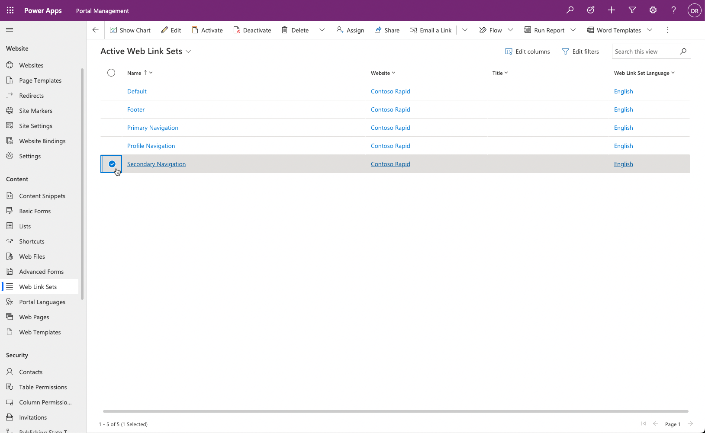
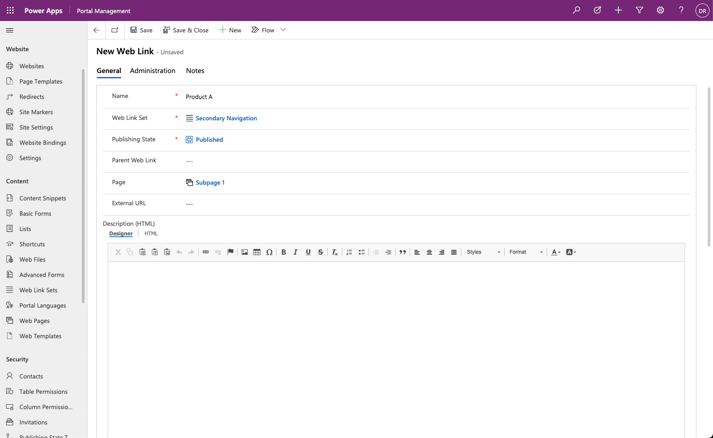
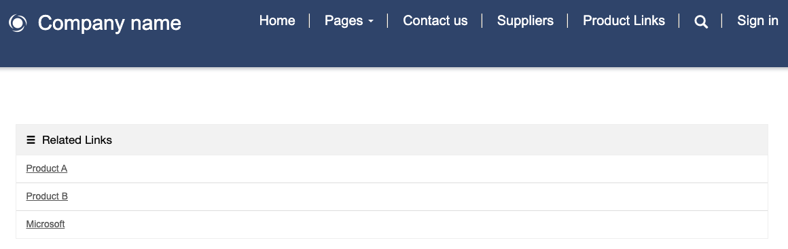

The purpose of this hands-on lab is to set up a webpage layout and add a side menu navigation to other webpages and external links.

## Learning objectives

The goal for these exercises is for you to learn how to:

- Identify and modify secondary website navigation.

- Use the Portal Management app to add new web links to an existing web link set.

- Create a webpage with an embedded navigation menu by using Power Pages design studio.

### Prerequisites

For this exercise, you need to have the following parameters set up in your environment:

- A provisioned Power Pages website. If you don't have a website available, follow the [Create a site with Power Pages](/power-pages/getting-started/create-manage/?azure-portal=true) instructions.
- Access to the Power Pages design studio.

> [!NOTE]
> This exercise assumes that one of the Starter layout website templates was used to provision the website, but any starter template with multiple pages will work. 

## Scenario

Your organization has provisioned and set up a Power Pages website. You want to start modifying the website navigation to provide quick access to frequently used information.

To modify website navigation to suit organizational requirements, you'll need to complete the following tasks:

- Use the Portal Management app to modify the existing **Secondary Navigation** web link set to include existing webpages and an external link.

- Create a new page by using Power Pages design studio.

- Add a two-column component to the new page.

- Modify the page source code to reference the secondary navigation.

### Update the web link set

To update the web link set, follow these steps:

1. Sign in to [Power Pages](https://make.powerpages.microsoft.com/?azure-portal=true).

1. Select the correct environment in the upper-right corner.

1. Select the ellipsis (**...**) menu for the website and then select **Portal management**. Don't close the Power Pages home window.

1. Locate the **Web Link Sets** rows.

1. Select and open the **Web Link Sets** row named **Secondary Navigation**. 

1. If the row doesn't exist, select **+ New** to create a new row named **Secondary Navigation**.

    > [!div class="mx-imgBorder"]
    > [](../media/select-secondary-navigation.png#lightbox)

1. Select the **Links** tab.

1. Select the **New Web Link** button.

1. Enter the following information:

    - **Name** - Product A

    - **Web Link Set** - Secondary Navigation (which should already be selected)

    - **Publishing State** - Published

    - **Page** - Subpage 1

    > [!NOTE]
    > This exercise assumes that one of the Starter layout website templates was used to provision the website. If a different template was used, your website might not have the **Subpage 1** page included. You can select any page of your choice to create the link.

1. Select **Save & Close**.

    > [!div class="mx-imgBorder"]
    > [](../media/subpage-navigation.png#lightbox)

1. Select the **New Web Link** button again.

1. Enter the following information:

    - **Name** - Product B

    - **Web Link Set** - Secondary Navigation (which should already be selected)

    - **Publishing State** - Published

    - **Page** - Subpage 2

1. Select **Save & Close**.

1. Select the **New Web Link** button again.

1. Enter the following information:

    - **Name** - Microsoft

    - **Web Link Set** - Secondary Navigation (which should already be selected)

    - **Publishing State** - Published

    - **External URL** - `https://www.microsoft.com`

1. Select **Save & Close**.

### Create the webpage

To create the webpage, follow these steps:

1. Switch to the Power Pages home window.

1. Select **Edit** to open Power Pages design studio.

1. Select the **Pages** workspace and then select **+ Page**.

1. In the new page dialog, complete the following actions:

   1. Enter **Product Links** as the **Page name**. 

   1. Select the **Start from blank** layout.

   1. Select **Add**.

### Add a column component and add navigation

To add a column component and add navigation, follow these steps:

1. Select **Edit code** to launch Visual Studio Code editor.

1. In the Code Editor, locate the innermost `<div>` element.

1. Add the `` Liquid tag to the line so that it resembles the following example:

   ```twig
   <div class="col-md-12 columnBlockLayout" style="display: flex; flex-direction: column;">
     
   </div>
   ```

1. Close the Visual Studio Code editor tab. Select **Save** if prompted.

1. Select **Sync** to synchronize changes.

1. Select **Preview > Desktop**. A page with links to the web pages and the external URL should appear.

    > [!div class="mx-imgBorder"]
    > [](../media/page-secondary-navigation.png#lightbox)

> [!NOTE]
> Many webpage components, such as lists and forms, are represented by Liquid tags. In this exercise, the *include* tag references the **Web Template** called *Weblink List Group*, which describes how the secondary navigation should be rendered. For more information, see [Liquid overview](/power-pages/configure/liquid/liquid-overview?azure-portal=true).
