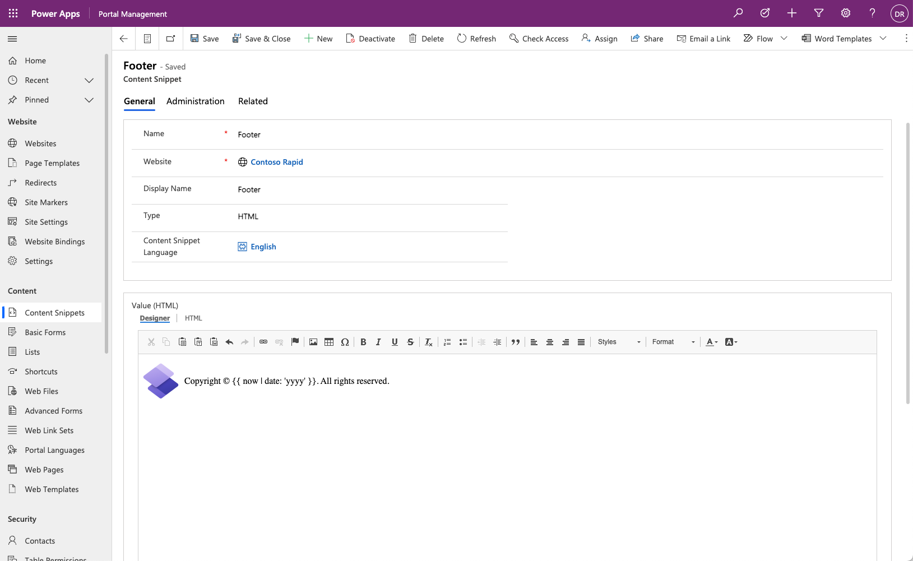

The Microsoft Power Pages design studio provides a set of tools to help you create content, manage pages, components, and themes, perform data modeling, manage views and forms, set up permissions, and much more. However, you can't add or edit many aspects of a Power Pages project by using the Power Pages design studio alone.

When the first Power Pages website is provisioned in a Microsoft Dataverse environment, one asset that's installed is the Portal Management model-driven app.

## Launch the Portal Management app

You'll have access to the Portal Management app after you have a first Power Pages website provisioned in your Dataverse environment. To access the Portal Management app, follow these steps:

1. Sign in to [Power Pages](https://make.powerpages.microsoft.com/?azure-portal=true).

1. Select the correct environment in the upper-right corner.

1. Select the ellipsis (**...**) menu for the website and then select **Portal management**. 

This process launches the Portal Management app and allows you to access all metadata and data that define the website content and behavior.

## Portal Management app overview

The Portal Management app allows you to perform advanced configuration actions on the website by providing direct access to the metadata rows that define the appearance, language, security, and functionality of the website.

The Portal Management app consists of standard, model-driven views and forms in which to add and update metadata. Some forms have specialized controls, such as HTML editors, to allow deeper customization of website content.

> [!div class="mx-imgBorder"]
> 

The Portal Management app contains the following areas:

- **Website** - Control various operational aspects of the portal, such as website settings, page templates, temporary and permanent redirects within the site, and others.

- **Content** - Access static content that appears on the website, navigation, and tables that control website access to Dataverse data, such as lists and forms.

- **Security** - Define security assets, such as web roles and table permissions.

- **Ads** - Create text or image-based ads and have them run in multiple placements throughout your site.

- **Polls** - Ask your audience about specific topics, collect and aggregate their responses, and get immediate feedback from their vote.

- **Administration** - Access miscellaneous portal features, such as integration with traffic analyzers and search engines.

For more information, see [Portal Management app overview](/power-pages/configure/portal-management-app?azure-portal=true).
