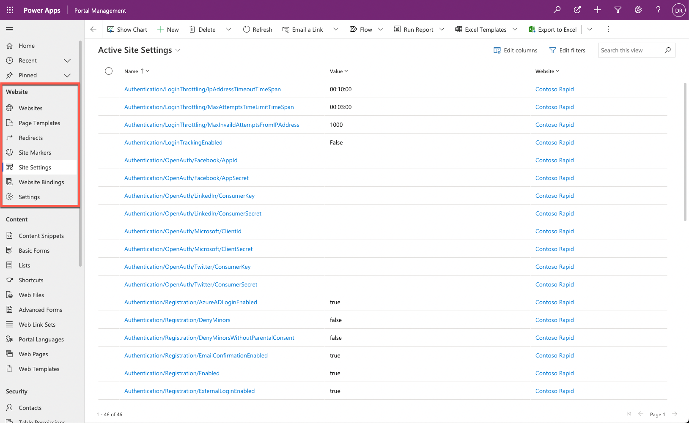
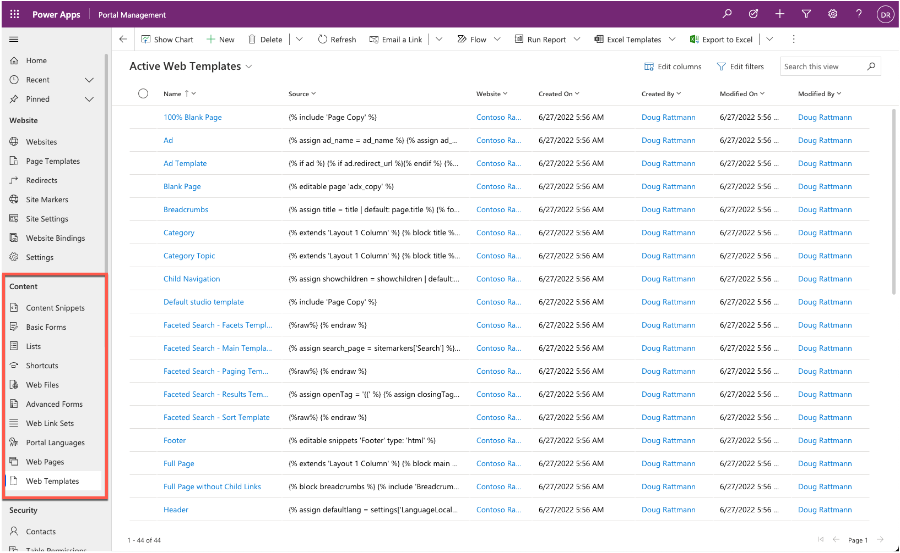
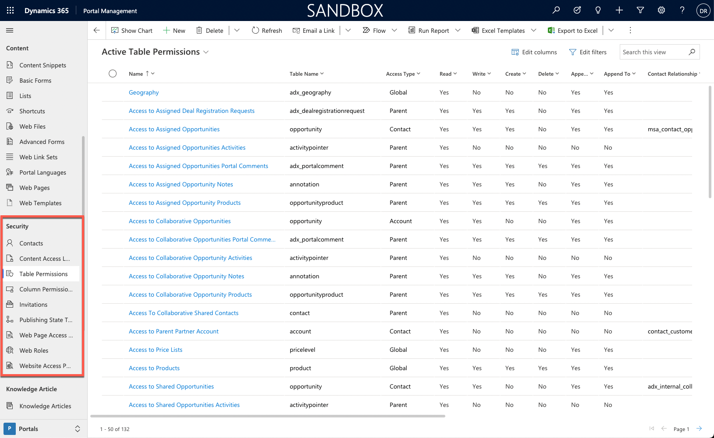

Makers need to understand website metadata and where it's used to effectively set up a Power Pages website. While most makers can create and edit website configuration and metadata directly in the Power Pages design studio or by using other tools, they can only add or modify rows in many Power Pages tables by using the Portal Management app.

The following section explains the purpose of the different Power Pages tables.

## Website

The **Website** section defines properties that control the behavior of the websites that are provisioned in the particular Dataverse environment.

> [!div class="mx-imgBorder"]
> 

| Metadata | Purpose |
| --- | --- |
| Websites | Each provisioned website has one website row that's the main parent table for all website metadata. The website row defines the default header and footer templates and the languages. We don't recommend that you create a website and related rows manually. Instead, let the system create the metadata through the provisioning or import process. |
| Page Templates | A webpage uses a page template to point to a fixed page template or to a web template. Page templates appear in the Power Pages design studio when you're creating new webpages. |
| Redirects | A redirect row is meant to be a temporary or a permanent redirect for a specific URL. You can use redirects to create a URL that redirects to a page that's deeper in the site or for a legacy URL to automatically redirect to a new page on the site. These redirect URLs are managed separately from the page content so that they don't need to fit directly in the web hierarchy. |
| Site Markers | A site marker is a pointer to a specific webpage row. You can reference the site marker in a Liquid tag on a content snippet, web template, or in webpage content. This feature allows you to avoid needing to hard-code specific URLs on webpages or content. |
| Site Settings | Site settings define specific behaviors of website functionality and features. Site settings are value pairs that can enable or disable particular items, such as authentication settings, searching, and caching. |
| Website Bindings | Website bindings link the particular website to the Microsoft Azure web application. Manual maintenance of website bindings isn't required because they're automatically managed when a new website is provisioned or when you change website settings in the Power Pages admin center. |
| Settings | Similar to the Site Settings table, the Settings table contains value pairs that are common to all websites that are provisioned for the particular environment as opposed to a specific website. |

## Content

The **Content** section contains tables that define what and how static and dynamic information is displayed on a Power Pages website. While you can add some content by using Power Pages design studio, you can only add or modify certain aspects by updating the data directly with the Portal Management app.

> [!div class="mx-imgBorder"]
> 

| Metadata | Purpose |
| --- | --- |
| Content Snippets | Content snippets are typically short, reusable content items that can appear on various parts of a website. An example of a content snippet would be the footer content that would be displayed on most webpages. A content snippet can contain text, Liquid code, HTML, and Cascading Style Sheets (CSS). Typically, a content snippet row would be replicated for each provisioned website language. |
| Basic Forms | Forms, previously referred to as Basic Forms, use model-driven form definitions to display forms on the website and enable access to Dataverse rows for website visitors. You can set up a form to be displayed as read-only, edit, or create. |
| Lists | Lists use model-driven view definitions to display lists of Dataverse rows. You can set up a list to allow navigation to a selected row or to run workflows. You can also enable advanced search and filter capabilities. |
| Shortcuts | A shortcut row allows you to make a direct link on a webpage to another webpage, web file, or an external URL, regardless of the hierarchy or site map of the website. By default, the shortcut link appears as a link on the parent webpage along with the list of other child pages. |
| Web Files | A web file row provides a metadata row where a file can be attached as a note. The web file row defines the name and partial URL. You can use web files for the images, CSS, and JavaScript files and to store downloadable content. |
| Advanced Forms | Multistep forms, previously referred to as Advanced forms, are similar components to forms; however, instead of a single row/form, multistep forms create a sequence of steps that you can use to build a website-based business process flow. |
| Web Link Sets | A web link set defines the website menu that can appear in the header of a webpage or as a submenu within a webpage. The Web Link Set row contains a collection of Web Link rows that can point to a website page or external URLs. |
| Portal Languages | List of all languages that are supported by Power Pages out of the box. You can also expand the list and add language variants, such as French (Canadian) or English (Australian), to cater to international audiences. You can associate any row with the website row to enable selected languages for website visitors. |
| Web Pages | The webpage row is the core of the website. It defines the actual displayed content, both static and through other components such as lists and forms. You can create and edit a webpage by using Power Pages design studio and the Portal Management app. |
| Web Templates | The Web Template row contains the Liquid, HTML, CSS, or JavaScript code that makes up the layout and foundation of how a webpage is rendered. When a website is provisioned, it includes a set of predefined web templates, which would allow you to create a basic website without needing to understand the code. You can create your own web templates or modify existing web templates to satisfy specific requirements and implement custom features of your website apps. |

## Security

The security capabilities of Power Pages are similar to Dataverse role-based security. The main concept is that a website user is represented by a contact row and can authenticate and sign in to a website. You can assign the website user to one or more web roles, which you can use to control access to static content and Dataverse data.

> [!div class="mx-imgBorder"]
> 

| Metadata | Purpose |
| --- | --- |
| Contacts | The Contact table is the actual Dataverse contact table. All authenticated website visitors, including internal staff members, must have a corresponding contact row regardless of the authentication method. |
| Table Permissions | Table permissions define the scope and the privileges for specific Dataverse tables. You can associate each table permission row with a web role, granting configured data access to website visitors. |
| Column Permissions                | Table permissions are used to help secure individual Dataverse table rows. Column permissions extend security to individual table columns. Column permissions are currently only applicable for [portal Web API](/power-pages/configure/web-api-overview?azure-portal=true) features. |
| Invitations                       | You can create and send an invitation for an existing Dataverse contact to join the website by using Microsoft Power Automate. After the invite has been accepted, it will determine the contact's access and permissions for the website. |
| Publishing State Transition Rules | You can grant users the permissions to create and update website content; however, further rules might be in place to allow for an approval process before the content is viewable by everyone. The Publishing State Transition Rule rows define who can publish or unpublish content on the website. |
| Web Page Access Control Rules     | Web Page Access Control Rules link a specific webpage to a web role, which is linked to website users. This feature controls what webpages that a website user can access. |
| Web Roles                         | You can assign one or many web role rows to a website user (contact). You can link the web role to table permissions, column permissions, and Web Page Access Control Rules to control access to content and Dataverse rows and columns. |
| Website Access Permissions | Website access permissions define which high-level editing and content preview permissions that specific web roles have for the website. |

Some website templates might install more settings for specific features, such as knowledge articles for the Customer self-service portal.
