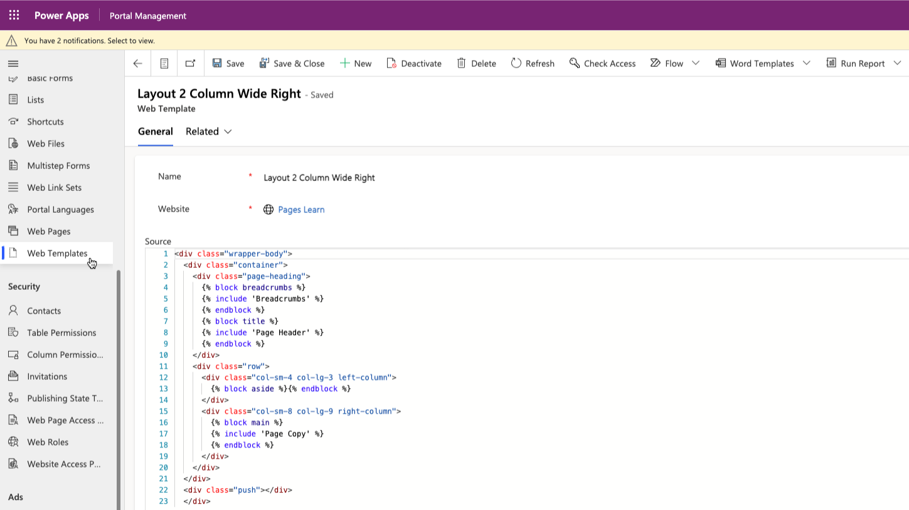

While webpages represent content that's accessible to website users, page templates help to maintain a consistent appearance throughout your entire website. Templates also define how dynamic content that's based on Microsoft Dataverse data is delivered to your users and how users can interact with the pages.

When you create a new webpage in the Power Pages design studio or the Portal Management app, choose a page template from the list of existing templates. Several page templates are included with each Power Pages template.

Two template types control how the template determines what to render:

- **Rewrite** - Uses the **Rewrite URL** column to render a fixed ASP.NET template.

- **Web Template** - Uses the **Web Template** column to render a given web template.

## Rewrite

The **Rewrite** template type refers to the physical path to the .aspx page that runs on the Power Pages web app and processes the request. Power Pages are hosted and don't provide direct access to the app, code, or resources. You can't create new **Rewrite** templates or change the behavior of the existing templates.

**Rewrite** templates are useful for specialized content processing, such as forums, blogs, and ideas. Several special **Rewrite** page templates are available, such as **Access Denied**, **Error**, and **Profile**. We don't recommend that you remove or replace these templates.

## Web templates

To create custom page templates, you can use the **Web Template** type, which is a layout template. For example, if a web template includes static HTML, this HTML is rendered as it is in the page output that uses that template. The real power of web templates comes from the ability to contain Liquid code, which adds processing capabilities to the static content, including access to Dataverse data.

Web templates are flexible; you can render them on their own or you can include them as part of another template. Web templates support inheritance where one template is based on and extends the functionality of another. Additionally, you can use them to render a standalone fragment of HTML, such as page breadcrumbs or the entire custom page, or you can create custom headers and footers for your Power Pages website.

Because the web template defines the content that's delivered to the client, a functional consultant would often engage a designer or developer to add CSS or JavaScript to extend a web template and add client-side functionality to the generated page.

> [!div class="mx-imgBorder"]
> 

### Web template columns

A web template is a simple table with the following columns:

- **Name** - When a template is included in other content or extended by other templates, it's referred to by this name.

- **Source** - The source content of the template. It can be a static text, HTML fragment, or a layout by using Liquid.

- **MIME type** - Defines what MIME type that the server sends to the client when the template is rendered. If a value isn't provided, the value is assumed **text/html**, which is a standard type for HTML pages. You can create a web template that renders specialized content. For example, you can create a web template that returns some data in JSON format. In this case, the MIME type would be set to **application/json**. People wouldn't use a page that uses this web template in a browser. Instead, it's called from JavaScript code, which effectively defines a data source in your solution.

### Website headers and footers

You can also use web templates to override the global header and footer that a Power Pages website uses. To accomplish this task, set the **Header Template** or **Footer Template** column of your website to the web template of your choice. If you override **Header Template**, your selected template assumes responsibility for rendering the primary navigation, sign-in/sign-out links, search interface, and so on, for your site interface elements that the default header template normally handles.

> [!TIP]
> If you don't specify a header or a footer template in the website row, the default content is rendered. To remove the header or footer, specify a blank template.
