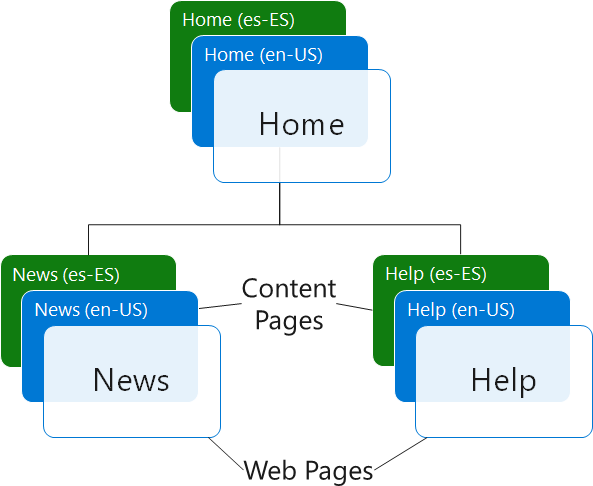
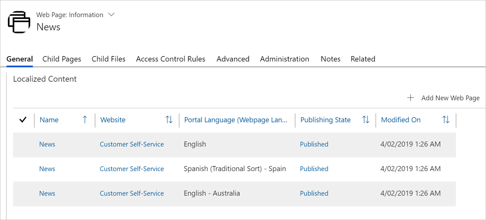
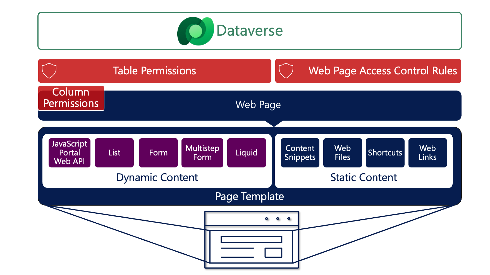

Webpages are the core of any website, including Power Pages. A webpage in a Power Pages website can display static and dynamic content, and you can set up a webpage to follow a site hierarchy. Webpages also have a unique structure to allow content to be displayed in different languages.

Each webpage row within a website has the following columns:

- **Website** - The website to which the page belongs. It's a required column that uniquely places the webpage row within a particular website.

- **Parent page** - The parent webpage of the table in the website content hierarchy. All webpages should have a parent page, except for the single root (Home) page of a website.

- **Partial URL** - The URL path segment that's used to build the website URL of the page. The single root (Home) page of your website (the single page that has no associated parent page) must have a partial URL value of a forward slash (**/**).

That hierarchical structure provides enough information for each webpage to calculate the path that's unique within the website.

| Webpage      | Parent page  | Partial URL | Calculated path            |
| ------------ | ------------ | ----------- | -------------------------- |
| Home         | -            | /           | /                          |
| News         | Home         | news        | /news/                     |
| Partner News | News         | partners    | /news/partners/            |
| Price List   | Partner News | price-list  | /news/partners/price-list/ |

When a request is received by the Power Pages web app, the target Microsoft Dataverse environment and website row are determined based on the domain name. Then, the app uses the path part of the request to locate the webpage row with the matching calculated path.

After the webpage has been determined, the page generation process starts with app completing the following high-level steps:

1. Check the Web Page Access Control Rules to determine if the visitor has permission to access the page.

1. Retrieve the page template that's linked to the webpage to determine the template to use for rendering the page (a fixed page template or a web template).

1. Process the template and then build the page output based on:

    - Static content, which the page content and the website metadata, such as content snippets, determine.

    - Dynamic content that the app generates by using data from Dataverse.

Each webpage represents a specific URL in your site that users can go to. When a user goes to a URL, the content that's associated with that URL will display.

## Static content

Properties of the webpage row determine static content, particularly the **Copy** column, which usually contains the HTML content of the page. You can add or edit this content in Power Pages design studio, Visual Studio Code editor, or you can add it to the content webpages in the Portal Management app.

### Content pages

Generally, a webpage is referenced as a single row. This reference is for convenience; multiple webpage entries exist on every page. One root webpage row is part of the site page hierarchy, which is the one that you edit when creating a new page. Other components on the page are multiple child rows or content pages that point to the root entry. These components support multilingual implementations where each child row is responsible for the content in one of the configured languages.

Every webpage, even in a single language website, has a root webpage and a content page for the base language. As a result, you can add content for other languages later.

> [!div class="mx-imgBorder"]
> 

When a webpage is first created, the system will save all properties, such as the name, partial URL, template, and so on, in the root row. The system creates content rows for each language, and it copies the page properties across. Then, the Portal Management app manages page properties and content on the individual content webpage rows. Pages in different languages can have different content and templates, expiration dates, navigation, and authors, and you can publish them on different dates.

> [!div class="mx-imgBorder"]
> 

You can use the path of the request to locate the webpage, or the root webpage, to be exact. You can define request language by the request URL, such as `https://www.contoso.com/es-ES/news`, or by a browser cookie, and the corresponding content page will be located. The content page defines the content and the template but contains no information about how the content is displayed, which the page template determines.

### Templates

Other than the **Copy** column defining the content on the page, a template can also use other properties such as **Title**, **Summary**, **Display Date**, and others. Templates often include the **Content Snippets** feature as reusable fragments, for example, when you're rendering common information such as a copyright message.

Templates can use references to elements of the site map such as **Web Files**, **Shortcuts**, and **Web Links**. Because you can secure site map elements, they're validated against the Web Page Access Control Rules. For example, if a visitor doesn't have permission to access a target page of a shortcut, by default, the shortcut isn't rendered.

## Dynamic content

You can generate dynamic content by using the following properties:

- **Lists** - These properties use the view definition of a Power Apps model-driven app to render the list of Dataverse rows as part of a webpage without the need for using custom code. When the view definition changes, so will the page output.

- **Forms** - Forms place the definition of a Power Apps model-driven app form on a webpage by providing a configuration-only method to render information from Dataverse rows. Forms aren't limited to displaying information, and you can use them to create and edit Dataverse rows.

- **Multistep Forms** - Multistep Forms are similar to forms but include some other functionality. They can render more than one model-driven app form on a website and can work with multiple tables. Multistep Forms support single or multi-step navigation and conditional branching logic.

- **Liquid** - Liquid is an open-source template language that's integrated into Power Pages. You can use it to add dynamic content to pages and to create various custom templates. Liquid allows access to all website tables, such as a current webpage that's being rendered and its properties or site settings. It can also read Dataverse data by using views or directly by using FetchXML. For more information, see [Build queries with FetchXML](/power-apps/developer/data-platform/use-fetchxml-construct-query?azure-portal=true).

To control access to Dataverse data, Power Pages uses the **Table Permissions** property. You can scope table permissions by using the relationships between a contact and other rows. For example, you can apply permissions to the Case table to restrict authenticated website users to access only their own cases.

Consider the **Table Permissions** property as the Power Pages equivalent of Dataverse security roles. Security roles are associated with Power Apps users, while **Table Permissions** apply to website users (contacts).

One goal in the process of building a webpage is to provide improved security. Web Page Access Control Rules govern access to website structures, while Table Permissions help secure access to Dataverse data.

> [!div class="mx-imgBorder"]
> 

Power Pages includes a robust and flexible mechanism for building static pages or pages that include data from Dataverse tables. By using a combination of lists, forms, multistep forms, Liquid, and JavaScript, you can build complete web applications by extending your Dataverse or Microsoft Dynamics 365 solutions to external and internal audiences.

For more information, see [Manage web pages](/power-pages/configure/web-page?azure-portal=true).
