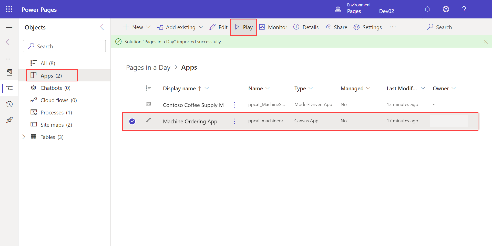
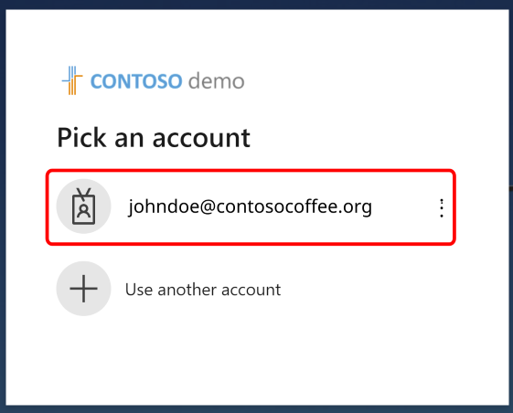
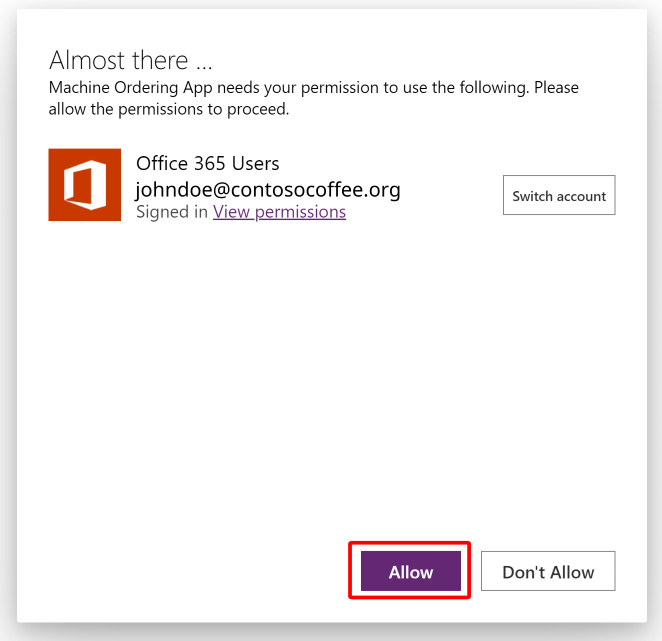
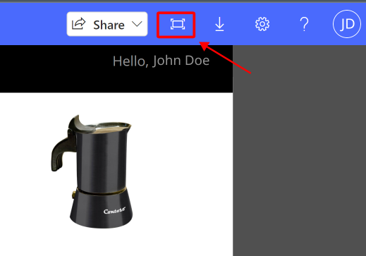
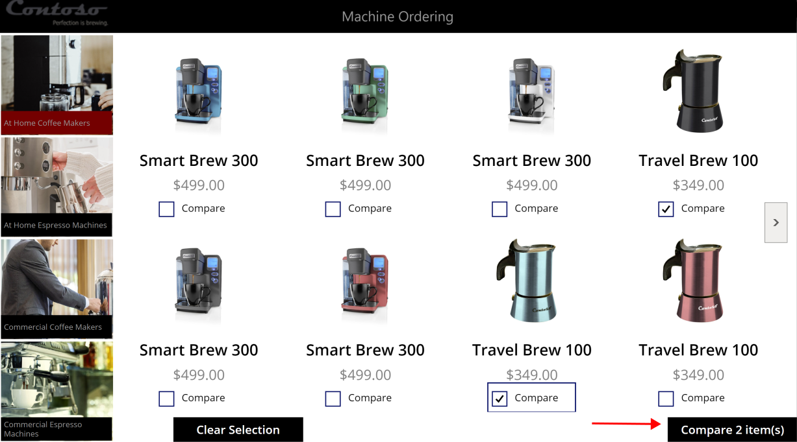
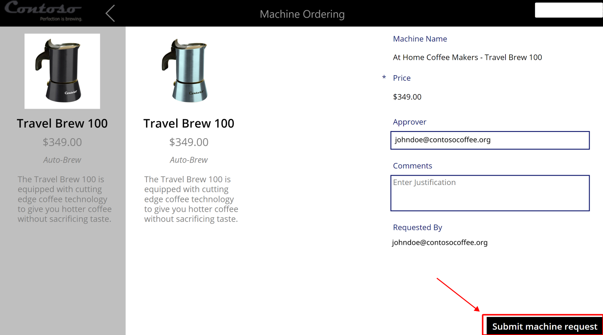
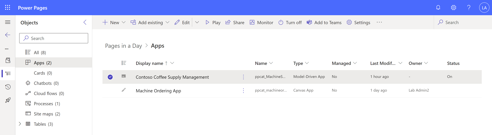
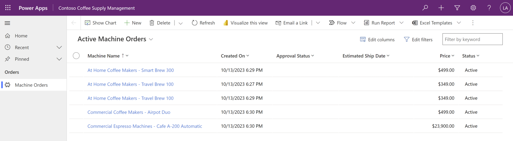
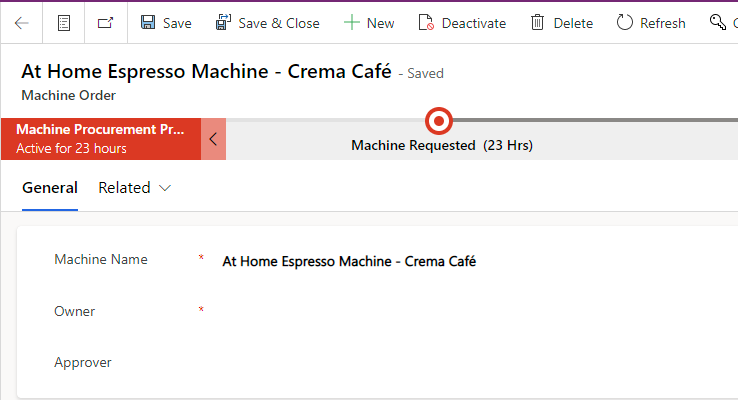

Now that the solution with a completed Power Apps application is installed, you need business data. In this task, you'll run the application and generate business data.

1. To navigate back to Power Pages from the design studio, select the home icon at the top left of the page. 

1. Select the **Pages in a Day** solution to open it. 

   > [!NOTE]
   > To open the solution a new tab, right-click the **Power Pages in a Day** solution and select the **Open in new tab** option.

1. Select the **Apps** node.

1. Select **Machine Ordering App**.

1. From the main menu, select **Play**.

   > [!div class="mx-imgBorder"]
   > 

1. A new tab will open in your browser. You might be prompted to sign in with an account. Choose the authentication account that you've been signed in with.

   > [!div class="mx-imgBorder"]
   > 

   You'll be prompted to grant permission to connect to **Office 365 Users**. Select **Allow**.

   > [!div class="mx-imgBorder"]
   > 

1. Select a couple of machines and then select **Compare** in the lower-right corner of the screen. If the **Compare** button doesn't show, select the **Fit to screen** icon in the upper right, as shown in the following screenshot.

   > [!div class="mx-imgBorder"]
   > 

   > [!div class="mx-imgBorder"]
   > 

1. Select one of the devices and then select **Submit**. Well done, you've now placed a device order.

   > [!div class="mx-imgBorder"]
   > 

1. You'll be redirected to a submission success screen. Select **OK** to return to the main screen.

   **Optional**: Repeat the previous steps a few times to add more sample data to your Microsoft Dataverse environment.

   When complete, you can close the browser tab to return to **Apps** within the **Power Pages in a Day** solution.

1. Select the **Contoso Coffee Supply Management** app (be careful not to select the name, as this will take you into editing the app) and then select **Play** from the ribbon at the top of the page.

   > [!div class="mx-imgBorder"]
   > 

   A new tab will open in your browser, showing a list of records that you created from the canvas app.

   > [!div class="mx-imgBorder"]
   > 

1. Select one of the machine names to open its record and view its form.

   > [!div class="mx-imgBorder"]
   > 

Now, you've completed all prerequisite actions that are required for this workshop.
