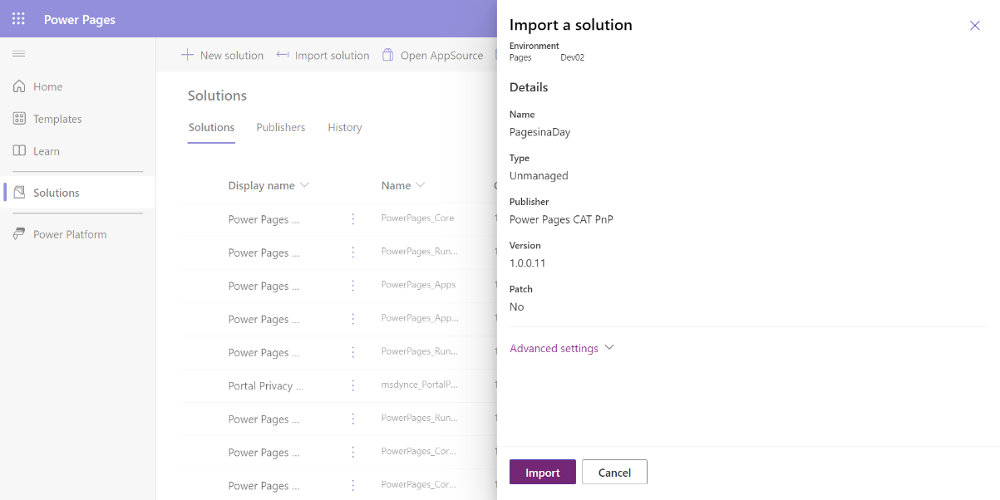

You can use a solution to transport components between environments. The solution that you're about to install is the completed solution from the standard [App in a Day course](https://aka.ms/appinaday/?azure-portal=true). The labs that are listed in this course continue building the functionality for apps that are built during the App in a Day course.

For more information, see [Solutions in Power Apps](/power-apps/maker/data-platform/solutions-overview/?azure-portal=true).

1. Locate the solution .zip file that contains the name **StudentImport.zip** within the student files you've downloaded (1.Dev Resources and Solution Packages > ALM > PP IAD - Student > StudentImport). Do not unzip this file. Download the [student files](https://github.com/MicrosoftDocs/mslearn-developer-tools-power-platform/raw/master/in-a-day/power-pages/PowerPagesIADSupplierPortalStudent.zip) if you do not have them.

   > [!IMPORTANT]
   > Unzipped solutions are not accepted by the Solution Importer. If you receive an error saying that you are missing the appropriate root file, then you have uploaded the wrong folder. 

   > [!div class="mx-imgBorder]
   > 

1. If you do not already, open the [Power Pages maker portal](https://make.powerpages.microsoft.com/?azure-portal=true).

1. In the upper-right corner, validate that you aren't in the default environment and that you're in your Dataverse environment.

   > [!div class="mx-imgBorder"]
   > 

1. From the home page of the marker portal, select **Solutions**.

   > [!div class="mx-imgBorder"]
   > 

1. In the ribbon, select **Import solution**.

   > [!div class="mx-imgBorder"]
   > 

1. Select the **Browse** button and browse to the location where you downloaded the solution and then select the file. Once the name of the file is displayed next to the **Browse** button, then select **Next**

   > [!div class="mx-imgBorder"]
   > 

1. Select **Import** in the **Import a solution** panel.

   > [!div class="mx-imgBorder"]
   > 

   The following message will display until the solution completes the installation.

   > [!div class="mx-imgBorder"]
   > 

   After a few minutes, when the solution has successfully imported, the banner will display a success message similar to the following screenshot. 
   
   > [!NOTE]
   > You do not need to refresh your browser, the banner will update automatically. 

   > [!div class="mx-imgBorder"]
   > 

1. When the import is complete, select the **Publish all customizations** button. The process might take a few minutes.

   > [!div class="mx-imgBorder"]
   > 

You now have the necessary prerequisite components to use for your supplier portal.