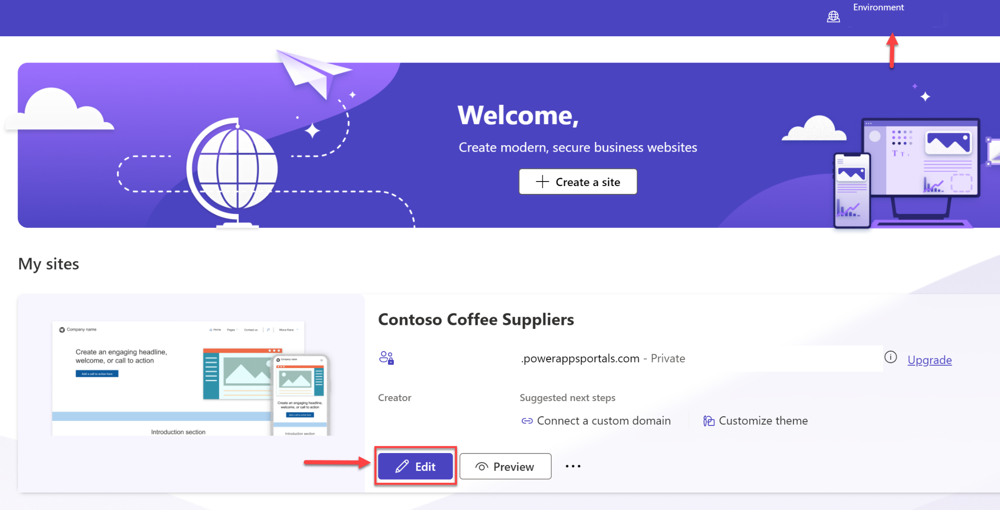
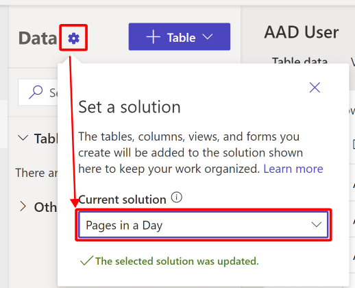

By default, all customizations that you make in Dataverse are saved in the Dataverse Default Solution. In the **Data** workspace, you can select any unmanaged solution where changes that have been made in the **Data** workspace will be added.

Solutions are important if you want to move your configuration to other environments.

You can add newly created tables, columns, forms, and views to the selected solution. In previous steps, you imported an unmanaged solution. In this task, you'll define which solution you'll work out of.

1. Go to [Power Pages](https://make.powerpages.microsoft.com/?azure-portal=true) to get to the Power Pages maker portal if you aren't already there. Validate that you're in the appropriate environment and then select **Edit** under your site.

   > [!div class="mx-imgBorder"]
   > 

1. From within the Power Pages designer studio, select **Data** on the left pane to access the **Data** workspace. Under **Data**, select the gear icon and then select the solution that you imported in a previous lab.

   > [!div class="mx-imgBorder"]
   > 