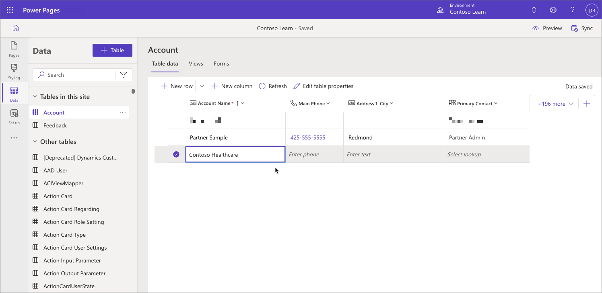
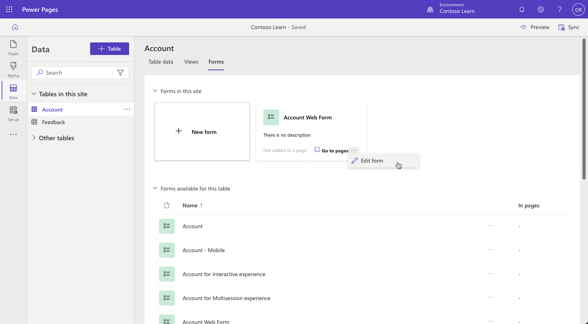

Power Pages is built on the foundation of Microsoft Dataverse. All Dataverse capabilities including comprehensive data modeling and declarative forms and views are available in Power Pages as well.

You can visualize and manage business data for the site in Power Pages design studio. With the **Data** workspace you can create and edit tables for the site, and create new or edit existing forms and views. These forms and views can then be used to create forms and lists components on the web pages.

## Tables

On the **Data** workspace, **Tables in this site** displays all tables used on the site. **Other tables** displays all Dataverse tables in the environment. You can also create a new table or open an existing one in the table designer to add new columns and rows on the **Table data** tab.

For more information, go to [Create and modify tables using Data Workspace](/power-pages/configure/data-workspace-tables).

## Views

By using the **Views** tab, you can create a view to select specific table columns and rows that you want to display in a site. The **Views** tab displays views used in the site lists and all other views defined for the selected table. 

Selecting an existing view or creating a new one opens the Power Apps view designer, where you can define the view layout and filters. Views are a foundation of the list component that can be added to pages.

For more information, go to [Create and modify views by using the Data workspace](/power-pages/configure/data-workspace-views).

## Forms

The **Forms** tab displays the forms used in the site and all other forms available for the selected table. Selecting an existing form or creating a new one opens the Power Apps form designer, where you can add form fields, components, and much more.

Power Pages supports a subset of form features available in Power Apps (for example, form scripting model is different). One of the advantages of **Data** workspace is that it only shows the supported forms, and the form designer only provides features and properties that are supported in portals. 

Forms created in **Data** workspace can then be used to [add a form to a page](/power-pages/getting-started/add-form), or to create [multistep forms](/power-pages/getting-started/multistep-forms).

For more information, go to [Create and modify forms by using the Data workspace](/power-pages/configure/data-workspace-forms).
