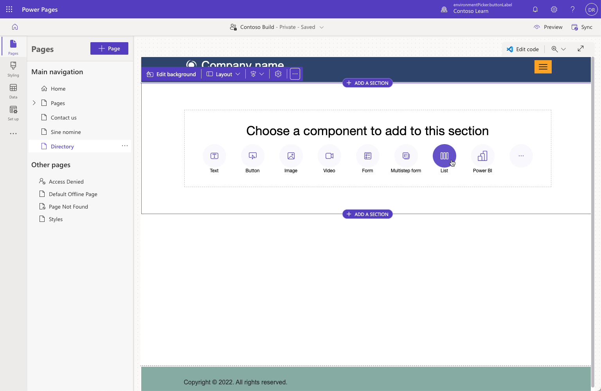

The purpose of this hands-on-lab is to use Power Pages design studio to build a secure web page displaying Dataverse data.

At the end of these exercises, you'll be able to accomplish the following tasks in Power Pages design studio:

- Add new columns to a Dataverse table.
- Create new views for a Dataverse table.
- Add list component to a web page.
- Apply page and table permissions to protect the data 

For this exercise, you'll need to have the following things:

- A provisioned Power Pages site in your environment. If you don't have a Power Pages site available, follow the [Create and manage Power Pages sites](/power-pages/getting-started/create-manage) instructions to create one.

## Scenario

Business would like to have a directory page on their site with the list of accounts from Dataverse including name, email, and phone number columns. For privacy reasons this directory should be accessible by authenticated users only. By default, accounts shouldn't be included in the directory but must be opted into it.

### High-level steps

1. Open your site in Power Pages design studio.
2. Using **Data** workspace add a new view and a new column opt-in column to the account table.
3. Add a new page and include a list component. Add read permissions for account table.
4. Restrict page access to authenticated users only.

## Detailed steps

### Launch Power Pages design studio

1. Sign in to [Power Pages](https://make.powerpages.microsoft.com/?azure-portal=true).
1. Select a target environment by using the environment selector in the upper-right corner.
1. Select your site then select **Edit** to launch the design studio.
1. Select **Data** workspace.

### Table modifications

1. Select **Account** table. 
   

2. Select **+ more** button, select **Email** column (find the column quickly by typing **email** into the search textbox), then press **Save** to add column to the view.
   

3. Create opt in column.

   1. Press **+ New column**.
   2. Enter **Show in directory** for Display name. 
   3. Select **Choice > Yes/No** for Data type.
   4. Set **Default choice** to **No**.
   5. Press **Save**.

   

4. Make sure that your account table has at least 8-10 data rows, enter some more rows as required filling in **Main Phone** and **Email** columns. Set **Show in directory** flag to true for some of the rows. 
    

5. Create new view

   1. Select **Views** tab.
   2. Enter **Directory** for View name.
   3. Press **Create**.
   4. Press **+ View column**, locate and select **Main Phone**.
   5. Press **+ View column** again, locate and select **Email**.
   6. Expand the view properties panel, and then select **Edit filters**.
   7. Press **+ Add > Add row**, select **Status** column, set **Equals** for condition, select **Active** for value.
   8. Press **+ Add > Add row**, select **Show in directory** column, set **Equals** for condition, select **Yes** for value.
   9. Press **OK**.

   

6. Notice the rows are now restricted to rows where **Show in directory** option is set to **Yes**.

7. Select **Sort by** then select **Account name**.

8. Your view should look like this:
   

9. Press **Save** then press **Publish view**. 

### Create a web page

1. Select **Pages** workspace.

   

2. Select **+ Page** button.

3. Enter **Directory** for the page name.

4. Select **Start from blank** standard layout, then press **Add**.

5. Select **List** from **Choose a component to add to this section** section.

6. Select **Account** table, select **Directory** list and press **OK**.
   

7. Your page now should look like this:
   

### Add permissions

If you preview the page now, the list component will display "You don't have permissions to view these records." message. This display expected as by default there are no permissions to access the rows regardless of the user roles.

1. Configure table permissions

   1. Press **+ New permission** button.
   2. Enter **Account read** for Name.
   3. Select **Account** for Table.
   4. Check **Read** under **Permissions to**.
   5. Select **+ Add roles** then check **Authenticated Users**.
   6. Press **Save**.

   

2. Select **Preview > Desktop**.

3. The list will display an error message if you aren't signed in. In this case press **Sign In**, select **Microsoft Entra ID** option, then sign in with your Azure credentials if prompted. You may be taken to your profile page. In this case select **Directory** from the menu.

4. The list should now be displayed. Test sorting by clicking column headers.
   

5. Select your user name then select **Sign out**. The list should now display the error message.

6. Restrict page access to authenticated users only.

   1. In **Page** workspace, select **Directory** page.
   2. Select ellipsis then select **Page settings**.
   3. Select **Permissions** tab.
   4. Select **I want to choose who can see this page** then select **Authenticated Users** from the role list.
   5. Press **OK**.

   

7. Select **Preview > Desktop**. Notice that you're redirected to the sign-in page and the **Directory** link is no longer in the navigation. 

   > [!IMPORTANT]
   > Anonymous visitors, previously denied only access to the account list on the page, no longer have visibility or access to the entire page. Page permissions protect the entire page regardless of what components are present. Table permissions govern access to the table rows regardless of where on the site the table is used. 

8. 

9. Sign in using **Microsoft Entra ID**. The **Directory** link will appear in the navigation and you'll be able to access the page and the account list.
