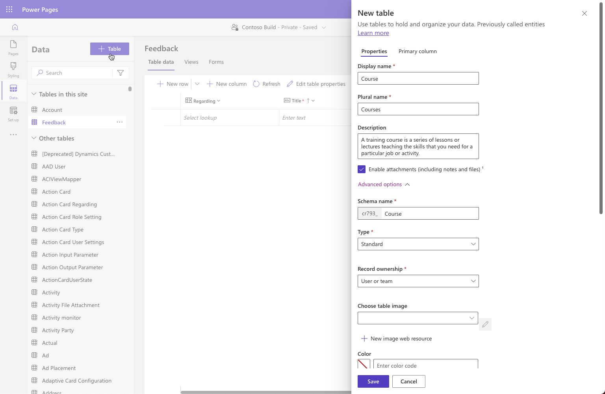

The main feature of Power Pages sites is the ability to show and interact with rows in Dataverse. Dataverse rows can be shown on a portal page by using list components or through custom web templates. Rows can be created and edited individually by using forms or as part of a step-by-step process by using multistep forms. Pro developers can use Power Pages Web API to interact with Dataverse data directly from JavaScript and create richer user experience inside Power Pages site.

Power Pages design studio significantly simplifies the data modeling experience for the makers. It provides access to most common features and capabilities of Dataverse. You can create and edit tables for the site, create and edit forms and views, and manage business data in the **Data** workspace.

Robust security model of Power Pages ensures that business information is protected and is only accessible by the correct stakeholders. The data is protected by using a combination of web roles and table and column permissions to ensure that site visitors only have the appropriate access to Dataverse rows.

* Page permissions control access to the individual pages on the website regardless of what components are present.
* Table permissions govern access to the table rows regardless of where on the site or how it is used, whether it's a list, form, Liquid code, or Web API.

Power Pages design studio provides makers with simple effective tools for managing page and table permissions.
